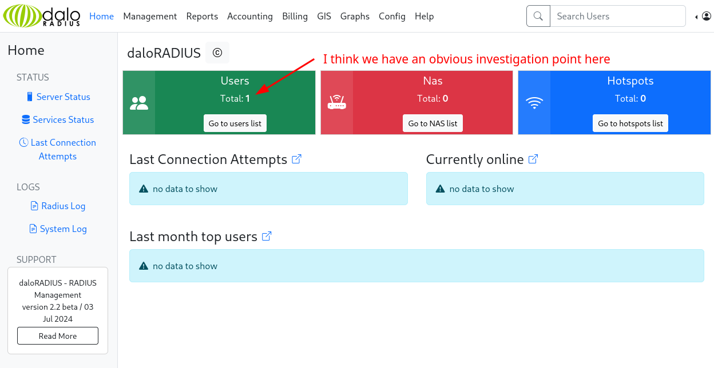
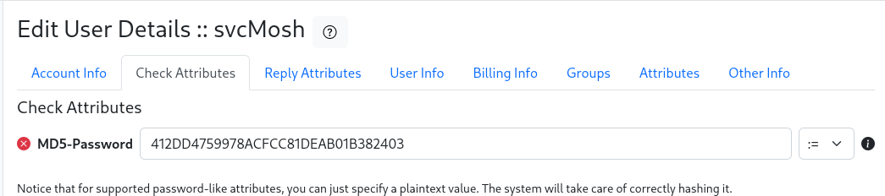
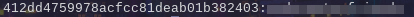
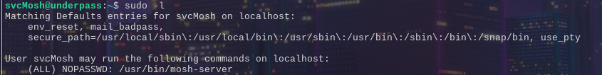
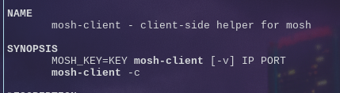

## Summary ##
This box presents with two open TCP ports (22,80) with nothing to go on, which leads us to check for open UdP ports. This revealed three open ports (161, 1812, 1813). Port 161 is common as SNMP and enumeration of the public community string reveals that the host intends to be a daloRAdIUS server. This is essentially a management/GUI framework for FreeRADIUS. We can look at the daloRADIUS github for potential paths to attack and common credentials. Proper enumeration reveals an exposed login page that works with default credentials. This lets us see a user listing of which there's one user with a visible MD5 hashed password. We crack this password, ssh into the server to find the first flag. Privilege escalation is gotten by examining sudo access and exploiting the creation of a `mosh` server which connecting to it provides us a root shell.


## Initial Recon 

### nmap
As typical with boxes we start with an nmap scan
```bash
nmap -sCV -oA nmap/underpass.tcp -p- $IP
```
<!--  -->


We see we have ssh and http open, so naturally we'll check the webpage

```bash
curl -s http://$IP 
```
and we can see it's a default apache webpage, so this doesn't give us much to go on.
So let's check the other transport protocol.

```bash
sudo nmap -sU --minrate 100000 -p- $IP
```
<!--  -->

### UDP checking
This let's us see three different ports; 161, 1812, 1813.
161 is typical, and I personally was not familiar with 1812 or 1813 so naturally I'll target the common easier thing first.

```bash
snmp-check -c v2 $IP
```
<!--  -->

We get a name and an email and the declaration that this is the only daloRADIUS server in the basin.
This is the first time I heard of daloRADIUS, so let's do some research.
- [daloRadius](https://www.daloradius.com/) - an advanced RADIUS web platform....based on a FreeRADIUS deployment.
- [FreeRADIUS](https://www.freeradius.org/) - The most used RADIUS server in the world
So this helps some, but just reading this bit, didn't really tell me what a RADIUS server actually is and why one would use it. So to give a concrete example after a fair amount of googling.
You know those Wi-Fi captive portals that let you login? That is almost guaranteed to be the product of a RADIUS server. Granting you access to the network like a guest-wifi, potentially logging your activity or checking whether you're still authorized to continue using the wi-fi. It differs strictly from something like guest-wifi access because there actually can be legitimate authentication and authorization rather than just users knowing a password for access. You can allow entry into the network and restrict accesses or even bandwidth or other resources. This is just a small example of how it would be used, but it helps to have something concrete to associate it to rather than the generic and abstract descriptions the websites give.

That didn't really help us yet though, so we should probably find out a little more about daloRADIUS specifically.
It looks like daloRADIUS is opensource and it has a github:
[daloRADIUS github](https://github.com/lirantal/daloradius/)

This gives us an example file structure of what to search for and looking at the installation file in doc/install/INSTALL we can see at the end:
```
 5. INSTALLATION COMPLETE
 ------------------------
    Surf to http://yourip/daloradius
    Login:
                username: administrator
                password: radius

    Notice: don't forget to change the default password in the Configuration -> Operators page
                        don't forget to also REMOVE completely or rename to some random undetected name the update.php script!
```

So we can take a good guess that we should try http://$IP/daloradius and this also provides us with some easy default credentials to try
Attempting to visit http://$IP/daloradius gives us a 403, which gives us a sign that we're correct.

We could look for specific pages or just turn this repo into it's own custom wordlist to fuzz for to see what we can actually hit
```bash
git clone https://github.com/lirantal/daloradius.git
cd daloradius
find | sed 's\^./\\g' > wordlist.tmp
ffuf -u http://$IP/daloradius/FUZZ -w wordlist.tmp -mc 200-209 > web.txt
```
We can see we get A LOT of hits, which is fantastic. This let's us have some choice, so let's see if we can find a page to test these login credentials.

```bash
grep 'login.php' web.txt
```
```
app/operators/login.php [Status: 200, Size: 2763, Words: 349, Lines: 98, Duration: 137ms]
app/users/login.php     [Status: 200, Size: 4422, Words: 660, Lines: 113, Duration: 137ms]
contrib/chilli/portal-bluechipwireless/hotspotlogin/hotspotlogin.php [Status: 200, Size: 821, Words: 35, Lines: 30, Duration: 130ms]
contrib/chilli/portal-bluechipwireless/hotspotlogin/template/loginform-login.php [Status: 200, Size: 1099, Words: 130, Lines: 44, Duration: 129ms]
contrib/chilli/portal1/hotspotlogin/hotspotlogin.php [Status: 200, Size: 807, Words: 50, Lines: 27, Duration: 126ms]
contrib/chilli/portal2/hotspotlogin/hotspotlogin.php [Status: 200, Size: 809, Words: 35, Lines: 30, Duration: 129ms]
contrib/chilli/portal2/hotspotlogin/template/loginform-login.php [Status: 200, Size: 909, Words: 87, Lines: 32, Duration: 127ms]
```

Trying them in order, gives us a login right away with `app/operators/login.php` using the default credentials from earlier.



We can see the user `svcMosh` with a password. The password doesn't look like something a normal person would put in, so it's probably hashed.
If you're familiar with hashes you might notice it as a likely MD5, or you can google it / ask AI...or try and edit the account and under Check Attributes it tells us what the hash is.




So, let's crack the hash?

```bash
echo "$MD5_HASH" > svcMosh.hash
hashcat svcMosh.hash rockyou.txt -m 0
```


## Foothold & Lateral Movement

### Shell as svcMosh

Okay, so what do we do with these credentials?
Naturally we try them anywhere else to see what we can do. The obvious option is to try ssh
```bash
ssh svcMosh@$IP
```

And we successfully authenticate as the user and get a shell


And we get our first investigatory point for privilege escalation when we run `sudo -l`


Now I have no idea what a mosh-server is, but usually running any server as root tends to have security vulnerabilities.
`man mosh-server`
The man pages says mosh this command is a helper for mosh (which stands for `mobile shell`) and this runs and then waits for a `mosh-client`
`man mosh-client`


So let's try that?


And we have our root shell.


## Mitigations 

### Default Credentials ###
The most obvious and crucial fix is taking the advice of doc/install/INSTALL, in the Note: section.
Which was, change your default password. This would have destroyed the initial foothold attainment immediately, because we would then need a brute-force to guess the credentials.
Then all you need to do is set up an auto-banner for this specific action from the same IP if you're particularly strict, or set up exponential response delays, with a reasonable cap to prevent any desire to brute-force but not make it so long that it's an obvious DDoS vector.

### Weak Credentials ###
Then the other obvious fix is the weak password that was easily crackable. MD5 is a terrible option for daloRADIUS to be using they only have two options SHA1 and MD5 that should obviously change to a nicer encryption scheme, pair that with a more sophisticated password for svcMosh.

### User Privileges ###
The user svcMosh does he need to run the mosh-server as a root user? Probably not, you can run it without root access, so it's entirely unecessary, remove this access. 

### Obscurity of Web Contents ###
Obscurity is not necessarily secure, but it does dramatically increase the effort needed of the attacker. Cloning the open source daloRADIUS repo and running it as is, makes it extremely easy to enumerate as we have seen. We can visit just about any area and access it, even the DockerFile to see how the instance is deployed. Removing those files from the web directory and even changing the structure can aid in increasing the attacker's time and effort and if they're only using one IP, then there's a higher chance we can ban their IP for malicious IP. Would it stop a sophisticated attacker? No, but we rather get bit by a sophisticated attacker rather than a script kiddie.


