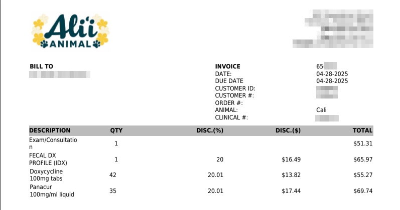

# Adding AI to an InvoiceParser

## The Overview 

[Furangel Invoice Parser - Code ](https://github.com/chin-tech/FurAngelInvoiceParser)

A couple months ago I assisted an animal shelter/rescue foundation. I didn't assist in the typical way one would help an animal shelter, like fostering animals or donating to vet appointments. I was helping them with an different kind of menial task. I got recruited into this by my wife because she's helped at the foundation before. She knows the owner and they were complaining about an administrative burden about a bunch of backlogged invoices they wanted stuck into their database. They had about 1,000 invoices and barely anyone to help them. They would typically have to read each invoice and manaually stick it into the database, making sure to properly fill in the categories and praying there's no duplicates. 

We're in 2025, this is unacceptable. So my wife told me their problem, I asked for their database and email and got to work. I built up a little program for them that goes through their email combing for invoices, finds the invoices, parses out all that good juicy data and uploads them to google_drive in a nicely renamed fashion for reference later. I also built a small web application that allows them to go in an easily adjust conflicting invoices (there's a lot of dogs with similar names and fuzzy matching only works so well). It was a wonderful learning experience too, as it got me to deploy something in the cloud in an actual meaningful way.


## The Issue ##
The problem was I only managed to get the bulk of their typical invoices and was left with a few strays (70-100) that didn't play nicely with pdf text extraction, having inconsistent formatting and some having images to display the vet name and I didn't want to deal with including OCR and more intricate processing for a couple of strays for something I am not even being paid to do. So I did as they did, and ignored it for a bit. Then the problem randomly came to me again while I was thinking of dipping my toes into the proverbial AI hype with some form of project and then I remembered this little project. And frankly, I am a little sad it wasn't harder. 
So here's an example of a PDF that just sucked with text_extraction:

An example:


Extracted Text:


Now I even removed some of the excess spaces to get it to display nicely. Notable problems?
- Vet Center: It doesn't show up in the extracted text, except in the email, but how would I decipher the vet center in the email without already knowing it prior?
- Ambiguous Endings: Now there's a whole new line associated with a singular n to finish the `Exam/Consultation` line. This might be indicative of a character limit for each column but then the following line `Fecal DX Profile (IDX)` basically shows that there's something else going on and I don't want to deal with reverse engineering it.

This contrasts significantly to the invoices I have made parsers for where they reliably have every charge on one line.

So of course I could have come up with a complicated way to parse and vet these extra invoices, but that would require more tinkering and edge cases that I didn't want to deal with.
I asked Gemini instead to see what it could do

Gemini's Output:
```
clinic,invoiceNumber,date,dogName,description,quantity,totalPrice
Alii Animal,656193,04-28-2025,Cali,Exam/Consultation,1,$51.31
Alii Animal,656193,04-28-2025,Cali,FECAL DX PROFILE (IDX),1,$65.97
Alii Animal,656193,04-28-2025,Cali,Doxycycline 100mg tabs,42,$55.27
Alii Animal,656193,04-28-2025,Cali,Panacur 100mg/ml liquid,35,$69.74
```


So yeah, who would have thought, an LLM that is picks up tons of context would be absolutely phenomenal at parsing a simple PDF. And we get about 600 queries a day for the free tier and we would only need about a 100.
I think I should integrate this into the codebase.

## The Solution

So, reading the docs it seems this was the minimal way to send a prompt to gemini via python

```python
from google import genai

client = genai.Client(api_key=API_KEY)

prompt = "Can you tell me the meaning of life? Just answer 42"

response = client.models.generate_content(model="gemini-2.0-flash", contents=prompt)
print(response.text)
```


So very easy to adjust to our needs, I just turned this into an aptly named function

```python
#invoices.py
def have_gemini_do_it(pdf_text: str) -> str:
    prompt = f"""
    Extract the following information from the text:
    clinic, invoiceNumber, date, dogName,  description, quantity, totalPrice
    and return the data as a comma separated table.
    If you cannot parse the content reliably only return an empty string.

    Text:
            {pdf_text}
    """
    response = client.models.generate_content(model="gemini-2.0-flash", contents=prompt)

    return response.text or ""
```

Now I just have to integrate this into my current code base.
Which I have a Protocol class that defines all the differing Parsers for each type of invoice, most were the same, but the little variations made some OOP a very nice solution.


```python 
#invoices.py

class InvoiceParser(Protocol):
    """Creates an InvoiceParser that accepts the text from an invoice"""
    clinic = ""
    clinic_abrv = ""
    invoice_pattern = r"Invoice:\s*?(\d+)"
    invoice_date_pattern = r"Printed:\s*?(\d{2}-\d{2}-\d{2})"
    dog_name_pattern = r"^\d{2}-\d{2}-\d{2}\s+([A-Z].+?)  \s+?\d"
    charges_dog_pattern = ""
    price_pattern = r"(\d+\.\d{2})"
    charges_pattern = ""
    charges_date_pattern = ""
    itemized_begin_pattern = r"^\s+(Description.*)"
    itemized_end_pattern = "Patient Subtotal:"
    section_reduce_pattern = ""
    invoice_date_format = DATE_MDY
    charge_date_format = DATE_MDY
    text = ""
    invoice = ""
    name = ""
    success_dir = ""
    fail_dir = ""
    drive_completed = ""
    drive_incomplete = ""

    def __init__(self, txt: str, invoice_path: Path, is_drive: bool = False):
        self.text = txt
        self.invoice = invoice_path
        self.name = invoice_path.name
        self.success_dir = INVOICE_DIR / Path(f"{self.clinic_abrv}_completed")
        self.fail_dir = INVOICE_DIR / Path(f"{self.clinic_abrv}_incomplete")
        self.drive_completed = f"{self.clinic_abrv}_completed"
        self.drive_incomplete = f"{self.clinic_abrv}_incomplete"

        if not is_drive:
            self.success_dir.mkdir(exist_ok=True, parents=True)
            self.fail_dir.mkdir(exist_ok=True, parents=True)

    def parse_invoice(self) -> None:
        items = []
        dog_names = self.get_dog_names()
        self.id = self.get_invoice_id()
        self.invoiced_date = self.get_invoiced_date()
        sections = self.get_itemized_section()
        new_name = f"{self.clinic_abrv}_{
            self.id}_{self.invoiced_date.date()}.pdf"
        self.charge_date = self.invoiced_date
        for index, section in enumerate(sections):
            self.curr_dog = dog_names[index]
            for i, lines in enumerate(section.splitlines()):
                if i == 0 or len(lines) < 60:
                    continue
                charges = self.parse_item(
                    lines)
                if not charges:
                    continue
                items.append(charges)
        self.items = pd.DataFrame(items)
        self.name = new_name

        #......<snip>
        # ....
        # ....</snip>

def get_parser(invoice_path: Union[Path, io.BytesIO], filename: str = None, is_drive: bool = False) -> InvoiceParser:
    txt = extract_text(invoice_path)
    parser_map = {
        r"Waipio Pet Clinic": WaipioParser,
        r"Wahiawa Pet Hospital": WahiawaParser,
        r"VCA ": VCAParser,
        r"Animal House Veterinary Center": AnimalHouseVetParser,
        r"Mililani Mauka Veterinary Clinic": MMVCParser,
    }
    for clinic_regex, parser in parser_map.items():
        if re.search(clinic_regex, txt):
            if re.search(r"Animal|Waipio|Wahiawa|Mililani", clinic_regex):
                txt = extract_text(invoice_path, mode='layout')
            if filename:
                invoice_path = Path(filename)
            return parser(txt, invoice_path, is_drive)
    else:
        raise Exception(
            f"{filename if filename else invoice_path.name}: No Available Parser!")
```


I have a function `get_parser` that returns the specific parser based on it finding the similar clinic name in the text. This works great, but now I need an AIParser to handle all the ones I didn't manage.
It seems easy enough to just add it in the `else` portion of the `get_parser` function.

The nice thing is I only have a single place where I call this method `parse_invoice()` and it's already wrapped in a try block, so all I have to do is vet the contents of the gemini output inside this method for the AIParser and it should work seamlessly of course making sure I run it through the same intermediate processsing I have for cataloging procedures and everything else.

```python 
#google_api_functions.py
#               <snip> ..... </snip>

                try:
                    parser = get_parser(
                        file, filename=filename, is_drive=True)
                    parser.parse_invoice()
                    filename = parser.name

#               <snip> ..... </snip>
```

So my orginal `parse_invoice` essentially splits the pdf text finding the Clinic name, the invoice_id, and the itemized section that describes what was done, to which dog and the price and quantity of it.
With the LLM doing the heavy lifting now, I can just get a CSV back with that information. The easiest way to handle this likely is just refactoring it to use a dataframe's apply function to mimic the workflow of what I'm doing with every other parser.

What I ended up with was:

```python 
#invoices.py

class AIParser(InvoiceParser):

    def parse_invoice(self, df: pd.DataFrame = pd.DataFrame()):
        if df.empty:
            csv_string = have_gemini_do_it(self.text)
            if not csv_string:
                raise Exception("Gemini failed to find the desired information")
            df = pd.read_csv(io.StringIO(csv_string))
        df['date'] = pd.to_datetime(df['date'])
        self.clinic = df['clinic'].values[0]
        self.clinic_abrv = make_clinic_abbreviation(self.clinic)
        self.invoiced_date = df['date'].max()
        self.id = df['invoiceNumber'].min()
        invoice_items = []
        def _inner_parse(x):
            charge = self.parse_item(x)
            invoice_items.append(charge)
        df.apply(lambda x: _inner_parse(x), axis=1)
        new_name = f"{self.clinic_abrv}_{
            self.id}_{self.invoiced_date.date()}.pdf"
        self.items = pd.DataFrame(invoice_items)
        self.name = new_name


    def parse_item(self, df_row: pd.Series) -> dict:
        charges = {}
        self.curr_dog = df_row['dogName']
        self.charge_date = df_row['date']
        date = df_row['date']
        price = df_row['totalPrice']
        description = df_row['description']
        if not description and price <= 0:
            return {}
        charges['COSTDATE'] = date.strftime(DATE_M_D_Y)
        charges['COSTDESCRIPTION'] = f"[{
            df_row['clinic']} - {df_row['invoiceNumber']} - {date.date()}] "
        charges['COSTAMOUNT'] = price
        charges['ANIMALNAME'] = self.curr_dog
        return get_description(description, charges, date)
```

Which integrates nicely into the previous codebase, for free with not that much work at all. Of course, google gets to spy on the invoice information sent to it, but since Google removed their `Don't Be Evil` slogan, I expect them to be snooping on basically any information on their servers, and this information is already there. I'd love to have them self-host an AI to run this, but considering I'm deliberately keeping everything to be pennies... suggesting a a couple grand to be shelled out for a decently performant in-house AI that really only needs to be ran about every two weeks, isn't a wortwhile proposition.


